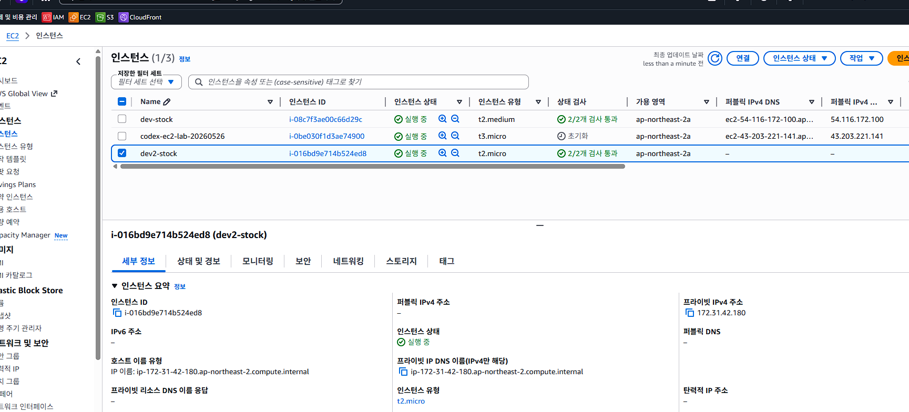

# AWS 초급 온보딩 Lab (회원가입/IAM/MFA/AWS CLI)

## Lab 목표
- AWS 계정 생성과 기본 보안 설정을 완료합니다.
- 루트 계정 사용을 최소화하고 IAM 사용자로 운영 시작 상태를 만듭니다.
- MFA(2단계 인증)를 활성화합니다.
- AWS CLI를 설치하고 기본 명령으로 동작을 확인합니다.

## Lab 완료 기준
- [ ] AWS 계정 생성 완료
- [ ] 루트 계정 MFA 활성화 완료
- [ ] IAM 관리자 사용자 1개 생성 완료
- [ ] IAM 사용자 MFA 활성화 완료
- [ ] AWS CLI 설치 및 `aws sts get-caller-identity` 성공

---

## 1) AWS 회원가입
1. AWS 공식 사이트에서 계정을 생성합니다.
2. 결제 수단 등록과 본인 인증을 완료합니다.
3. 리전은 학습용으로 `ap-northeast-2`를 기본값으로 사용할 것을 권장합니다.

체크포인트:
- [ ] 콘솔 로그인 가능
- [ ] Billing 대시보드 접근 가능

---

## 2) 루트 계정 보안 최소 설정
> 루트 계정은 초기 보안 설정 용도로만 사용하고, 일상 작업에는 사용하지 않습니다.

1. 루트 계정으로 로그인합니다.
2. 계정 보안 메뉴에서 MFA를 활성화합니다.
3. 복구 수단(백업 코드/복구 방법)을 안전한 위치에 보관합니다.

체크포인트:
- [ ] 루트 계정 MFA 상태: 활성(Enabled)

---

## 3) IAM 관리자 사용자 생성
1. IAM 콘솔에서 사용자 1명을 생성합니다. (예: `lab-admin`)
2. 콘솔 로그인 허용을 켭니다.
3. 관리자 권한 정책(예: `AdministratorAccess`)을 실습용으로 부여합니다.
4. 생성된 사용자로 콘솔에 재로그인합니다.

체크포인트:
- [ ] 루트가 아닌 IAM 사용자로 로그인 성공
- [ ] IAM 사용자로 EC2/ECS/LB 콘솔 접근 가능

---

## 4) IAM 사용자 2단계 인증(MFA) 활성화
1. IAM 사용자 보안 자격 증명 메뉴로 이동합니다.
2. 가상 MFA 앱(Authenticator 계열) 또는 보안키를 등록합니다.
3. MFA 적용 후 재로그인합니다.

체크포인트:
- [ ] IAM 사용자 MFA 상태: 활성(Enabled)

---

## 5) AWS CLI 설치
운영체제별 공식 설치 가이드를 사용해 AWS CLI v2를 설치합니다.

설치 확인:
```bash
aws --version
```

체크포인트:
- [ ] `aws --version` 출력 확인

---

## 6) AWS CLI 초기 설정 및 검증
1. IAM 사용자 Access Key를 발급합니다. (실습 후 비활성화/삭제 권장)
2. 터미널에서 설정을 입력합니다.

```bash
aws configure
```

예시 입력:
- AWS Access Key ID: `AKIA...`
- AWS Secret Access Key: `xxxxxxxx`
- Default region name: `ap-northeast-2`
- Default output format: `json`

연결 확인:
```bash
aws sts get-caller-identity
aws ec2 describe-regions --output table
```

체크포인트:
- [ ] `Account`, `Arn`, `UserId` 조회 성공
- [ ] 리전 목록 조회 성공

---

## 7) 비용/보안 기본 수칙 (초급자 필수)
- 실습 종료 후 미사용 리소스(ALB, EC2, ECS, EIP)를 즉시 삭제합니다.
- 액세스 키는 개인 PC에만 저장하고 공개 저장소에 절대 커밋하지 않습니다.
- 루트 계정 액세스 키는 생성하지 않습니다.
- CloudShell 또는 최소권한 IAM 정책 사용을 우선 고려합니다.

---

## 다음 Lab
- 네트워크/인프라 실습으로 이동: [EC2/001.md](001.md)


---

## YouTube 참고 영상
- [YouTube에서 관련 영상 찾아보기](https://www.youtube.com/results?search_query=EC2+000+aws+onboarding+lab)


---

aws ec2 run-instances \
    --image-id ami-0765f9741eedf9c7b \
    --instance-type t2.micro \
    --key-name kdy-ec2-key \
    --subnet-id subnet-0e23866dad8a8ebc3

