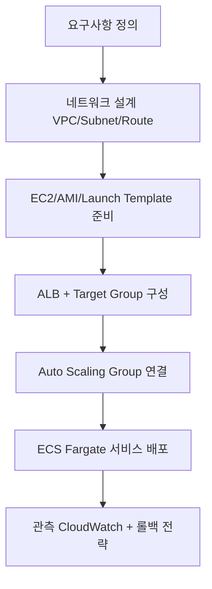

## AWS 회원가입·보안 기본 설정부터 EC2 네트워크, ALB, Auto Scaling, ECS Fargate 배포까지  
## Lab 스타일로 단계별로 따라갈 수 있도록 정리한 저장소입니다.

---

## 시작 전에: 개인별 필수 준비 가이드

이 저장소는 **AWS 계정 보안 설정 → EC2/VPC/ALB → ECS Fargate 배포** 순서로 진행합니다.  
아래 항목을 먼저 갖추면 실습 중단 없이 진행할 수 있습니다.

### 1) 개인별 습득 권장 기술 스택

| 구분 | 최소 필요 수준 | 왜 필요한가 |
|---|---|---|
| AWS 기본 | IAM 사용자/권한, 리전, VPC 개념을 이해 | 계정/보안/네트워크 실습의 전제 |
| 네트워크 | CIDR, Subnet, Route Table, IGW/NAT 차이 이해 | `EC2/001.md`, `EC2/002.md` 실습 정확도 향상 |
| 리눅스 기초 | SSH 접속, 파일 전송, 기본 명령(`cd`, `ls`, `cat`, `systemctl`) | EC2 인스턴스 점검/운영 실습에 필요 |
| 컨테이너 기초 | Docker 이미지 빌드/실행, 태그 개념 | ECS/ECR 실습(`ECS/001_fargate_hands_on.md`) 필수 |
| Python 기초 | 가상환경(venv), `pip`, FastAPI 실행 | `BE-fastapi`, `ai/*` 실습에 필요 |
| Git/GitHub | 저장소 클론, 브랜치/PR, GitHub Actions 개념 | `deploy` 모듈과 CI/CD 흐름 이해 |

### 2) 권장 개인 PC 사양

| 항목 | 최소 사양 | 권장 사양 |
|---|---|---|
| CPU | 2코어 이상 | 4코어 이상 |
| 메모리(RAM) | 8GB | 16GB 이상 |
| 저장공간 | 여유 10GB 이상 | 여유 20GB 이상 (Docker 이미지/로그 포함) |
| OS | Windows 10+, macOS 12+, Ubuntu 20.04+ | 최신 안정 버전 |
| 네트워크 | 안정적인 인터넷(업/다운 모두) | 유선 또는 고품질 Wi-Fi |

권장 로컬 도구:
- AWS CLI v2
- Python 3.10+
- Docker Desktop(또는 Docker Engine)
- Git + VS Code(또는 선호 IDE)
- MFA 앱(예: Google Authenticator, Microsoft Authenticator)

### 3) 가입/생성해야 할 플랫폼·계정

| 플랫폼 | 필수 여부 | 용도 |
|---|---|---|
| AWS 계정 | 필수 | EC2, ALB, ECS, ECR 등 실습 리소스 생성 |
| GitHub 계정 | 권장(배포 자동화는 사실상 필수) | 소스 관리, GitHub Actions 기반 배포 |
| MFA 앱 계정/설치 | 필수 | 루트/IAM 사용자 MFA 활성화 |
| Docker Hub 계정 | 선택 | 로컬 컨테이너 학습 보조(본 실습 핵심 배포는 ECR 사용) |

필수 선행 완료 체크:
- [ ] AWS 계정 결제 수단 등록 + 본인 인증 완료
- [ ] 루트 계정 MFA 활성화
- [ ] IAM 관리자 사용자 생성 + MFA 활성화
- [ ] `aws configure` 및 `aws sts get-caller-identity` 성공

### 4) 예상 비용(카드 청구 예상금액)

> 아래는 **서울 리전(ap-northeast-2), 온디맨드, 학습용 단기 사용** 기준의 보수적 추정치입니다.  
> 실제 청구는 사용 시간/트래픽/리소스 개수에 따라 달라지며, 반드시 AWS Billing 콘솔에서 실시간 확인하세요.

가정:
- 환율: 1 USD = 1,400 KRW(예시)
- 실습 중 주요 비용 리소스: ALB, EC2, ECS(Fargate), ECR 저장소, CloudWatch 로그
- 하루 실습 후 미사용 리소스 즉시 삭제

| 시나리오 | 사용 패턴(예시) | 예상 총비용(USD) | 카드 청구 예상(원화) |
|---|---|---:|---:|
| 1일 집중 실습 | ALB 6~8시간 + EC2 1~2대 단기 + ECS Task 단기 | 약 $2 ~ $8 | 약 2,800원 ~ 11,200원 |
| 1주(평일 저녁) 실습 | 평일 2~3시간씩 리소스 기동/종료 반복 | 약 $10 ~ $35 | 약 14,000원 ~ 49,000원 |
| 24시간 상시 방치 | ALB/EC2/ECS를 중지하지 않고 유지 | 약 $40+ / 월 이상 가능 | 약 56,000원+/월 이상 가능 |

비용 절감 핵심:
- 실습 종료 즉시 `ALB`, `EC2`, `ECS Service`, `EIP`, 불필요 `ECR` 이미지를 삭제
- ECS 서비스는 미사용 시 Desired Count를 0으로 조정
- Billing Alarm(예: 10 USD, 30 USD) 사전 설정
- 프리티어 대상 여부를 계정 생성 시점 기준으로 확인
  - AWS Free Tier: https://aws.amazon.com/free/
  - AWS Billing 콘솔의 Free Tier 페이지에서 월별 사용량/잔여량 확인

---

## 저장소 구조

```
aws-ec2-alb-lab/
├── EC2/                        # VPC·Subnet·IGW·ALB·ASG 실습 (CLI + 콘솔)
│   ├── 000_aws_onboarding_lab.md   # 회원가입 / IAM / MFA / AWS CLI
│   ├── 001.md                      # VPC·Subnet·IGW·라우팅 (CLI)
│   ├── 002.md                      # ALB·Target Group·Listener (CLI)
│   ├── 003.md                      # ASG 운용 점검 + EC2 Instance Connect 트러블슈팅
│   ├── 004.md                      # 콘솔 기반 AMI·Template·ASG 체크리스트
│   ├── 005.md                      # 애플리케이션 런타임 준비 (JDK·SFTP)
│   ├── 008.md                      # 운영 점검용 CLI 조회 명령 모음
│   ├── template.json               # Launch Template 예시 JSON
│   └── redact_ec2_images.py        # EC2 스크린샷 민감정보 마스킹 스크립트
│
├── ECS/                        # ECS Fargate 배포 실습
│   ├── aws_ecs_fargate_summary.md  # ECS·Fargate 핵심 개념 정리
│   ├── 001_fargate_hands_on.md     # ECR 빌드·푸시 → Fargate 서비스 배포
│   ├── 002_ecs_alb_lab.md          # ECS Service + ALB 경로 기반 라우팅
│   └── 003_study_checklist.md      # 스터디 점검 질문 모음
│
├── LB/                         # Load Balancer 학습
│   └── 001_alb_settings_lab.md     # ALB vs NLB 비교·설정·점검·트러블슈팅
│
├── BE-fastapi/                 # Docker 기반 FastAPI 샘플 API
│   ├── app/
│   │   └── main.py                 # FastAPI 앱 본체
│   ├── Dockerfile
│   └── requirements.txt
│
├── ag-grid-app/                # Nginx에 배포 가능한 AG Grid 정적 앱
│   ├── index.html
│   ├── styles.css
│   └── app.js
│
├── deploy/                     # ECS 배포 자동화 샘플 3종
│   ├── shell/
│   │   ├── deploy_ecs_cli.sh       # Shell Script 방식
│   │   └── deploy.env.example      # 환경변수 템플릿
│   └── ansible/
│       ├── deploy_ecs_cli.yml      # Ansible Playbook 방식
│       ├── inventory.ini
│       └── group_vars/all.yml
│
├── ai/                         # AWS AI 서비스별 Python 실습
│   ├── bedrock-python-llm/         # Bedrock/Claude 호출 예시
│   ├── comprehend-python/          # 감성 분석·개체명 인식·언어 감지
│   ├── lex-python/                 # Lex v2 챗봇 대화 세션
│   ├── polly-python/               # 텍스트→음성(TTS) 변환
│   ├── rekognition-python/         # 이미지 레이블·얼굴·텍스트 분석
│   ├── textract-python/            # 문서 OCR·폼(KEY-VALUE) 추출
│   ├── transcribe-python/          # 음성→텍스트(ASR) 변환
│   └── financial-rag-python/       # 금융공학 RAG 커리큘럼 + Python 실습
│
├── assets/                     # 다이어그램 이미지
│   ├── aws-study-flow.svg
│   └── aws-cloud-architecture.svg
```

---

## 학습 범위

| 폴더 | 내용 |
|---|---|
| `EC2` | 회원가입·IAM·MFA·AWS CLI 온보딩, VPC·Subnet·IGW·라우팅, ALB·Target Group, ASG, AMI·Launch Template |
| `ECS` | ECS/Fargate 핵심 개념, ECR 이미지 빌드·배포, ALB 연동, CloudWatch 로그·헬스체크 |
| `LB` | ALB vs NLB 비교, Listener·Rule·Target Group, 헬스체크, 트러블슈팅 |
| `BE-fastapi` | FastAPI Hello World API, Docker 빌드·실행 |
| `ag-grid-app` | 바닐라 HTML/JS 기반 AG Grid 정적 앱, Nginx 배포 |
| `deploy` | Shell / Ansible / GitHub Actions 3가지 방식의 ECS 배포 자동화 |
| `ai` | Bedrock, Comprehend, Lex, Polly, Rekognition, Textract, Transcribe + 금융공학 RAG Python 실습 |

---

## 권장 학습 순서



### 순서도 이미지


### AWS 클라우드 아키텍처 다이어그램


### 단계별 학습 경로

| 단계 | 파일 | 핵심 내용 |
|---|---|---|
| 1 | [EC2/000_aws_onboarding_lab.md](EC2/000_aws_onboarding_lab.md) | AWS 계정 생성, 루트·IAM MFA, AWS CLI 설치·검증 |
| 2 | [EC2/001.md](EC2/001.md) | VPC·Subnet 2개·IGW·Route Table·퍼블릭 IP 자동할당 |
| 3 | [EC2/002.md](EC2/002.md) | ALB 보안그룹·Target Group·Listener 구성 |
| 4 | [EC2/003.md](EC2/003.md) | ASG 상태 점검, EC2 Instance Connect 트러블슈팅, 부하 테스트 |
| 5 | [EC2/004.md](EC2/004.md) | 콘솔에서 AMI·Launch Template·ASG·LB 연결 재점검 |
| 6 | [EC2/005.md](EC2/005.md) | JDK 설치·SFTP 파일 전송·앱 실행 |
| 7 | [LB/001_alb_settings_lab.md](LB/001_alb_settings_lab.md) | ALB vs NLB, Listener·Rule 구조, 헬스체크·503 진단 |
| 8 | [ECS/aws_ecs_fargate_summary.md](ECS/aws_ecs_fargate_summary.md) | ECS·Fargate 개념 정리 |
| 9 | [ECS/001_fargate_hands_on.md](ECS/001_fargate_hands_on.md) | ECR 빌드·푸시 → Fargate 서비스 배포·삭제 |
| 10 | [ECS/002_ecs_alb_lab.md](ECS/002_ecs_alb_lab.md) | ECS Service + ALB 경로 기반 라우팅·트러블슈팅 |
| 11 | [ECS/003_study_checklist.md](ECS/003_study_checklist.md) | 스터디 점검 질문 셀프 체크 |

---

## 실습 전 준비 사항

- AWS 계정 생성 및 결제·본인 인증 완료
- 루트 계정 + IAM 사용자 MFA 활성화
- AWS CLI v2 설치 및 `aws configure` 완료
- 기본 리전 확정 (예: `ap-northeast-2`)
- 비용 발생 리소스(ALB, EC2, ECS, EIP) 생성·삭제 계획 수립

---

## 빠른 시작 (처음 방문한 경우)

### 1) 최소 학습 동선
- 인프라 기초부터 시작: [EC2/000_aws_onboarding_lab.md](EC2/000_aws_onboarding_lab.md) → [EC2/001.md](EC2/001.md) → [EC2/002.md](EC2/002.md)
- ECS까지 확장: [ECS/aws_ecs_fargate_summary.md](ECS/aws_ecs_fargate_summary.md) → [ECS/001_fargate_hands_on.md](ECS/001_fargate_hands_on.md)
- 배포 자동화 연결: [deploy/README.md](deploy/README.md) + `.github/workflows/deploy-ecs-aws-cli.yml`

### 2) 로컬에서 바로 실행해볼 샘플
```bash
# FastAPI 샘플
cd BE-fastapi
python -m venv .venv && source .venv/bin/activate
pip install -r requirements.txt
uvicorn app.main:app --host 0.0.0.0 --port 8000

# AG Grid 정적 앱 (별도 터미널)
cd ag-grid-app
python3 -m http.server 8080
```

### 3) 학습 목적별 추천 진입점
| 목적 | 먼저 볼 문서 |
|---|---|
| AWS 계정/보안 온보딩 | [EC2/000_aws_onboarding_lab.md](EC2/000_aws_onboarding_lab.md) |
| ALB/Target Group 구조 이해 | [EC2/002.md](EC2/002.md), [LB/001_alb_settings_lab.md](LB/001_alb_settings_lab.md) |
| ECS Fargate 배포 실습 | [ECS/001_fargate_hands_on.md](ECS/001_fargate_hands_on.md) |
| GitHub Actions 기반 배포 자동화 | [deploy/README.md](deploy/README.md), [.github/workflows/deploy-ecs-aws-cli.yml](.github/workflows/deploy-ecs-aws-cli.yml) |

---

## 모듈별 상세 안내

### EC2 — 네트워크·인프라 실습

**EC2/000 — AWS 온보딩 Lab**  
AWS 계정 생성부터 IAM 관리자 사용자, MFA, AWS CLI 초기 설정, 연결 검증까지 초급자용 완전 체크리스트를 제공합니다.

**EC2/001 — VPC·Subnet·IGW·Route Table (CLI)**
```bash
# VPC 생성
aws ec2 create-vpc --cidr-block 10.0.0.0/16

# Public Subnet 2개 (AZ 분산)
aws ec2 create-subnet --vpc-id vpc-xxxxxxxx --cidr-block 10.0.1.0/24 --availability-zone ap-northeast-2a
aws ec2 create-subnet --vpc-id vpc-xxxxxxxx --cidr-block 10.0.2.0/24 --availability-zone ap-northeast-2c

# IGW 연결 및 0.0.0.0/0 라우트 추가
aws ec2 create-internet-gateway ...
aws ec2 attach-internet-gateway ...
aws ec2 create-route --route-table-id rtb-xxxxxxxx --destination-cidr-block 0.0.0.0/0 --gateway-id igw-xxxxxxxx
```

**EC2/002 — ALB·Target Group·Listener (CLI)**
```bash
# Target Group 생성 (instance 타입)
aws elbv2 create-target-group --name nginx-tg --protocol HTTP --port 80 --vpc-id vpc-xxxxxxxx --target-type instance --health-check-path /index.html

# ALB 생성 (internet-facing, Public Subnet 2개 이상 필수)
aws elbv2 create-load-balancer --name nginx-alb --subnets subnet-xxxxxxxx subnet-yyyyyyyy --security-groups sg-xxxxxxxx --scheme internet-facing --type application

# Listener 생성
aws elbv2 create-listener --load-balancer-arn <ALB_ARN> --protocol HTTP --port 80 --default-actions Type=forward,TargetGroupArn=<TG_ARN>
```

**EC2/003 — ASG 운용 점검 + Instance Connect 트러블슈팅**  
SSH 접속 불가 시 확인 순서, `EC2 Instance Connect` 전용 IAM 권한, 보안그룹·라우팅·AMI 지원 여부 점검, ASG/Target Health CLI 조회 방법을 정리합니다.

**EC2/004 — 콘솔 기반 체크리스트**  
CLI 실습 이후 콘솔에서 AMI 권한, Launch Template 버전, ASG 용량·헬스체크 유형, LB 가용영역·Listener 연결을 재검증하는 체크리스트입니다.

**EC2/005 — 애플리케이션 런타임 준비**  
JDK 설치, SFTP 기반 파일 전송, 앱 실행, 보안 운영 원칙을 다룹니다.

**EC2/008 — 운영 점검 명령 모음**  
ALB가 사용하는 Subnet, Subnet↔AZ 매핑, 라우팅 경로, 보안그룹 인바운드/아웃바운드, Target Group 상태를 빠르게 조회하는 CLI 템플릿 모음입니다.

---

### ECS — Fargate 배포 실습

**ECS/aws_ecs_fargate_summary.md** — ECS 클러스터·서비스·Task Definition·ECR 개념 정리

**ECS/001 — Fargate 배포 실습 (FastAPI 샘플)**
```bash
# ECR 리포지토리 생성 → 이미지 빌드·푸시 → Task Definition 등록 → ECS Service 생성
AWS_REGION="ap-northeast-2"
CLUSTER_NAME="study-fargate-cluster"
# (전체 명령은 ECS/001_fargate_hands_on.md 참조)
```

**ECS/002 — ECS Service + ALB 경로 기반 라우팅**  
Target Group 타입을 `ip`로 생성하고, ECS Service에 `--load-balancers` 옵션으로 ALB를 연결하는 방법과 트러블슈팅(`unhealthy`, 503, Target registration failed)을 다룹니다.

**ECS/003 — 스터디 점검 체크리스트**  
ECS·Fargate·ECR·ALB 개념 확인용 셀프 질문 목록입니다.

---

### LB — Load Balancer 학습

**ALB vs NLB 비교**

| 항목 | ALB | NLB |
|---|---|---|
| 계층 | L7 (HTTP/HTTPS) | L4 (TCP/UDP/TLS) |
| 라우팅 | Host/Path 기반 | 포트·프로토콜 기반 |
| 주요 용도 | 웹·API | 고성능 TCP, 고정 IP |

**주요 점검 명령**
```bash
aws elbv2 describe-load-balancers --names <ALB_NAME>
aws elbv2 describe-listeners --load-balancer-arn <ALB_ARN>
aws elbv2 describe-rules --listener-arn <LISTENER_ARN>
aws elbv2 describe-target-health --target-group-arn <TG_ARN>
```

---

### BE-fastapi — FastAPI Docker 샘플

엔드포인트:
- `GET /` → `{ "message": "hello world" }`
- `GET /health` → `{ "status": "ok" }`

```bash
# Docker 빌드·실행
cd BE-fastapi
docker build -t be-fastapi-hello .
docker run --rm -p 8000:8000 be-fastapi-hello

# 동작 확인
curl http://127.0.0.1:8000/
curl http://127.0.0.1:8000/health
```

로컬 직접 실행:
```bash
python -m venv .venv && source .venv/bin/activate
pip install -r requirements.txt
uvicorn app.main:app --host 0.0.0.0 --port 8000
```

---

### ag-grid-app — AG Grid 정적 앱

바닐라 HTML/CSS/JS 기반 AG Grid 앱으로, Nginx에 바로 올릴 수 있습니다.

```bash
# 로컬 확인
cd ag-grid-app
python3 -m http.server 8080
# → http://127.0.0.1:8080

# Nginx 배포
sudo mkdir -p /var/www/html/ag-grid-app
sudo cp -r ag-grid-app/* /var/www/html/ag-grid-app/
sudo systemctl reload nginx
# → http://<EC2_PUBLIC_IP>/ag-grid-app/
```

---

### deploy — ECS 배포 자동화 3종

공통 흐름: ECR 리포지토리 확인·생성 → 이미지 빌드·푸시 → Task Definition 등록 → ECS Service 업데이트 → 안정화 대기

**1) Shell Script 방식**
```bash
cp deploy/shell/deploy.env.example .env.deploy
set -a && source .env.deploy && set +a
./deploy/shell/deploy_ecs_cli.sh
```

**2) Ansible 방식**
```bash
# 사전 요구: ansible, aws cli, docker
# 변수 파일: deploy/ansible/group_vars/all.yml
ansible-playbook -i deploy/ansible/inventory.ini deploy/ansible/deploy_ecs_cli.yml
```

**3) GitHub Actions 방식**  
워크플로우: `.github/workflows/deploy-ecs-aws-cli.yml`

추가 실습:
- `deploy/README.md`의 **4) 실습: `deploy-ecr-ec2.yml`용 AWS CLI 인프라 구성**
- 참조 워크플로우: [deploy-ecr-ec2.yml](https://github.com/edumgt/investment-analysis/blob/main/.github/workflows/deploy-ecr-ec2.yml)

필수 GitHub 설정:
- **Secrets**: `AWS_ROLE_TO_ASSUME` (OIDC Assume할 Role ARN)
- **Variables**: `AWS_REGION`, `ECS_CLUSTER`, `ECS_SERVICE`, `TASK_FAMILY`, `ECR_REPO`, `CONTAINER_NAME`
- 선택: `CONTAINER_PORT`, `CPU`, `MEMORY`

> 장기 Access Key 대신 **OIDC + IAM Role** 사용을 권장합니다.

---

### ai — AWS AI 서비스 Python 예시 모음

`ai/` 폴더는 **서비스별로 바로 실행 가능한 Python 샘플**을 모아둔 영역입니다.  
각 하위 폴더는 `README.md`(사전 조건/권한/실행법) + `*_example.py`(실행 코드) 구조로 통일되어 있습니다.

| 하위 폴더 | 다루는 서비스 | 실습 포인트 | 대표 실행 예시 |
|---|---|---|---|
| `ai/bedrock-python-llm` | Amazon Bedrock (Claude/Nova) | LLM 호출, 모델/리전 제약 확인 | `python3 ai/bedrock-python-llm/bedrock_claude_example.py` |
| `ai/comprehend-python` | Amazon Comprehend | 감성 분석, 개체명 인식, 언어 감지 | `python3 ai/comprehend-python/comprehend_example.py` |
| `ai/lex-python` | Amazon Lex v2 | Intent/Slot 기반 챗봇 대화 세션 | `python3 ai/lex-python/lex_example.py` |
| `ai/polly-python` | Amazon Polly | 텍스트/SSML 음성 합성(MP3) | `python3 ai/polly-python/polly_example.py --text "안녕하세요"` |
| `ai/rekognition-python` | Amazon Rekognition | 이미지 라벨·얼굴·텍스트 분석 | `python3 ai/rekognition-python/rekognition_example.py --file photo.jpg` |
| `ai/textract-python` | Amazon Textract | 문서 OCR, 폼(KEY-VALUE) 분석 | `python3 ai/textract-python/textract_example.py --file sample.png --forms` |
| `ai/transcribe-python` | Amazon Transcribe | 오디오 비동기 STT 변환 | `python3 ai/transcribe-python/transcribe_example.py --s3-uri s3://<bucket>/audio.mp3 --lang ko-KR` |
| `ai/financial-rag-python` | Financial Engineering RAG | 금융공학 문서 기반 검색·근거 응답 파이프라인 | `python3 ai/financial-rag-python/financial_rag_lab.py --query "VaR를 줄이는 방법은?" --top-k 3` |

공통 사전 준비:
- AWS 자격 증명 설정 (`aws configure` 또는 EC2/ECS IAM Role)
- `boto3` 설치
- 서비스별 최소 IAM 권한 부여 (각 하위 README 표 참고)
- 리전 일치 확인 (`AWS_REGION`)

```bash
# 자격 증명 설정 (아래 중 하나)
aws configure                        # 로컬 개발
# 또는 EC2/ECS에 IAM Role 연결 (권장)

# 환경변수 (필요 시)
export AWS_REGION=us-east-1
export BEDROCK_MODEL_ID=anthropic.claude-3-haiku-20240307-v1:0

# 실행
python ai/bedrock-python-llm/bedrock_claude_example.py
```

> Bedrock 모델 접근 권한(IAM + 모델 액세스)이 사전에 설정되어 있어야 합니다.

추가로 `ai/financial-rag-python`은 AWS API 호출 없이 실행 가능한 **금융공학 RAG 커리큘럼 Lab**을 제공합니다.  
실습 흐름: 문서 적재 → 청킹 → TF-IDF 검색 → 근거 포함 응답 생성.

```bash
python3 ai/financial-rag-python/financial_rag_lab.py \
  --query "금리 상승기에 채권 비중을 줄이는 이유는?" \
  --top-k 3
```

---

## 실습 종료 체크리스트 (비용/보안)

- [ ] 미사용 ECS 서비스 Desired count를 0으로 조정 또는 서비스 삭제
- [ ] 불필요한 ALB/Target Group 삭제
- [ ] 테스트용 EC2 인스턴스/ASG/Launch Template 정리
- [ ] 사용하지 않는 ECR 이미지 및 리포지토리 정리
- [ ] 퍼블릭 노출 보안그룹 인바운드 규칙(0.0.0.0/0) 최소화
- [ ] IAM 임시 권한·액세스 키 재검토

참고 명령:
```bash
aws ecs list-services --cluster <CLUSTER_NAME>
aws elbv2 describe-load-balancers
aws ec2 describe-instances --filters Name=instance-state-name,Values=running
aws ecr describe-repositories
```

---

## 빠른 트러블슈팅

| 증상 | 확인 항목 |
|---|---|
| `EC2 Instance Connect: Access denied` | 퍼블릭 IP 유무, IGW 라우팅, SG 22 허용, `ec2-instance-connect:SendSSHPublicKey` 권한, AMI 지원 여부 |
| ALB `503 Service Unavailable` | Target Group에 등록된 인스턴스 없음, 헬스체크 실패, 태스크 수 0 |
| `InvalidConfigurationRequest` (ALB 생성) | ALB 보안그룹이 Subnet과 다른 VPC에 속해 있는 경우 → 동일 VPC SG로 재생성 |
| ECS Task `unhealthy` | ALB SG → Task SG 8000 포트 허용 확인 |
| ECS `Target registration failed` | Target Group 타입이 `ip`인지 확인 (Fargate는 `ip` 필수) |
| Bedrock 호출 오류 | IAM 정책에 `bedrock:InvokeModel` 권한 및 모델 액세스 승인 여부 확인 |

---

## 문서 인덱스

| 폴더/파일 | 링크 |
|---|---|
| EC2 학습 가이드 | [EC2/README.md](EC2/README.md) |
| AWS 초급 온보딩 Lab | [EC2/000_aws_onboarding_lab.md](EC2/000_aws_onboarding_lab.md) |
| VPC·Subnet·IGW·라우팅 | [EC2/001.md](EC2/001.md) |
| ALB·Target Group·Listener | [EC2/002.md](EC2/002.md) |
| ASG 운용 점검 | [EC2/003.md](EC2/003.md) |
| 콘솔 기반 AMI·ASG 체크리스트 | [EC2/004.md](EC2/004.md) |
| 애플리케이션 런타임 준비 | [EC2/005.md](EC2/005.md) |
| 운영 점검 CLI 모음 | [EC2/008.md](EC2/008.md) |
| ECS 학습 가이드 | [ECS/README.md](ECS/README.md) |
| Fargate 핵심 개념 정리 | [ECS/aws_ecs_fargate_summary.md](ECS/aws_ecs_fargate_summary.md) |
| Fargate 배포 실습 | [ECS/001_fargate_hands_on.md](ECS/001_fargate_hands_on.md) |
| ECS + ALB 라우팅 | [ECS/002_ecs_alb_lab.md](ECS/002_ecs_alb_lab.md) |
| 스터디 점검 체크리스트 | [ECS/003_study_checklist.md](ECS/003_study_checklist.md) |
| LB 학습 가이드 | [LB/README.md](LB/README.md) |
| ALB 설정·점검 Lab | [LB/001_alb_settings_lab.md](LB/001_alb_settings_lab.md) |
| FastAPI Docker 샘플 | [BE-fastapi/README.md](BE-fastapi/README.md) |
| AG Grid 정적 앱 | [ag-grid-app/README.md](ag-grid-app/README.md) |
| ECS 배포 자동화 3종 | [deploy/README.md](deploy/README.md) |
| Bedrock Python LLM 예시 | [ai/bedrock-python-llm/README.md](ai/bedrock-python-llm/README.md) |
| Comprehend Python 예시 | [ai/comprehend-python/README.md](ai/comprehend-python/README.md) |
| Lex Python 예시 | [ai/lex-python/README.md](ai/lex-python/README.md) |
| Polly Python 예시 | [ai/polly-python/README.md](ai/polly-python/README.md) |
| Rekognition Python 예시 | [ai/rekognition-python/README.md](ai/rekognition-python/README.md) |
| Textract Python 예시 | [ai/textract-python/README.md](ai/textract-python/README.md) |
| Transcribe Python 예시 | [ai/transcribe-python/README.md](ai/transcribe-python/README.md) |
| 금융공학 RAG Python Lab | [ai/financial-rag-python/README.md](ai/financial-rag-python/README.md) |

---

## 보안 처리 안내

- `EC2` 폴더의 스크린샷 이미지(`*.png`)는 민감정보 노출 방지를 위해 마스킹 처리했습니다.
- 문서 내 계정 ID, IP, ARN, 리소스 ID 예시는 `xxxxxxxx` 형태로 표기했습니다.
- 실습 종료 후 미사용 리소스(ALB, EC2, ECS 서비스, EIP)를 즉시 삭제해 불필요한 비용을 방지합니다.
- Access Key는 공개 저장소에 커밋하지 않습니다. 가능하면 IAM Role + OIDC를 우선 사용합니다.
- 스크린샷 마스킹 스크립트: [`EC2/redact_ec2_images.py`](EC2/redact_ec2_images.py)


---

## YouTube 참고 영상
- [YouTube에서 관련 영상 찾아보기](https://www.youtube.com/results?search_query=AWS+EC2+ECS+ALB+Lab)
