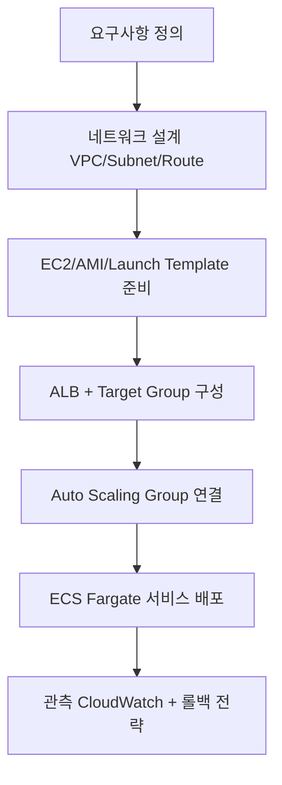

# 클라우드 인프라 및 아키텍처 핵심 개념 가이드
  
본 문서는 클라우드 도입, 거버넌스, 시스템 설계 및 관련 비즈니스 생태계에 대한 핵심 개념을 일목요연하게 정리한 가이드입니다.
 
---

## 1. 클라우드 거버넌스 (Cloud Governance)
기업이 클라우드 서비스를 도입하고 사용할 때, 비용, 보안, 운영, 준수 관리(Compliance) 등을 통제하고 최적화하기 위해 수립하는 정책, 프로세스, 프레임워크의 집합입니다.

* **핵심 목적:** "자율성을 주되, 통제력은 잃지 않는다" (속도와 통제의 균형)
* **5대 핵심 요소:**
    1.  **비용 관리 및 최적화 (FinOps):** 태깅(Tagging)을 통한 비용 추적 및 미사용 자원 자동 종료
    2.  **보안 및 위험 관리:** 데이터 암호화 표준 정의 및 네트워크 방화벽 규칙 자동화
    3.  **신원 및 접근 권한 관리 (IAM):** 최소 권한의 원칙(Principle of Least Privilege) 및 MFA 의무화
    4.  **자원 및 운영 관리:** 인프라를 코드로 관리(IaC)하여 휴먼 에러 방지
    5.  **규정 준수 (Compliance):** 국내외 법적 규제(ISMS-P, GDPR 등) 준수 및 로깅 체계 구축

---

## 2. 인프라 운영 방식: 온프레미스 vs 클라우드
| 비교 항목 | 온프레미스 (On-Premise) | 클라우드 (Cloud) |
| :--- | :--- | :--- |
| **인프라 위치** | 회사 내 전산실 또는 자체 데이터 센터 | 클라우드 공급사(AWS, Azure 등)의 데이터 센터 |
| **비용 구조** | **초기 투자 비용(CapEx)** 중심 | **운영 비용(OpEx)** 중심 (종량제) |
| **준비 기간** | 장비 주문 및 설치까지 수주~수개월 소요 | 클릭 몇 번으로 수분 이내 자원 생성 |
| **확장성** | 하드웨어 추가 구매 필요 (느림) | 트래픽 변화에 따라 실시간 스케일링 가능 |
| **유지 보수** | 내부 IT 인력이 직접 관리 및 수리 | 하드웨어 관리는 클라우드 제조사가 전담 |

* **하이브리드 클라우드 (Hybrid Cloud):** 보안이 중요한 핵심 DB는 온프레미스에 두고, 트래픽 변화가 심한 웹 서비스나 AI 연산은 클라우드를 활용하는 혼합형 모델이 최신 트렌드입니다.

---

## 3. 격리 환경: 플레이그라운드 vs 샌드박스
운영 환경(Production)에 영향을 주지 않도록 격리된 가상 환경을 의미하지만, 목적에 따라 차이가 있습니다.

* **플레이그라운드 (Playground):** 개발자가 신기술을 마음껏 실험하고 학습할 수 있도록 규제를 최소화한 안전한 모래놀이터 (혁신 중심).
* **샌드박스 (Sandbox):** 외부와의 상호 작용을 철저히 차단하고 악성코드 검사나 위험한 시스템 변형을 사전에 차단하기 위해 통제된 환경 (보안 중심).

---

## 4. IT 아키텍트 직무 분류 (TA / AA)
아키텍트(Architect)는 비즈니스 요구사항을 바탕으로 기술적 뼈대를 구성하는 설계자입니다.

* **TA (Technical Architect / 테크니컬 아키텍트):**
    * **역할:** 서버, 네트워크, 스토리지, OS, 미들웨어 등 **하드웨어 및 시스템 인프라** 영역 설계.
    * **핵심 관심사:** 고가용성(HA), 성능 최적화, 장애 복구(Failover), 보안 구조.
* **AA (Application Architect / 어플리케이션 아키텍트):**
    * **역할:** 프로그램 자체의 구조, 공통 프레임워크, 디자인 패턴 등 **소프트웨어 및 소스 코드** 영역 설계.
    * **핵심 관심사:** 개발 생산성, 유지 보수성, 마이크로서비스 아키텍처(MSA) 설계.
* **DA (Data Architect / 데이터 아키텍트):** 데이터 모델링, DB 구조 표준화 및 전사 데이터 흐름 설계 담당.


---

## 5. 클라우드 생태계의 주요 제공업체 (ISP, CSP, MSP)
* **ISP (Internet Service Provider / 인터넷 서비스 제공업체):** 통신망을 구축하여 인터넷 접속을 제공하는 기업 (예: KT, SKB, LGU+).
* **CSP (Cloud Service Provider / 클라우드 서비스 제공업체):** 대규모 데이터 센터를 기반으로 가상화된 인프라를 빌려주는 원천 기업 (예: AWS, Azure, GCP).
* **MSP (Managed Service Provider / 클라우드 관리 서비스 제공업체):** 기업이 클라우드를 잘 도입하고 운영할 수 있도록 컨설팅, 이관, 관제를 대행하는 전문 기업 (예: 메가존클라우드, 베스핀글로벌).


## AWS 회원가입·보안 기본 설정부터 EC2 네트워크, ALB, Auto Scaling, ECS Fargate 배포까지  
## Lab 스타일로 단계별로 따라갈 수 있도록 정리한 저장소입니다.

---

## 시작 전에: 개인별 필수 준비 가이드

이 저장소는 **AWS 계정 보안 설정 → EC2/VPC/ALB → ECS Fargate 배포** 순서로 진행합니다.  
아래 항목을 먼저 갖추면 실습 중단 없이 진행할 수 있습니다.

### 1) 개인별 습득 권장 기술 스택

| 구분 | 최소 필요 수준 | 왜 필요한가 |
|---|---|---|
| AWS 기본 | IAM 사용자/권한, 리전, VPC 개념을 이해 | 계정/보안/네트워크 실습의 전제 |
| 네트워크 | CIDR, Subnet, Route Table, IGW/NAT 차이 이해 | `EC2/001.md`, `EC2/002.md` 실습 정확도 향상 |
| 리눅스 기초 | SSH 접속, 파일 전송, 기본 명령(`cd`, `ls`, `cat`, `systemctl`) | EC2 인스턴스 점검/운영 실습에 필요 |
| 컨테이너 기초 | Docker 이미지 빌드/실행, 태그 개념 | ECS/ECR 실습(`ECS/001_fargate_hands_on.md`) 필수 |
| Python 기초 | 가상환경(venv), `pip`, FastAPI 실행 | `BE-fastapi`, `ai/*` 실습에 필요 |
| Git/GitHub | 저장소 클론, 브랜치/PR, GitHub Actions 개념 | `deploy` 모듈과 CI/CD 흐름 이해 |

### 2) 권장 개인 PC 사양

| 항목 | 최소 사양 | 권장 사양 |
|---|---|---|
| CPU | 2코어 이상 | 4코어 이상 |
| 메모리(RAM) | 8GB | 16GB 이상 |
| 저장공간 | 여유 10GB 이상 | 여유 20GB 이상 (Docker 이미지/로그 포함) |
| OS | Windows 10+, macOS 12+, Ubuntu 20.04+ | 최신 안정 버전 |
| 네트워크 | 안정적인 인터넷(업/다운 모두) | 유선 또는 고품질 Wi-Fi |

권장 로컬 도구:
- AWS CLI v2

---

```bash
curl "https://awscli.amazonaws.com/awscli-exe-linux-x86_64.zip" -o "awscliv2.zip"
unzip awscliv2.zip
sudo ./aws/install
```

---


- Python 3.10+
- Docker Desktop(또는 Docker Engine)
- Git + VS Code(또는 선호 IDE)
- MFA 앱(예: Google Authenticator, Microsoft Authenticator)

### 3) 가입/생성해야 할 플랫폼·계정

| 플랫폼 | 필수 여부 | 용도 |
|---|---|---|
| AWS 계정 | 필수 | EC2, ALB, ECS, ECR 등 실습 리소스 생성 |
| GitHub 계정 | 권장(배포 자동화는 사실상 필수) | 소스 관리, GitHub Actions 기반 배포 |
| MFA 인증 앱 설치 | 필수 | 루트/IAM 사용자 MFA 활성화 |
| Docker Hub 계정 | 선택 | 로컬 컨테이너 학습 보조(본 실습 핵심 배포는 ECR 사용) |

필수 선행 완료 체크:
- [ ] AWS 계정 결제 수단 등록 + 본인 인증 완료
- [ ] 루트 계정 MFA 활성화
- [ ] IAM 관리자 사용자 생성 + MFA 활성화
- [ ] `aws configure` 및 `aws sts get-caller-identity` 성공

### 4) 예상 비용(카드 청구 예상금액)

> 아래는 **서울 리전(ap-northeast-2), 온디맨드, 학습용 단기 사용** 기준의 보수적 추정치입니다.  
> 실제 청구는 사용 시간/트래픽/리소스 개수에 따라 달라지며, 반드시 AWS Billing 콘솔에서 실시간 확인하세요.

가정:
- 환율: 1 USD = 1,400 KRW(예시, 실제 결제 전 최신 환율 확인)
- 실습 중 주요 비용 리소스: ALB, EC2, ECS(Fargate), ECR 저장소, CloudWatch 로그
- 하루 실습 후 미사용 리소스 즉시 삭제

| 시나리오 | 사용 패턴(예시) | 예상 총비용(USD) | 카드 청구 예상(원화) |
|---|---|---:|---:|
| 1일 집중 실습 | ALB 6~8시간 + EC2 1~2대 단기 + ECS Task 단기 | 약 $2 ~ $8 | 약 2,800원 ~ 11,200원 |
| 1주(평일 저녁) 실습 | 평일 2~3시간씩 리소스 기동/종료 반복 | 약 $10 ~ $35 | 약 14,000원 ~ 49,000원 |
| 24시간 상시 방치 | ALB/EC2/ECS를 중지하지 않고 유지 | 약 $40+ / 월 이상 가능 | 약 56,000원+/월 이상 가능 |

비용 절감 핵심:
- 실습 종료 즉시 `ALB`, `EC2`, `ECS Service`, `EIP`, 불필요 `ECR` 이미지를 삭제
- ECS 서비스는 미사용 시 Desired Count를 0으로 조정
- Billing Alarm(예: 10 USD, 30 USD) 사전 설정
- 프리티어 대상 여부를 계정 생성 시점 기준으로 확인
  - AWS Free Tier: https://aws.amazon.com/free/
  - AWS Billing 콘솔의 Free Tier 페이지에서 월별 사용량/잔여량 확인

---

## 저장소 구조

```
aws-ec2-alb-lab/
├── EC2/                        # VPC·Subnet·IGW·ALB·ASG 실습 (CLI + 콘솔)
│   ├── 000_aws_onboarding_lab.md   # 회원가입 / IAM / MFA / AWS CLI
│   ├── 001.md                      # VPC·Subnet·IGW·라우팅 (CLI)
│   ├── 002.md                      # ALB·Target Group·Listener (CLI)
│   ├── 003.md                      # ASG 운용 점검 + EC2 Instance Connect 트러블슈팅
│   ├── 004.md                      # 콘솔 기반 AMI·Template·ASG 체크리스트
│   ├── 005.md                      # 애플리케이션 런타임 준비 (JDK·SFTP)
│   ├── 008.md                      # 운영 점검용 CLI 조회 명령 모음
│   ├── template.json               # Launch Template 예시 JSON
│   └── redact_ec2_images.py        # EC2 스크린샷 민감정보 마스킹 스크립트
│
├── ECS/                        # ECS Fargate 배포 실습
│   ├── aws_ecs_fargate_summary.md  # ECS·Fargate 핵심 개념 정리
│   ├── 001_fargate_hands_on.md     # ECR 빌드·푸시 → Fargate 서비스 배포
│   ├── 002_ecs_alb_lab.md          # ECS Service + ALB 경로 기반 라우팅
│   └── 003_study_checklist.md      # 스터디 점검 질문 모음
│
├── LB/                         # Load Balancer 학습
│   └── 001_alb_settings_lab.md     # ALB vs NLB 비교·설정·점검·트러블슈팅
│
├── BE-fastapi/                 # Docker 기반 FastAPI 샘플 API
│   ├── app/
│   │   └── main.py                 # FastAPI 앱 본체
│   ├── Dockerfile
│   └── requirements.txt
│
├── ag-grid-app/                # Nginx에 배포 가능한 AG Grid 정적 앱
│   ├── index.html
│   ├── styles.css
│   └── app.js
│
├── deploy/                     # ECS 배포 자동화 샘플 3종
│   ├── shell/
│   │   ├── deploy_ecs_cli.sh       # Shell Script 방식
│   │   └── deploy.env.example      # 환경변수 템플릿
│   └── ansible/
│       ├── deploy_ecs_cli.yml      # Ansible Playbook 방식
│       ├── inventory.ini
│       └── group_vars/all.yml
│
├── .github/workflows/          # GitHub Actions 배포 워크플로우 3종
│   ├── deploy-dockerhub-ec2.yml    # Docker Hub → EC2 배포
│   ├── deploy-ecr-ec2.yml          # ECR → EC2 배포
│   └── deploy-ecs-aws-cli.yml      # ECR → ECS Fargate 배포
│
├── ai/                         # AWS AI 서비스별 Python 실습
│   ├── bedrock-python-llm/         # Bedrock/Claude 호출 예시
│   ├── comprehend-python/          # 감성 분석·개체명 인식·언어 감지
│   ├── lex-python/                 # Lex v2 챗봇 대화 세션
│   ├── polly-python/               # 텍스트→음성(TTS) 변환
│   ├── rekognition-python/         # 이미지 레이블·얼굴·텍스트 분석
│   ├── textract-python/            # 문서 OCR·폼(KEY-VALUE) 추출
│   ├── transcribe-python/          # 음성→텍스트(ASR) 변환
│   └── financial-rag-python/       # 금융공학 RAG 커리큘럼 + Python 실습
│
├── assets/                     # 다이어그램 이미지
│   ├── aws-study-flow.svg
│   └── aws-cloud-architecture.svg
```

---

## 학습 범위

| 폴더 | 내용 |
|---|---|
| `EC2` | 회원가입·IAM·MFA·AWS CLI 온보딩, VPC·Subnet·IGW·라우팅, ALB·Target Group, ASG, AMI·Launch Template |
| `ECS` | ECS/Fargate 핵심 개념, ECR 이미지 빌드·배포, ALB 연동, CloudWatch 로그·헬스체크 |
| `LB` | ALB vs NLB 비교, Listener·Rule·Target Group, 헬스체크, 트러블슈팅 |
| `BE-fastapi` | FastAPI Hello World API, Docker 빌드·실행 |
| `ag-grid-app` | 바닐라 HTML/JS 기반 AG Grid 정적 앱, Nginx 배포 |
| `deploy` | Shell / Ansible / GitHub Actions 3가지 방식의 ECS 배포 자동화 |
| `ai` | Bedrock, Comprehend, Lex, Polly, Rekognition, Textract, Transcribe + 금융공학 RAG Python 실습 |

---

## 권장 학습 순서



### 순서도 이미지


### AWS 클라우드 아키텍처 다이어그램


### 단계별 학습 경로

| 단계 | 파일 | 핵심 내용 |
|---|---|---|
| 1 | [EC2/000_aws_onboarding_lab.md](EC2/000_aws_onboarding_lab.md) | AWS 계정 생성, 루트·IAM MFA, AWS CLI 설치·검증 |
| 2 | [EC2/001.md](EC2/001.md) | VPC·Subnet 2개·IGW·Route Table·퍼블릭 IP 자동할당 |
| 3 | [EC2/002.md](EC2/002.md) | ALB 보안그룹·Target Group·Listener 구성 |
| 4 | [EC2/003.md](EC2/003.md) | ASG 상태 점검, EC2 Instance Connect 트러블슈팅, 부하 테스트 |
| 5 | [EC2/004.md](EC2/004.md) | 콘솔에서 AMI·Launch Template·ASG·LB 연결 재점검 |
| 6 | [EC2/005.md](EC2/005.md) | JDK 설치·SFTP 파일 전송·앱 실행 |
| 7 | [LB/001_alb_settings_lab.md](LB/001_alb_settings_lab.md) | ALB vs NLB, Listener·Rule 구조, 헬스체크·503 진단 |
| 8 | [ECS/aws_ecs_fargate_summary.md](ECS/aws_ecs_fargate_summary.md) | ECS·Fargate 개념 정리 |
| 9 | [ECS/001_fargate_hands_on.md](ECS/001_fargate_hands_on.md) | ECR 빌드·푸시 → Fargate 서비스 배포·삭제 |
| 10 | [ECS/002_ecs_alb_lab.md](ECS/002_ecs_alb_lab.md) | ECS Service + ALB 경로 기반 라우팅·트러블슈팅 |
| 11 | [ECS/003_study_checklist.md](ECS/003_study_checklist.md) | 스터디 점검 질문 셀프 체크 |

---

## 실습 전 준비 사항

- AWS 계정 생성 및 결제·본인 인증 완료
- 루트 계정 + IAM 사용자 MFA 활성화
- AWS CLI v2 설치 및 `aws configure` 완료
- 기본 리전 확정 (예: `ap-northeast-2`)
- 비용 발생 리소스(ALB, EC2, ECS, EIP) 생성·삭제 계획 수립

---

## 빠른 시작 (처음 방문한 경우)

### 1) 최소 학습 동선
- 인프라 기초부터 시작: [EC2/000_aws_onboarding_lab.md](EC2/000_aws_onboarding_lab.md) → [EC2/001.md](EC2/001.md) → [EC2/002.md](EC2/002.md)
- ECS까지 확장: [ECS/aws_ecs_fargate_summary.md](ECS/aws_ecs_fargate_summary.md) → [ECS/001_fargate_hands_on.md](ECS/001_fargate_hands_on.md)
- 배포 자동화 연결: [deploy/README.md](deploy/README.md)  
  - Docker Hub → EC2: [deploy-dockerhub-ec2.yml](.github/workflows/deploy-dockerhub-ec2.yml)  
  - ECR → EC2: [deploy-ecr-ec2.yml](.github/workflows/deploy-ecr-ec2.yml)  
  - ECR → ECS Fargate: [deploy-ecs-aws-cli.yml](.github/workflows/deploy-ecs-aws-cli.yml)

### 2) 로컬에서 바로 실행해볼 샘플
```bash
# FastAPI 샘플
cd BE-fastapi
python -m venv .venv && source .venv/bin/activate
pip install -r requirements.txt
uvicorn app.main:app --host 0.0.0.0 --port 8000

# AG Grid 정적 앱 (별도 터미널)
cd ag-grid-app
python3 -m http.server 8080
```

### 3) 학습 목적별 추천 진입점
| 목적 | 먼저 볼 문서 |
|---|---|
| AWS 계정/보안 온보딩 | [EC2/000_aws_onboarding_lab.md](EC2/000_aws_onboarding_lab.md) |
| ALB/Target Group 구조 이해 | [EC2/002.md](EC2/002.md), [LB/001_alb_settings_lab.md](LB/001_alb_settings_lab.md) |
| ECS Fargate 배포 실습 | [ECS/001_fargate_hands_on.md](ECS/001_fargate_hands_on.md) |
| GitHub Actions 배포 자동화 (Docker Hub→EC2) | [deploy-dockerhub-ec2.yml](.github/workflows/deploy-dockerhub-ec2.yml) |
| GitHub Actions 배포 자동화 (ECR→EC2) | [deploy-ecr-ec2.yml](.github/workflows/deploy-ecr-ec2.yml) |
| GitHub Actions 배포 자동화 (ECR→ECS) | [deploy-ecs-aws-cli.yml](.github/workflows/deploy-ecs-aws-cli.yml) |
| WSL→IAM→S3→EC2→ECR→GitHub Actions 를 CLI 로 한 번에 | [AWS CLI 엔드투엔드 실습 로드맵](#aws-cli-엔드투엔드-실습-로드맵-wsl--iam--s3--ec2--ecr--github-actions) |
| 주식투자 웹앱 플랫폼을 AWS 위에 운영 구성 | [AWS 기반 주식투자 웹앱 플랫폼 시스템 구성](#aws-기반-주식투자-웹앱-플랫폼-시스템-구성-aws-cli) |

---

## AWS CLI 엔드투엔드 실습 로드맵 (WSL → IAM → S3 → EC2 → ECR → GitHub Actions)

개인 PC의 WSL 환경 준비부터 GitHub Actions 자동화까지, **콘솔 클릭 대신 AWS CLI 명령으로** 전 과정을 한 번에 따라가는 통합 가이드입니다.  
각 단계는 독립적으로 실행할 수 있지만, 순서대로 진행하면 앞 단계에서 만든 리소스 ID를 그대로 이어서 사용할 수 있습니다.

```
[0] WSL 준비 ─► [1] AWS CLI 설치 ─► [2] IAM 사용자/MFA ─► [3] aws configure
                                                                  │
      ┌───────────────────────────────────────────────────────────┘
      ▼
[4] S3용 IAM 정책 ─► [5] S3 버킷 + 정적 웹 호스팅 ─► [6] 정적 파일 업로드 ─► [13] CloudFront 연동
      │
      ▼
[7] EC2 생성 ─► [8] EIP 할당 ─► [9] EIP↔EC2 연결 ─► [10] 보안그룹 ─► [11] AMI ─► [12] 기동/중지
      │
      ▼
[14] EC2 접속 + Docker 설치 ─► [15] Docker 이미지 빌드/업로드 ─► [16] ECR 리포지토리 ─► [17] ECR 이미지 푸시
      │
      ▼
[18] GitHub Actions 로 전체 자동화 ─► [19] 리소스 정리
```

> 표기 규칙  
> - 계정 ID, 리소스 ID 등은 `xxxxxxxx` 대신 **셸 변수**(`$ACCOUNT_ID`, `$INSTANCE_ID` 등)로 표기합니다. 각 단계에서 변수를 먼저 채운 뒤 명령을 실행하세요.  
> - 리전은 서울(`ap-northeast-2`)을 기준으로 합니다.  
> - 새 터미널을 열면 변수가 사라지므로, 작업 중에는 하나의 터미널을 유지하거나 `~/.aws-lab.env` 파일에 `export` 문을 모아 두고 `source` 하세요.

### 공통 변수 (터미널을 열 때마다 먼저 실행)

```bash
export AWS_REGION=ap-northeast-2
export LAB_NAME=aws-lab            # 리소스 이름 접두어 (본인 이니셜 등으로 변경 권장)
export KEY_NAME=${LAB_NAME}-key    # EC2 키페어 이름
```

---

### 0단계. 개인별 PC WSL 환경 준비

Windows 10/11에서 WSL2 + Ubuntu를 설치합니다. (PowerShell 관리자 권한)

```powershell
wsl --install -d Ubuntu-22.04
wsl --set-default-version 2
wsl -l -v            # VERSION 이 2 인지 확인
```

Ubuntu(WSL) 터미널에서 기본 도구 설치:

```bash
sudo apt-get update && sudo apt-get upgrade -y
sudo apt-get install -y unzip curl git jq ca-certificates gnupg lsb-release
```

Docker는 두 가지 중 하나를 선택합니다.

| 방식 | 설명 | 확인 명령 |
|---|---|---|
| Docker Desktop (권장) | Windows에 설치 후 Settings → Resources → WSL Integration 에서 Ubuntu 활성화 | `docker version` |
| Docker Engine 직접 설치 | WSL 안에 apt 로 설치 (아래 14단계와 동일한 스크립트) | `sudo systemctl status docker` |

WSL 체크리스트:
- [ ] `wsl -l -v` 에서 Ubuntu 가 VERSION 2
- [ ] `docker run --rm hello-world` 성공
- [ ] `git config --global user.name / user.email` 설정 완료
- [ ] 프로젝트는 `/mnt/c/...` 가 아닌 **WSL 홈(`~/`)** 아래에 클론 (파일 I/O 속도 및 권한 문제 예방)

```bash
cd ~
git clone https://github.com/edumgt/aws-ec2-alb-lab.git
cd aws-ec2-alb-lab
```

---

### 1단계. AWS CLI v2 설치 (WSL)

```bash
cd ~
curl "https://awscli.amazonaws.com/awscli-exe-linux-x86_64.zip" -o "awscliv2.zip"
unzip -q awscliv2.zip
sudo ./aws/install
aws --version        # aws-cli/2.x.x 출력 확인
rm -rf awscliv2.zip aws
```

이미 설치된 경우 업데이트:

```bash
sudo ./aws/install --bin-dir /usr/local/bin --install-dir /usr/local/aws-cli --update
```

자동 완성 설정(선택):

```bash
echo 'complete -C /usr/local/bin/aws_completer aws' >> ~/.bashrc
source ~/.bashrc
```

---

### 2단계. AWS IAM 설정 (루트 보호 → 관리자 사용자 → 액세스 키)

**루트 계정으로 해야 하는 최소 작업(콘솔, 1회만)**
1. 루트 계정 MFA 활성화 (IAM → 보안 자격 증명)
2. 첫 번째 IAM 관리자 사용자 생성 + 콘솔 로그인 + 액세스 키 발급  
   (CLI 자격 증명이 아직 없으므로 첫 사용자는 콘솔에서 만듭니다)

자세한 캡처 기반 절차 → [EC2/000_aws_onboarding_lab.md](EC2/000_aws_onboarding_lab.md)

**이후 추가 사용자는 CLI 로 생성** (관리자 자격 증명으로 3단계 `aws configure` 완료 후 실행 가능)

```bash
export IAM_USER=${LAB_NAME}-cli

# 1) 사용자 생성
aws iam create-user --user-name "$IAM_USER"

# 2) 실습용 권한 부여 (학습 편의상 PowerUser, 운영에서는 최소 권한 정책으로 교체)
aws iam attach-user-policy \
  --user-name "$IAM_USER" \
  --policy-arn arn:aws:iam::aws:policy/PowerUserAccess

# IAM 자체를 다뤄야 하면(정책/역할 생성) 아래도 추가
aws iam attach-user-policy \
  --user-name "$IAM_USER" \
  --policy-arn arn:aws:iam::aws:policy/IAMFullAccess

# 3) 액세스 키 발급 → 출력된 AccessKeyId / SecretAccessKey 를 안전한 곳에 보관
aws iam create-access-key --user-name "$IAM_USER" \
  --query 'AccessKey.{AccessKeyId:AccessKeyId,SecretAccessKey:SecretAccessKey}' \
  --output table

# 4) 콘솔 로그인이 필요하면 로그인 프로필 생성
aws iam create-login-profile --user-name "$IAM_USER" \
  --password 'Temp#Passw0rd!' --password-reset-required
```

가상 MFA 장치를 CLI 로 등록(선택):

```bash
aws iam create-virtual-mfa-device \
  --virtual-mfa-device-name "${IAM_USER}-mfa" \
  --outfile ~/${IAM_USER}-qr.png --bootstrap-method QRCodePNG
# QR 이미지를 인증 앱으로 스캔 후 연속된 코드 2개 입력
aws iam enable-mfa-device \
  --user-name "$IAM_USER" \
  --serial-number "arn:aws:iam::$(aws sts get-caller-identity --query Account --output text):mfa/${IAM_USER}-mfa" \
  --authentication-code1 123456 --authentication-code2 654321
```

액세스 키 보안 원칙:
- 키는 절대 Git 에 커밋하지 않습니다 (`.gitignore` 에 `*.csv`, `.env*` 포함 확인).
- 90일 주기로 교체: `aws iam create-access-key` → 교체 → `aws iam delete-access-key --access-key-id <OLD>`.
- CI/CD 는 가능하면 18단계의 OIDC 역할 방식을 사용합니다.

---

### 3단계. aws configure 설정

```bash
aws configure
# AWS Access Key ID     : (2단계에서 발급한 키)
# AWS Secret Access Key : (2단계에서 발급한 시크릿)
# Default region name   : ap-northeast-2
# Default output format : json
```

여러 계정/사용자를 오갈 때는 **프로파일**을 사용합니다.

```bash
aws configure --profile lab
export AWS_PROFILE=lab          # 이후 모든 명령이 lab 프로파일 사용
```

연결 검증(필수):

```bash
aws sts get-caller-identity
export ACCOUNT_ID=$(aws sts get-caller-identity --query Account --output text)
echo "ACCOUNT_ID=$ACCOUNT_ID"
```

설정 파일 위치: `~/.aws/credentials`(키), `~/.aws/config`(리전/출력 형식).  
Windows 쪽 AWS CLI 와 자격 증명을 공유하려면 `ln -s /mnt/c/Users/<사용자>/.aws ~/.aws` 로 심볼릭 링크를 걸 수 있습니다.

---

### 4단계. S3용 IAM 설정 (최소 권한 정책)

실습용 버킷 하나에만 접근할 수 있는 고객 관리형 정책을 만들고 사용자에게 연결합니다.

```bash
export BUCKET_NAME=${LAB_NAME}-static-$ACCOUNT_ID    # S3 버킷 이름은 전 세계 유일해야 함

cat > /tmp/s3-static-site-policy.json <<EOF
{
  "Version": "2012-10-17",
  "Statement": [
    {
      "Sid": "ListAllBuckets",
      "Effect": "Allow",
      "Action": ["s3:ListAllMyBuckets", "s3:GetBucketLocation"],
      "Resource": "*"
    },
    {
      "Sid": "ManageLabBucket",
      "Effect": "Allow",
      "Action": [
        "s3:CreateBucket", "s3:DeleteBucket", "s3:ListBucket",
        "s3:GetBucketWebsite", "s3:PutBucketWebsite", "s3:DeleteBucketWebsite",
        "s3:GetBucketPolicy", "s3:PutBucketPolicy", "s3:DeleteBucketPolicy",
        "s3:GetBucketPublicAccessBlock", "s3:PutBucketPublicAccessBlock",
        "s3:PutBucketOwnershipControls", "s3:GetBucketOwnershipControls"
      ],
      "Resource": "arn:aws:s3:::${BUCKET_NAME}"
    },
    {
      "Sid": "ManageLabObjects",
      "Effect": "Allow",
      "Action": ["s3:PutObject", "s3:GetObject", "s3:DeleteObject", "s3:PutObjectAcl"],
      "Resource": "arn:aws:s3:::${BUCKET_NAME}/*"
    }
  ]
}
EOF

aws iam create-policy \
  --policy-name "${LAB_NAME}-s3-static-site" \
  --policy-document file:///tmp/s3-static-site-policy.json

aws iam attach-user-policy \
  --user-name "$IAM_USER" \
  --policy-arn "arn:aws:iam::${ACCOUNT_ID}:policy/${LAB_NAME}-s3-static-site"

# 확인
aws iam list-attached-user-policies --user-name "$IAM_USER" --output table
```

> 정책을 수정할 때는 `aws iam create-policy-version --set-as-default` 를 사용합니다(버전 5개 제한).  
> 이 저장소의 정책 관리 패턴 예시 → [iam/setup/01_setup_iam_user_policy.sh](iam/setup/01_setup_iam_user_policy.sh)

---

### 5단계. S3 버킷 생성 + 정적 웹 호스팅 설정

```bash
# 1) 버킷 생성 (서울 리전은 LocationConstraint 필수)
aws s3api create-bucket \
  --bucket "$BUCKET_NAME" \
  --region "$AWS_REGION" \
  --create-bucket-configuration LocationConstraint="$AWS_REGION"

# 2) 퍼블릭 액세스 차단 해제 (정적 웹 호스팅 엔드포인트로 직접 서비스할 때만)
aws s3api put-public-access-block \
  --bucket "$BUCKET_NAME" \
  --public-access-block-configuration \
    BlockPublicAcls=false,IgnorePublicAcls=false,BlockPublicPolicy=false,RestrictPublicBuckets=false

# 3) 객체 소유권: 버킷 소유자 강제 (ACL 비활성화, 정책 기반으로만 공개)
aws s3api put-bucket-ownership-controls \
  --bucket "$BUCKET_NAME" \
  --ownership-controls 'Rules=[{ObjectOwnership=BucketOwnerEnforced}]'

# 4) 정적 웹 호스팅 활성화
aws s3 website "s3://${BUCKET_NAME}/" --index-document index.html --error-document index.html

# 5) 읽기 전용 퍼블릭 버킷 정책
cat > /tmp/bucket-policy.json <<EOF
{
  "Version": "2012-10-17",
  "Statement": [{
    "Sid": "PublicReadGetObject",
    "Effect": "Allow",
    "Principal": "*",
    "Action": "s3:GetObject",
    "Resource": "arn:aws:s3:::${BUCKET_NAME}/*"
  }]
}
EOF
aws s3api put-bucket-policy --bucket "$BUCKET_NAME" --policy file:///tmp/bucket-policy.json

# 6) 확인
aws s3api get-bucket-website --bucket "$BUCKET_NAME"
export S3_WEBSITE_URL="http://${BUCKET_NAME}.s3-website.${AWS_REGION}.amazonaws.com"
echo "$S3_WEBSITE_URL"
```

> CloudFront(13단계)를 앞단에 두고 **OAC(Origin Access Control)** 로 접근을 제한하면 2)와 5)의 퍼블릭 공개가 필요 없습니다. 학습 순서상 먼저 웹 호스팅 엔드포인트로 동작을 확인하고, 13단계에서 잠그는 흐름을 권장합니다.

---

### 6단계. AWS CLI 로 정적 파일 업로드

이 저장소의 [ag-grid-app/](ag-grid-app/) 정적 앱을 업로드합니다.

```bash
# 단일 파일
aws s3 cp ag-grid-app/index.html "s3://${BUCKET_NAME}/index.html" --content-type text/html

# 디렉터리 동기화 (변경분만 업로드, 삭제된 파일은 버킷에서도 제거)
aws s3 sync ag-grid-app/ "s3://${BUCKET_NAME}/" \
  --delete \
  --exclude "Dockerfile" --exclude "README.md" \
  --cache-control "max-age=300"

# 확인
aws s3 ls "s3://${BUCKET_NAME}/" --recursive --human-readable
curl -s -o /dev/null -w "%{http_code}\n" "$S3_WEBSITE_URL"
```

자주 쓰는 옵션:

| 옵션 | 용도 |
|---|---|
| `--dryrun` | 실제 업로드 없이 변경 목록만 출력 |
| `--exact-timestamps` | 크기 같아도 수정 시각이 다르면 다시 업로드 |
| `--content-type` | 확장자 추론이 어긋날 때 명시 (예: `.js` → `application/javascript`) |
| `--cache-control` | 브라우저/CloudFront 캐시 제어 |

---

### 7단계. AWS CLI 로 EC2 설정

```bash
# 1) 키페어 생성 (프라이빗 키는 로컬에만 저장)
aws ec2 create-key-pair \
  --key-name "$KEY_NAME" \
  --key-type ed25519 \
  --query 'KeyMaterial' --output text > ~/.ssh/${KEY_NAME}.pem
chmod 400 ~/.ssh/${KEY_NAME}.pem

# 2) 최신 Ubuntu 22.04 AMI 조회
export AMI_ID=$(aws ec2 describe-images \
  --owners 099720109477 \
  --filters "Name=name,Values=ubuntu/images/hvm-ssd/ubuntu-jammy-22.04-amd64-server-*" \
            "Name=state,Values=available" \
  --query 'sort_by(Images, &CreationDate)[-1].ImageId' --output text)

# 3) 기본 VPC / 퍼블릭 서브넷 조회
export VPC_ID=$(aws ec2 describe-vpcs --filters Name=isDefault,Values=true \
  --query 'Vpcs[0].VpcId' --output text)
export SUBNET_ID=$(aws ec2 describe-subnets \
  --filters "Name=vpc-id,Values=$VPC_ID" "Name=map-public-ip-on-launch,Values=true" \
  --query 'Subnets[0].SubnetId' --output text)

# 4) 보안그룹은 10단계에서 만들지만, 인스턴스 생성 시 필요하므로 먼저 생성
export SG_ID=$(aws ec2 create-security-group \
  --group-name "${LAB_NAME}-web-sg" \
  --description "web + ssh for lab" \
  --vpc-id "$VPC_ID" \
  --query 'GroupId' --output text)

# 5) 인스턴스 생성
export INSTANCE_ID=$(aws ec2 run-instances \
  --image-id "$AMI_ID" \
  --instance-type t3.micro \
  --key-name "$KEY_NAME" \
  --subnet-id "$SUBNET_ID" \
  --security-group-ids "$SG_ID" \
  --associate-public-ip-address \
  --block-device-mappings 'DeviceName=/dev/sda1,Ebs={VolumeSize=20,VolumeType=gp3,DeleteOnTermination=true}' \
  --tag-specifications "ResourceType=instance,Tags=[{Key=Name,Value=${LAB_NAME}-web}]" \
  --query 'Instances[0].InstanceId' --output text)

aws ec2 wait instance-running --instance-ids "$INSTANCE_ID"
aws ec2 describe-instances --instance-ids "$INSTANCE_ID" \
  --query 'Reservations[0].Instances[0].{Id:InstanceId,State:State.Name,PublicIp:PublicIpAddress,AZ:Placement.AvailabilityZone}' \
  --output table
```

VPC/서브넷/IGW 가 없는 계정에서 자동 생성까지 포함한 스크립트 → [deploy/create-ec2-docker.sh](deploy/create-ec2-docker.sh)  
Docker 설치까지 User Data 로 한 번에 처리하려면 위 스크립트의 `--user-data` 부분을 참고하세요.

---

### 8단계. AWS CLI 로 EIP(Elastic IP) 설정

인스턴스를 중지/시작하면 퍼블릭 IP 가 바뀌므로 고정 IP 가 필요하면 EIP 를 할당합니다.

```bash
export ALLOCATION_ID=$(aws ec2 allocate-address \
  --domain vpc \
  --tag-specifications "ResourceType=elastic-ip,Tags=[{Key=Name,Value=${LAB_NAME}-eip}]" \
  --query 'AllocationId' --output text)

export EIP=$(aws ec2 describe-addresses --allocation-ids "$ALLOCATION_ID" \
  --query 'Addresses[0].PublicIp' --output text)
echo "EIP=$EIP ($ALLOCATION_ID)"
```

> EIP 는 **인스턴스에 연결되지 않은 상태**이거나, 중지된 인스턴스에 연결된 상태로 남아 있으면 시간당 과금됩니다. 실습 종료 시 반드시 `release-address` 로 반납하세요(19단계).

---

### 9단계. AWS CLI 로 EIP 와 EC2 연결

```bash
export ASSOCIATION_ID=$(aws ec2 associate-address \
  --instance-id "$INSTANCE_ID" \
  --allocation-id "$ALLOCATION_ID" \
  --query 'AssociationId' --output text)

# 확인 (PublicIpAddress 가 EIP 로 바뀌어야 함)
aws ec2 describe-instances --instance-ids "$INSTANCE_ID" \
  --query 'Reservations[0].Instances[0].PublicIpAddress' --output text

# 연결 해제 / 반납 (필요 시)
aws ec2 disassociate-address --association-id "$ASSOCIATION_ID"
aws ec2 release-address --allocation-id "$ALLOCATION_ID"
```

---

### 10단계. AWS CLI 로 보안그룹 설정

7단계에서 만든 `$SG_ID` 에 인바운드 규칙을 추가합니다.

```bash
export MY_IP=$(curl -s https://checkip.amazonaws.com)/32

# SSH 는 내 IP 에서만
aws ec2 authorize-security-group-ingress --group-id "$SG_ID" \
  --ip-permissions "IpProtocol=tcp,FromPort=22,ToPort=22,IpRanges=[{CidrIp=$MY_IP,Description='my pc ssh'}]"

# HTTP(80), FastAPI(8000) 는 전체 공개
aws ec2 authorize-security-group-ingress --group-id "$SG_ID" \
  --ip-permissions \
    "IpProtocol=tcp,FromPort=80,ToPort=80,IpRanges=[{CidrIp=0.0.0.0/0,Description='http'}]" \
    "IpProtocol=tcp,FromPort=8000,ToPort=8000,IpRanges=[{CidrIp=0.0.0.0/0,Description='fastapi'}]"

# 규칙 확인
aws ec2 describe-security-groups --group-ids "$SG_ID" \
  --query 'SecurityGroups[0].IpPermissions[*].{Port:FromPort,Cidr:IpRanges[0].CidrIp,Desc:IpRanges[0].Description}' \
  --output table

# 규칙 삭제 예시 (SSH 전체 공개를 실수로 넣었을 때)
aws ec2 revoke-security-group-ingress --group-id "$SG_ID" \
  --protocol tcp --port 22 --cidr 0.0.0.0/0

# 기존 인스턴스에 보안그룹 교체/추가
aws ec2 modify-instance-attribute --instance-id "$INSTANCE_ID" --groups "$SG_ID"
```

보안그룹 참조 규칙(ALB → EC2 처럼 SG 끼리 허용)은 `--source-group` 을 사용합니다.  
VPC/보안그룹 삭제 순서 → [EC2/009_vpc_sg_delete_guide.md](EC2/009_vpc_sg_delete_guide.md)

---

### 11단계. AWS CLI 로 AMI 작업

Docker 설치 등 세팅이 끝난 인스턴스를 이미지로 저장해 재사용합니다.

```bash
# 1) AMI 생성 (--no-reboot 는 일관성 저하 가능, 학습용은 재부팅 허용 권장)
export MY_AMI_ID=$(aws ec2 create-image \
  --instance-id "$INSTANCE_ID" \
  --name "${LAB_NAME}-docker-$(date +%Y%m%d-%H%M)" \
  --description "ubuntu 22.04 + docker" \
  --tag-specifications "ResourceType=image,Tags=[{Key=Project,Value=$LAB_NAME}]" \
  --query 'ImageId' --output text)

aws ec2 wait image-available --image-ids "$MY_AMI_ID"

# 2) 내 AMI 목록
aws ec2 describe-images --owners self \
  --query 'Images[*].{Id:ImageId,Name:Name,State:State,Created:CreationDate}' --output table

# 3) 내 AMI 로 새 인스턴스 기동
aws ec2 run-instances --image-id "$MY_AMI_ID" --instance-type t3.micro \
  --key-name "$KEY_NAME" --subnet-id "$SUBNET_ID" --security-group-ids "$SG_ID" \
  --associate-public-ip-address \
  --tag-specifications "ResourceType=instance,Tags=[{Key=Name,Value=${LAB_NAME}-from-ami}]"

# 4) AMI 삭제 = 등록 해제 + 스냅샷 삭제 (둘 다 해야 과금 중단)
SNAPSHOT_IDS=$(aws ec2 describe-images --image-ids "$MY_AMI_ID" \
  --query 'Images[0].BlockDeviceMappings[*].Ebs.SnapshotId' --output text)
aws ec2 deregister-image --image-id "$MY_AMI_ID"
for s in $SNAPSHOT_IDS; do aws ec2 delete-snapshot --snapshot-id "$s"; done
```

콘솔 캡처와 함께 보는 AMI 가이드 → [EC2/010_ami_guide.md](EC2/010_ami_guide.md)

---

### 12단계. AWS CLI 로 서버 기동 / 중지

```bash
# 중지 (EBS 는 유지, 컴퓨팅 과금 중단, 퍼블릭 IP 는 EIP 아니면 변경됨)
aws ec2 stop-instances --instance-ids "$INSTANCE_ID"
aws ec2 wait instance-stopped --instance-ids "$INSTANCE_ID"

# 시작
aws ec2 start-instances --instance-ids "$INSTANCE_ID"
aws ec2 wait instance-running --instance-ids "$INSTANCE_ID"

# 재부팅
aws ec2 reboot-instances --instance-ids "$INSTANCE_ID"

# 상태 조회 (Name 태그 기준)
aws ec2 describe-instances \
  --filters "Name=tag:Name,Values=${LAB_NAME}-*" \
  --query 'Reservations[*].Instances[*].{Name:Tags[?Key==`Name`].Value|[0],Id:InstanceId,State:State.Name,Ip:PublicIpAddress}' \
  --output table

# 종료(삭제) — 되돌릴 수 없음
aws ec2 terminate-instances --instance-ids "$INSTANCE_ID"
aws ec2 wait instance-terminated --instance-ids "$INSTANCE_ID"
```

중지 상태에서 인스턴스 타입을 바꾸려면:

```bash
aws ec2 modify-instance-attribute --instance-id "$INSTANCE_ID" --instance-type '{"Value":"t3.small"}'
```

---

### 13단계. AWS CLI 로 CloudFront 연동 (S3 정적 사이트 앞단)

두 가지 방식 중 하나를 선택합니다.

| 방식 | 오리진 | 특징 |
|---|---|---|
| A. 웹 호스팅 엔드포인트 | `bucket.s3-website.region.amazonaws.com` (Custom Origin, HTTP only) | 5단계 그대로 사용, 설정 단순 |
| B. OAC (권장) | `bucket.s3.region.amazonaws.com` (S3 Origin) | 버킷 비공개 유지, CloudFront 만 접근 허용 |

**방식 B (OAC) 예시**

```bash
# 1) OAC 생성
export OAC_ID=$(aws cloudfront create-origin-access-control \
  --origin-access-control-config \
    "Name=${LAB_NAME}-oac,SigningProtocol=sigv4,SigningBehavior=always,OriginAccessControlOriginType=s3" \
  --query 'OriginAccessControl.Id' --output text)

# 2) 배포 설정 JSON
cat > /tmp/cf-dist.json <<EOF
{
  "CallerReference": "${LAB_NAME}-$(date +%s)",
  "Comment": "${LAB_NAME} static site",
  "Enabled": true,
  "DefaultRootObject": "index.html",
  "Origins": {
    "Quantity": 1,
    "Items": [{
      "Id": "s3-${BUCKET_NAME}",
      "DomainName": "${BUCKET_NAME}.s3.${AWS_REGION}.amazonaws.com",
      "OriginAccessControlId": "${OAC_ID}",
      "S3OriginConfig": { "OriginAccessIdentity": "" }
    }]
  },
  "DefaultCacheBehavior": {
    "TargetOriginId": "s3-${BUCKET_NAME}",
    "ViewerProtocolPolicy": "redirect-to-https",
    "AllowedMethods": { "Quantity": 2, "Items": ["GET", "HEAD"] },
    "Compress": true,
    "CachePolicyId": "658327ea-f89d-4fab-a63d-7e88639e58f6"
  },
  "CustomErrorResponses": {
    "Quantity": 1,
    "Items": [{ "ErrorCode": 403, "ResponsePagePath": "/index.html", "ResponseCode": "200", "ErrorCachingMinTTL": 10 }]
  },
  "PriceClass": "PriceClass_200"
}
EOF
# CachePolicyId 658327ea-... 는 AWS 관리형 "CachingOptimized" 정책

# 3) 배포 생성
export DIST_ID=$(aws cloudfront create-distribution \
  --distribution-config file:///tmp/cf-dist.json \
  --query 'Distribution.Id' --output text)
export CF_DOMAIN=$(aws cloudfront get-distribution --id "$DIST_ID" \
  --query 'Distribution.DomainName' --output text)

# 4) 버킷 정책을 "이 배포만 읽기 허용"으로 교체 → 퍼블릭 차단 다시 활성화
cat > /tmp/bucket-policy-oac.json <<EOF
{
  "Version": "2012-10-17",
  "Statement": [{
    "Sid": "AllowCloudFrontOAC",
    "Effect": "Allow",
    "Principal": { "Service": "cloudfront.amazonaws.com" },
    "Action": "s3:GetObject",
    "Resource": "arn:aws:s3:::${BUCKET_NAME}/*",
    "Condition": { "StringEquals": { "AWS:SourceArn": "arn:aws:cloudfront::${ACCOUNT_ID}:distribution/${DIST_ID}" } }
  }]
}
EOF
aws s3api put-bucket-policy --bucket "$BUCKET_NAME" --policy file:///tmp/bucket-policy-oac.json
aws s3api put-public-access-block --bucket "$BUCKET_NAME" \
  --public-access-block-configuration \
    BlockPublicAcls=true,IgnorePublicAcls=true,BlockPublicPolicy=true,RestrictPublicBuckets=true

# 5) 배포 완료 대기 후 접속 (수 분 소요)
aws cloudfront wait distribution-deployed --id "$DIST_ID"
echo "https://${CF_DOMAIN}"
```

파일을 다시 업로드한 뒤 캐시 무효화:

```bash
aws s3 sync ag-grid-app/ "s3://${BUCKET_NAME}/" --delete --exclude "Dockerfile" --exclude "README.md"
aws cloudfront create-invalidation --distribution-id "$DIST_ID" --paths "/*"
```

삭제 순서(비활성화 → 삭제):

```bash
ETAG=$(aws cloudfront get-distribution-config --id "$DIST_ID" --query ETag --output text)
aws cloudfront get-distribution-config --id "$DIST_ID" --query DistributionConfig \
  | jq '.Enabled=false' > /tmp/cf-disable.json
aws cloudfront update-distribution --id "$DIST_ID" --if-match "$ETAG" --distribution-config file:///tmp/cf-disable.json
aws cloudfront wait distribution-deployed --id "$DIST_ID"
ETAG=$(aws cloudfront get-distribution-config --id "$DIST_ID" --query ETag --output text)
aws cloudfront delete-distribution --id "$DIST_ID" --if-match "$ETAG"
```

---

### 14단계. EC2 접속 및 Docker 설치

**접속 방법 3가지**

```bash
export EC2_HOST=${EIP:-$(aws ec2 describe-instances --instance-ids "$INSTANCE_ID" \
  --query 'Reservations[0].Instances[0].PublicIpAddress' --output text)}

# (a) SSH 키페어
ssh -i ~/.ssh/${KEY_NAME}.pem ubuntu@"$EC2_HOST"

# (b) EC2 Instance Connect — 60초 유효 임시 키 등록 후 SSH (SG 22 허용 필요)
aws ec2-instance-connect send-ssh-public-key \
  --instance-id "$INSTANCE_ID" --instance-os-user ubuntu \
  --ssh-public-key file://~/.ssh/id_ed25519.pub
ssh ubuntu@"$EC2_HOST"

# (c) SSM Session Manager — 22번 포트 없이 접속 (인스턴스에 SSM 역할 + Session Manager 플러그인 필요)
aws ssm start-session --target "$INSTANCE_ID"
```

**Docker 설치 (EC2 안에서 실행, Ubuntu 22.04)**

```bash
sudo apt-get update -y
sudo apt-get install -y ca-certificates curl gnupg lsb-release
sudo install -m 0755 -d /etc/apt/keyrings
curl -fsSL https://download.docker.com/linux/ubuntu/gpg | sudo gpg --dearmor -o /etc/apt/keyrings/docker.gpg
sudo chmod a+r /etc/apt/keyrings/docker.gpg
echo "deb [arch=$(dpkg --print-architecture) signed-by=/etc/apt/keyrings/docker.gpg] \
  https://download.docker.com/linux/ubuntu $(. /etc/os-release && echo $VERSION_CODENAME) stable" \
  | sudo tee /etc/apt/sources.list.d/docker.list > /dev/null
sudo apt-get update -y
sudo apt-get install -y docker-ce docker-ce-cli containerd.io docker-buildx-plugin docker-compose-plugin
sudo systemctl enable --now docker
sudo usermod -aG docker ubuntu
newgrp docker
docker run --rm hello-world

# EC2 에서 ECR 을 쓰려면 AWS CLI 도 설치
sudo apt-get install -y unzip
curl -s "https://awscli.amazonaws.com/awscli-exe-linux-x86_64.zip" -o awscliv2.zip && unzip -q awscliv2.zip && sudo ./aws/install
```

WSL 에서 원격으로 한 번에 실행하려면:

```bash
ssh -i ~/.ssh/${KEY_NAME}.pem ubuntu@"$EC2_HOST" 'bash -s' < deploy/shell/ec2-apply.sh
```

> EC2 에 액세스 키를 넣지 않고 ECR 을 사용하려면 **인스턴스 프로파일**을 붙입니다.  
> `bash iam/setup/02_setup_ec2_role.sh` 실행 후:
> ```bash
> aws ec2 associate-iam-instance-profile --instance-id "$INSTANCE_ID" \
>   --iam-instance-profile Name=EC2ECRPullRole
> ```

---

### 15단계. Docker 이미지 빌드 및 업로드

WSL 에서 이미지를 빌드하고 EC2 로 전달하는 3가지 경로입니다.

```bash
# 빌드 (BE: FastAPI, FE: Nginx 정적)
docker build -t be-test:latest ./BE-fastapi
docker build -t fe-test:latest ./ag-grid-app
```

| 경로 | 명령 | 언제 쓰나 |
|---|---|---|
| (1) Docker Hub | `docker tag be-test:latest <hub-id>/be-test:latest && docker push <hub-id>/be-test:latest` | 공개 이미지, 빠른 실험 |
| (2) 파일 전송 | `docker save be-test:latest \| gzip \| ssh -i ~/.ssh/${KEY_NAME}.pem ubuntu@$EC2_HOST 'gunzip \| docker load'` | 레지스트리 없이 1회성 배포 |
| (3) ECR (권장) | 16~17단계 | AWS IAM 으로 권한 통제, GitHub Actions 연계 |

EC2 에서 실행:

```bash
ssh -i ~/.ssh/${KEY_NAME}.pem ubuntu@"$EC2_HOST" <<'REMOTE'
docker rm -f fastapi-app fe-ag-grid 2>/dev/null || true
docker run -d --name fastapi-app --restart unless-stopped -p 8000:8000 be-test:latest
docker run -d --name fe-ag-grid  --restart unless-stopped -p 80:80     fe-test:latest
docker ps --format 'table {{.Names}}\t{{.Status}}\t{{.Ports}}'
REMOTE

curl -s "http://$EC2_HOST:8000/health"
curl -s -o /dev/null -w "%{http_code}\n" "http://$EC2_HOST/"
```

Docker Hub 경로를 GitHub Actions 로 자동화한 예시 → [.github/workflows/deploy-dockerhub-ec2.yml](.github/workflows/deploy-dockerhub-ec2.yml)

---

### 16단계. AWS CLI 로 ECR 작업

```bash
export ECR_REGISTRY="${ACCOUNT_ID}.dkr.ecr.${AWS_REGION}.amazonaws.com"

# 1) 리포지토리 생성 (BE / FE)
for repo in be-test fe-test; do
  aws ecr create-repository \
    --repository-name "$repo" \
    --image-scanning-configuration scanOnPush=true \
    --image-tag-mutability MUTABLE \
    --encryption-configuration encryptionType=AES256 \
    --query 'repository.repositoryUri' --output text
done

# 2) 수명 주기 정책: 태그 없는 이미지 7일 후 삭제, 최근 10개만 유지
cat > /tmp/ecr-lifecycle.json <<'EOF'
{
  "rules": [
    { "rulePriority": 1, "description": "untagged 7d",
      "selection": { "tagStatus": "untagged", "countType": "sinceImagePushed", "countUnit": "days", "countNumber": 7 },
      "action": { "type": "expire" } },
    { "rulePriority": 2, "description": "keep last 10",
      "selection": { "tagStatus": "any", "countType": "imageCountMoreThan", "countNumber": 10 },
      "action": { "type": "expire" } }
  ]
}
EOF
for repo in be-test fe-test; do
  aws ecr put-lifecycle-policy --repository-name "$repo" --lifecycle-policy-text file:///tmp/ecr-lifecycle.json
done

# 3) 조회
aws ecr describe-repositories --query 'repositories[*].{Name:repositoryName,Uri:repositoryUri}' --output table

# 4) 푸시 권한 (IAM 사용자에 ECR Push 정책 연결) — 저장소 스크립트 사용
bash iam/setup/01_setup_iam_user_policy.sh     # 정책 JSON: iam/policies/ecr-push-policy.json
```

---

### 17단계. AWS CLI 로 ECR 에 이미지 업로드

```bash
# 1) 로그인 (토큰 12시간 유효)
aws ecr get-login-password --region "$AWS_REGION" \
  | docker login --username AWS --password-stdin "$ECR_REGISTRY"

# 2) 태그 & 푸시
export IMAGE_TAG=$(git rev-parse --short HEAD)   # 또는 latest
docker tag be-test:latest "$ECR_REGISTRY/be-test:$IMAGE_TAG"
docker tag fe-test:latest "$ECR_REGISTRY/fe-test:$IMAGE_TAG"
docker push "$ECR_REGISTRY/be-test:$IMAGE_TAG"
docker push "$ECR_REGISTRY/fe-test:$IMAGE_TAG"

# 3) 확인
aws ecr describe-images --repository-name be-test \
  --query 'sort_by(imageDetails,&imagePushedAt)[-5:].{Tag:imageTags[0],Pushed:imagePushedAt,MB:imageSizeInBytes}' \
  --output table

# 4) 취약점 스캔 결과
aws ecr describe-image-scan-findings --repository-name be-test --image-id imageTag="$IMAGE_TAG" \
  --query 'imageScanFindings.findingSeverityCounts'
```

빌드 + 푸시를 한 번에 → `bash deploy/ecr-push-be.sh` ([deploy/ecr-push-be.sh](deploy/ecr-push-be.sh), `IMAGE_TAG=v1.0.0` 환경변수로 태그 지정)

**EC2 에서 ECR 이미지 pull & 실행**

```bash
ssh -i ~/.ssh/${KEY_NAME}.pem ubuntu@"$EC2_HOST" bash -s -- "$ECR_REGISTRY" "$AWS_REGION" "$IMAGE_TAG" <<'REMOTE'
REG=$1; REGION=$2; TAG=$3
aws ecr get-login-password --region "$REGION" | docker login --username AWS --password-stdin "$REG"
docker pull "$REG/be-test:$TAG"; docker pull "$REG/fe-test:$TAG"
docker rm -f fastapi-app fe-ag-grid 2>/dev/null || true
docker run -d --name fastapi-app --restart unless-stopped -p 8000:8000 "$REG/be-test:$TAG"
docker run -d --name fe-ag-grid  --restart unless-stopped -p 80:80     "$REG/fe-test:$TAG"
docker ps --format 'table {{.Names}}\t{{.Image}}\t{{.Status}}'
REMOTE
```

(EC2 에 인스턴스 프로파일이 없다면 `aws configure` 로 pull 전용 자격 증명을 먼저 설정해야 합니다.)

---

### 18단계. GitHub Actions 에 전체 과정 설정

위 4~17단계 중 **반복되는 배포 작업**(S3 업로드, CloudFront 무효화, ECR 빌드/푸시, EC2 컨테이너 교체)을 워크플로우로 옮깁니다.  
IAM/EC2/EIP/보안그룹 같은 1회성 인프라 생성은 CI 에 넣지 않고 위 CLI 절차(또는 IaC)로 관리합니다.

#### 18-1. 인증 방식 선택

| 방식 | GitHub Secrets | 장점/단점 |
|---|---|---|
| A. 액세스 키 | `AWS_ACCESS_KEY_ID`, `AWS_SECRET_ACCESS_KEY` | 설정 단순 / 장기 키 유출 위험 |
| B. OIDC 역할 (권장) | `AWS_ROLE_TO_ASSUME` (역할 ARN) | 키 없음, 단기 토큰 / 초기 설정 필요 |

OIDC 역할 생성(저장소 스크립트, `iam/trust-policies/github-oidc-trust.json` 의 `repo:<owner>/<repo>:*` 를 본인 저장소로 수정 후 실행):

```bash
bash iam/setup/03_setup_github_oidc.sh
aws iam get-role --role-name GitHubActionsECRRole --query 'Role.Arn' --output text
```

역할에 S3/CloudFront 권한도 추가(정적 사이트 배포용):

```bash
cat > /tmp/gha-static-policy.json <<EOF
{
  "Version": "2012-10-17",
  "Statement": [
    { "Effect": "Allow", "Action": ["s3:ListBucket"], "Resource": "arn:aws:s3:::${BUCKET_NAME}" },
    { "Effect": "Allow", "Action": ["s3:PutObject","s3:DeleteObject","s3:GetObject"], "Resource": "arn:aws:s3:::${BUCKET_NAME}/*" },
    { "Effect": "Allow", "Action": ["cloudfront:CreateInvalidation"], "Resource": "arn:aws:cloudfront::${ACCOUNT_ID}:distribution/${DIST_ID}" }
  ]
}
EOF
aws iam put-role-policy --role-name GitHubActionsECRRole \
  --policy-name "${LAB_NAME}-static-deploy" --policy-document file:///tmp/gha-static-policy.json
```

#### 18-2. Secrets / Variables 등록 (GitHub CLI)

```bash
gh auth login
# Secrets (민감)
gh secret set AWS_ROLE_TO_ASSUME --body "arn:aws:iam::${ACCOUNT_ID}:role/GitHubActionsECRRole"
gh secret set SSH_PRIVATE_KEY  < ~/.ssh/${KEY_NAME}.pem
# Variables (비민감)
gh variable set AWS_REGION      --body "$AWS_REGION"
gh variable set ECR_REGISTRY    --body "$ECR_REGISTRY"
gh variable set S3_BUCKET       --body "$BUCKET_NAME"
gh variable set CF_DIST_ID      --body "$DIST_ID"
gh variable set EC2_HOST        --body "$EC2_HOST"
```

#### 18-3. 통합 워크플로우 예시 — `.github/workflows/deploy-full-pipeline.yml`

```yaml
name: Full pipeline (S3 + CloudFront + ECR + EC2)

on:
  push:
    branches: [main]
    paths:
      - 'ag-grid-app/**'
      - 'BE-fastapi/**'
      - '.github/workflows/deploy-full-pipeline.yml'
  workflow_dispatch:

permissions:
  id-token: write      # OIDC 토큰 발급
  contents: read

env:
  AWS_REGION:   ${{ vars.AWS_REGION }}
  ECR_REGISTRY: ${{ vars.ECR_REGISTRY }}
  IMAGE_TAG:    ${{ github.sha }}

jobs:
  # ── 1. 정적 사이트 → S3 → CloudFront 무효화 ──────────────────────────
  static-site:
    runs-on: ubuntu-latest
    steps:
      - uses: actions/checkout@v4
      - uses: aws-actions/configure-aws-credentials@v4
        with:
          role-to-assume: ${{ secrets.AWS_ROLE_TO_ASSUME }}
          aws-region: ${{ env.AWS_REGION }}
      - name: S3 sync
        run: |
          aws s3 sync ag-grid-app/ "s3://${{ vars.S3_BUCKET }}/" \
            --delete --exclude "Dockerfile" --exclude "README.md" \
            --cache-control "max-age=300"
      - name: CloudFront invalidation
        run: aws cloudfront create-invalidation --distribution-id "${{ vars.CF_DIST_ID }}" --paths "/*"

  # ── 2. 컨테이너 이미지 → ECR ─────────────────────────────────────────
  build-push:
    runs-on: ubuntu-latest
    steps:
      - uses: actions/checkout@v4
      - uses: aws-actions/configure-aws-credentials@v4
        with:
          role-to-assume: ${{ secrets.AWS_ROLE_TO_ASSUME }}
          aws-region: ${{ env.AWS_REGION }}
      - name: ECR login
        id: ecr
        uses: aws-actions/amazon-ecr-login@v2
      - name: Build & push BE / FE
        run: |
          for app in be-test:BE-fastapi fe-test:ag-grid-app; do
            repo=${app%%:*}; dir=${app##*:}
            docker build -t "$ECR_REGISTRY/$repo:$IMAGE_TAG" -t "$ECR_REGISTRY/$repo:latest" "./$dir"
            docker push "$ECR_REGISTRY/$repo:$IMAGE_TAG"
            docker push "$ECR_REGISTRY/$repo:latest"
          done

  # ── 3. EC2 에서 pull & 재기동 ─────────────────────────────────────────
  deploy-ec2:
    runs-on: ubuntu-latest
    needs: build-push
    steps:
      - name: SSH → docker pull/run
        uses: appleboy/ssh-action@v1
        with:
          host: ${{ vars.EC2_HOST }}
          username: ubuntu
          key: ${{ secrets.SSH_PRIVATE_KEY }}
          envs: ECR_REGISTRY,AWS_REGION,IMAGE_TAG
          script: |
            # EC2 에 인스턴스 프로파일(EC2ECRPullRole)이 연결되어 있어야 함
            aws ecr get-login-password --region "$AWS_REGION" \
              | docker login --username AWS --password-stdin "$ECR_REGISTRY"
            docker pull "$ECR_REGISTRY/be-test:$IMAGE_TAG"
            docker pull "$ECR_REGISTRY/fe-test:$IMAGE_TAG"
            docker rm -f fastapi-app fe-ag-grid 2>/dev/null || true
            docker run -d --name fastapi-app --restart unless-stopped -p 8000:8000 "$ECR_REGISTRY/be-test:$IMAGE_TAG"
            docker run -d --name fe-ag-grid  --restart unless-stopped -p 80:80     "$ECR_REGISTRY/fe-test:$IMAGE_TAG"
            docker image prune -f
            docker ps --format 'table {{.Names}}\t{{.Image}}\t{{.Status}}'
      - name: Smoke test
        run: |
          curl -fsS "http://${{ vars.EC2_HOST }}:8000/health"
          curl -fsS -o /dev/null -w "%{http_code}\n" "http://${{ vars.EC2_HOST }}/"
```

실행 및 모니터링:

```bash
git add .github/workflows/deploy-full-pipeline.yml && git commit -m "ci: full pipeline" && git push origin main
gh workflow run deploy-full-pipeline.yml          # 수동 실행
gh run list --workflow deploy-full-pipeline.yml --limit 5
gh run watch                                      # 최근 실행 실시간 로그
```

#### 18-4. 단계별 매핑 (CLI 절차 ↔ 워크플로우)

| CLI 단계 | 워크플로우 job / step | 저장소 참고 파일 |
|---|---|---|
| 3. aws configure | `configure-aws-credentials` (OIDC) | [iam/setup/03_setup_github_oidc.sh](iam/setup/03_setup_github_oidc.sh) |
| 6. S3 업로드 | `static-site` → S3 sync | 본 문서 |
| 13. CloudFront | `static-site` → invalidation | 본 문서 |
| 16~17. ECR | `build-push` | [deploy/ecr-push-be.sh](deploy/ecr-push-be.sh), [deploy-ecr-ec2.yml](.github/workflows/deploy-ecr-ec2.yml) |
| 14~15. EC2 Docker | `deploy-ec2` | [deploy/shell/ec2-apply.sh](deploy/shell/ec2-apply.sh) |
| (확장) ECS Fargate | 별도 워크플로우 | [deploy-ecs-aws-cli.yml](.github/workflows/deploy-ecs-aws-cli.yml), [ECS/004_docker_ecr_ecs_pipeline.md](ECS/004_docker_ecr_ecs_pipeline.md) |

기존 액세스 키 방식 워크플로우(현재 저장소에서 사용 중) → [deploy-ecr-ec2.yml](.github/workflows/deploy-ecr-ec2.yml)  
OIDC 로 전환하려면 `aws-access-key-id / aws-secret-access-key` 두 줄을 `role-to-assume` 한 줄로 바꾸고 `permissions.id-token: write` 를 추가하면 됩니다.

---

### 19단계. 실습 종료 후 리소스 정리 (과금 방지)

생성 역순으로 삭제합니다.

```bash
# CloudFront (13단계 삭제 절차 참고: 비활성화 → 대기 → 삭제)
# EC2
aws ec2 terminate-instances --instance-ids "$INSTANCE_ID"
aws ec2 wait instance-terminated --instance-ids "$INSTANCE_ID"
# EIP (인스턴스 종료 후 연결이 풀리면 반납)
aws ec2 release-address --allocation-id "$ALLOCATION_ID"
# AMI + 스냅샷 (11단계 4) 참고)
# 보안그룹 / 키페어
aws ec2 delete-security-group --group-id "$SG_ID"
aws ec2 delete-key-pair --key-name "$KEY_NAME"
# ECR (이미지 포함 강제 삭제)
aws ecr delete-repository --repository-name be-test --force
aws ecr delete-repository --repository-name fe-test --force
# S3 (객체 비운 후 버킷 삭제)
aws s3 rm "s3://${BUCKET_NAME}" --recursive
aws s3api delete-bucket --bucket "$BUCKET_NAME"
# IAM (액세스 키 → 정책 분리 → 사용자)
aws iam list-access-keys --user-name "$IAM_USER" --query 'AccessKeyMetadata[*].AccessKeyId' --output text \
  | xargs -n1 -I{} aws iam delete-access-key --user-name "$IAM_USER" --access-key-id {}
aws iam detach-user-policy --user-name "$IAM_USER" --policy-arn "arn:aws:iam::${ACCOUNT_ID}:policy/${LAB_NAME}-s3-static-site"
aws iam delete-policy --policy-arn "arn:aws:iam::${ACCOUNT_ID}:policy/${LAB_NAME}-s3-static-site"
```

남은 리소스 최종 점검:

```bash
aws ec2 describe-instances --filters Name=instance-state-name,Values=running,stopped --query 'Reservations[*].Instances[*].InstanceId' --output text
aws ec2 describe-addresses --query 'Addresses[*].PublicIp' --output text
aws ec2 describe-images --owners self --query 'Images[*].ImageId' --output text
aws ecr describe-repositories --query 'repositories[*].repositoryName' --output text
aws s3 ls
aws cloudfront list-distributions --query 'DistributionList.Items[*].{Id:Id,Enabled:Enabled}' --output table
```

### 전체 진행 체크리스트

- [ ] 0. WSL2 + Docker + git 동작 확인
- [ ] 1. `aws --version` 이 2.x
- [ ] 2. 루트 MFA, IAM 사용자, 액세스 키 발급
- [ ] 3. `aws sts get-caller-identity` 성공
- [ ] 4. S3 전용 IAM 정책 연결
- [ ] 5. 버킷 생성 + 정적 웹 호스팅 활성화
- [ ] 6. `aws s3 sync` 로 업로드, 웹 엔드포인트 200 응답
- [ ] 7. 키페어 + EC2 인스턴스 running
- [ ] 8~9. EIP 할당 및 인스턴스 연결
- [ ] 10. 보안그룹 22(내 IP)/80/8000 규칙
- [ ] 11. AMI 생성 및 재기동 확인
- [ ] 12. stop/start/terminate 명령 숙지
- [ ] 13. CloudFront 도메인으로 HTTPS 접속
- [ ] 14. SSH 접속 + Docker 설치
- [ ] 15. 이미지 빌드 후 EC2 에서 컨테이너 실행
- [ ] 16~17. ECR 리포지토리 생성 + 이미지 푸시
- [ ] 18. GitHub Actions 워크플로우 성공(green)
- [ ] 19. 리소스 정리 및 청구 대시보드 확인

---

## AWS 기반 주식투자 웹앱 플랫폼 시스템 구성 (AWS CLI)

앞의 **AWS CLI 엔드투엔드 실습 로드맵**이 개별 서비스를 익히는 과정이었다면, 이 섹션은 그 단계들을 조합해 **주식·코인 모의투자 웹앱 플랫폼**(예: `stock-coin-trade` 저장소의 Nginx 프론트엔드 + Flask 백엔드 + MariaDB/PostgreSQL 구성)을 AWS 위에 **운영 가능한 형태로 구성**하는 절차입니다.  
모든 리소스는 AWS CLI 로 생성하며, 로드맵의 0~3단계(WSL, AWS CLI, IAM, `aws configure`)가 완료되어 있다고 가정합니다.

> 아래 Phase A~H 는 [deploy/stock-platform/](deploy/stock-platform/README.md) 에 실행 스크립트(`01_network.sh` ~ `09_github_actions.sh`, `99_cleanup.sh`)로도 제공됩니다. 명령을 하나씩 이해하며 따라갈 때는 이 섹션을, 한 번에 구성할 때는 스크립트를 사용하세요.

### 1) 목표 아키텍처

```
                       사용자 (브라우저 / 외부 Open API 클라이언트)
                                      │ HTTPS
                                      ▼
                     Route 53  ──►  CloudFront (+ WAF rate limit, ACM 인증서)
                                      │
                 ┌────────────────────┼─────────────────────────────┐
                 │ 기본 경로 (/*)     │ /api/* , /openapi/*          │ /v1/* (외부 연동 Open API)
                 ▼                    ▼                             ▼
        S3 (정적 프론트엔드)    ALB (HTTPS 443, 80→443)      API Gateway (HTTP API)
        index.html/js/css              │                             │
                                       ▼                             ▼
                          EC2 앱 서버 (퍼블릭 서브넷)           Lambda (시세 수집·계좌 연동)
                          ├─ nginx (:3000→80) ─► Flask API        ▲
                          └─ docker compose (ECR 이미지 pull)      │ EventBridge Scheduler
                                       │                          (장중 1분 / 장마감 배치)
        ┌──────────────────────────────┼──────────────────────────────┐
        ▼                              ▼                              ▼
  RDS MariaDB                   RDS PostgreSQL                 SSM Parameter Store
  (회원·모의 주문·보유자산)      (퀀트 OHLCV·전략·체결·성과)      (증권사 API 키, DB 비밀번호)
  프라이빗 서브넷 2AZ            프라이빗 서브넷 2AZ              KMS 암호화 SecureString
                                                                       │
                                        외부: KIS / KB증권 / Alpaca Paper / 거래소 공개 API
                                                                       │
                                CloudWatch Logs·Alarms ── SNS ── Budgets (월 예산 알림)
```

**기능 요구 → AWS 서비스 매핑**

| 플랫폼 기능 | 구성 요소 | AWS 서비스 | 선택 이유 |
|---|---|---|---|
| 화면(회원가입, 시세 차트, 주문 UI) | Nginx 정적 파일 | S3 + CloudFront | 서버 없이 전 세계 캐시, HTTPS 기본 제공 |
| REST API(회원·모의 주문·시세·AI 분석) | Flask 컨테이너 | EC2 + Docker Compose (ALB 뒤) | 로드맵 7~17단계 재사용, 추후 ASG/ECS 로 확장 |
| 회원·주문·보유자산 저장 | MariaDB | RDS for MariaDB | 백업·패치 자동화, 프라이빗 서브넷 격리 |
| 퀀트 시계열·백테스트 결과 | PostgreSQL | RDS for PostgreSQL | 분석 워크로드를 트랜잭션 DB 와 분리 |
| 증권사 API 키·DB 비밀번호 | `kis.key`, `kb.key`, `al.key`, `.env` | SSM Parameter Store (SecureString) | 이미지·Git 에 키를 넣지 않음, IAM 으로 접근 통제 |
| 장중 시세 수집, 장마감 정산 배치 | 크론 스크립트 | Lambda + EventBridge Scheduler | 서버 유휴 비용 없음, 실패 재시도 내장 |
| 외부 시스템용 Open API | Flask `/openapi/*` | API Gateway (HTTP API) → Lambda 또는 ALB | 키 발급·사용량 제한·스로틀링 |
| 도메인·인증서 | `st.<도메인>` | Route 53 + ACM | DNS 검증 자동 갱신 인증서 |
| 모니터링·비용 | 로그, 알람 | CloudWatch + SNS + Budgets | 5xx·CPU 알람, 월 예산 초과 메일 |

**단계적 성장 경로** (한 번에 다 만들지 않아도 됩니다)

| 단계 | 구성 | 월 예상 비용(서울, 학습용) |
|---|---|---|
| Stage 1 | 단일 EC2(t3.small) + 컨테이너 DB + CloudFront/S3 | 약 $25~30 |
| Stage 2 | + RDS MariaDB/PostgreSQL(db.t4g.micro ×2) + ALB + SSM | 약 $70~90 |
| Stage 3 | + Lambda/EventBridge/API Gateway + WAF + 알람 | 약 $75~100 (호출량 소량 기준) |

> NAT Gateway(약 $35/월 + 트래픽)는 이 구성에 **필요하지 않습니다**. 앱 EC2 는 퍼블릭 서브넷에 두고 보안그룹으로 막으며, RDS 는 프라이빗 서브넷에 있어도 외부 통신이 필요 없고, Lambda 는 VPC 밖에서 실행해 외부 API 를 호출합니다.

---

### 2) 공통 변수

```bash
export AWS_REGION=ap-northeast-2
export APP=stock-trade                       # 리소스 접두어
export DOMAIN_NAME=example.co.kr             # Route 53 에 호스팅 존이 있는 도메인
export APP_HOST=st.${DOMAIN_NAME}            # 서비스 주소
export ACCOUNT_ID=$(aws sts get-caller-identity --query Account --output text)
export ECR_REGISTRY="${ACCOUNT_ID}.dkr.ecr.${AWS_REGION}.amazonaws.com"
export KEY_NAME=${APP}-key
export MY_IP=$(curl -s https://checkip.amazonaws.com)/32
```

---

### Phase A. 네트워크 — VPC, 서브넷 2AZ, 계층별 보안그룹

```bash
# VPC
export VPC_ID=$(aws ec2 create-vpc --cidr-block 10.20.0.0/16 \
  --tag-specifications "ResourceType=vpc,Tags=[{Key=Name,Value=${APP}-vpc}]" \
  --query 'Vpc.VpcId' --output text)
aws ec2 modify-vpc-attribute --vpc-id "$VPC_ID" --enable-dns-hostnames
aws ec2 modify-vpc-attribute --vpc-id "$VPC_ID" --enable-dns-support

# 서브넷: 퍼블릭 2개(앱/ALB), 프라이빗 2개(RDS)
mk_subnet() { aws ec2 create-subnet --vpc-id "$VPC_ID" --cidr-block "$1" --availability-zone "$2" \
  --tag-specifications "ResourceType=subnet,Tags=[{Key=Name,Value=$3}]" --query 'Subnet.SubnetId' --output text; }
export PUB_A=$(mk_subnet 10.20.1.0/24 ${AWS_REGION}a ${APP}-public-a)
export PUB_C=$(mk_subnet 10.20.2.0/24 ${AWS_REGION}c ${APP}-public-c)
export PRI_A=$(mk_subnet 10.20.11.0/24 ${AWS_REGION}a ${APP}-private-a)
export PRI_C=$(mk_subnet 10.20.12.0/24 ${AWS_REGION}c ${APP}-private-c)
for s in $PUB_A $PUB_C; do aws ec2 modify-subnet-attribute --subnet-id "$s" --map-public-ip-on-launch; done

# IGW + 퍼블릭 라우트 테이블
export IGW_ID=$(aws ec2 create-internet-gateway \
  --tag-specifications "ResourceType=internet-gateway,Tags=[{Key=Name,Value=${APP}-igw}]" \
  --query 'InternetGateway.InternetGatewayId' --output text)
aws ec2 attach-internet-gateway --internet-gateway-id "$IGW_ID" --vpc-id "$VPC_ID"

export RTB_PUB=$(aws ec2 create-route-table --vpc-id "$VPC_ID" \
  --tag-specifications "ResourceType=route-table,Tags=[{Key=Name,Value=${APP}-rtb-public}]" \
  --query 'RouteTable.RouteTableId' --output text)
aws ec2 create-route --route-table-id "$RTB_PUB" --destination-cidr-block 0.0.0.0/0 --gateway-id "$IGW_ID"
for s in $PUB_A $PUB_C; do aws ec2 associate-route-table --route-table-id "$RTB_PUB" --subnet-id "$s"; done
# 프라이빗 서브넷은 메인 라우트 테이블(로컬 라우팅만) 그대로 사용 → 인터넷 경로 없음
```

**보안그룹 3계층** (ALB → 앱 → DB 방향으로만 열림)

```bash
mk_sg() { aws ec2 create-security-group --group-name "$1" --description "$2" --vpc-id "$VPC_ID" \
  --tag-specifications "ResourceType=security-group,Tags=[{Key=Name,Value=$1}]" --query 'GroupId' --output text; }
export SG_ALB=$(mk_sg ${APP}-alb-sg "public https")
export SG_APP=$(mk_sg ${APP}-app-sg "app from alb")
export SG_DB=$(mk_sg  ${APP}-db-sg  "db from app")

# ALB: 80/443 전체 공개 (CloudFront 만 허용하려면 관리형 프리픽스 리스트 com.amazonaws.global.cloudfront.origin-facing 사용)
aws ec2 authorize-security-group-ingress --group-id "$SG_ALB" --ip-permissions \
  "IpProtocol=tcp,FromPort=80,ToPort=80,IpRanges=[{CidrIp=0.0.0.0/0}]" \
  "IpProtocol=tcp,FromPort=443,ToPort=443,IpRanges=[{CidrIp=0.0.0.0/0}]"

# 앱: 3000(nginx) 은 ALB SG 에서만, 22 는 내 IP 에서만
aws ec2 authorize-security-group-ingress --group-id "$SG_APP" --ip-permissions \
  "IpProtocol=tcp,FromPort=3000,ToPort=3000,UserIdGroupPairs=[{GroupId=$SG_ALB,Description=alb}]" \
  "IpProtocol=tcp,FromPort=22,ToPort=22,IpRanges=[{CidrIp=$MY_IP,Description=admin ssh}]"

# DB: 3306(MariaDB), 5432(PostgreSQL) 은 앱 SG 에서만
aws ec2 authorize-security-group-ingress --group-id "$SG_DB" --ip-permissions \
  "IpProtocol=tcp,FromPort=3306,ToPort=3306,UserIdGroupPairs=[{GroupId=$SG_APP}]" \
  "IpProtocol=tcp,FromPort=5432,ToPort=5432,UserIdGroupPairs=[{GroupId=$SG_APP}]"
```

---

### Phase B. 비밀 관리 — SSM Parameter Store + 앱용 IAM 역할

증권사 API 키와 DB 비밀번호는 컨테이너 이미지나 Git 이 아니라 Parameter Store 에 두고, EC2 는 **인스턴스 프로파일**로 읽습니다.  
(`stock-coin-trade` 백엔드의 `AWS_SSM_PARAMETER_PREFIX=/stock-coin-trade` 설정과 동일한 경로 규칙)

```bash
export SSM_PREFIX=/stock-coin-trade

# DB 비밀번호 생성 → 파라미터 저장
export DB_PASS=$(openssl rand -base64 24 | tr -d '/+=' | cut -c1-24)
export QUANT_DB_PASS=$(openssl rand -base64 24 | tr -d '/+=' | cut -c1-24)
put() { aws ssm put-parameter --name "${SSM_PREFIX}/$1" --value "$2" --type SecureString --overwrite >/dev/null && echo "  saved ${SSM_PREFIX}/$1"; }
put db/mariadb/password  "$DB_PASS"
put db/postgres/password "$QUANT_DB_PASS"
put app/secret_key       "$(openssl rand -hex 32)"

# 증권사·거래소 키 (값은 로컬 키 파일에서 읽어 넣고, 터미널 히스토리에 남기지 않음)
put kis/app_key    "$(sed -n 1p ~/keys/kis.key)"
put kis/app_secret "$(sed -n 2p ~/keys/kis.key)"
put kb/app_key     "$(sed -n 1p ~/keys/kb.key)"
put alpaca/key_id  "$(sed -n 1p ~/keys/al.key)"
put alpaca/secret  "$(sed -n 2p ~/keys/al.key)"

# 조회 (권한 확인용)
aws ssm get-parameters-by-path --path "$SSM_PREFIX" --recursive --with-decryption \
  --query 'Parameters[*].Name' --output table
```

**EC2 인스턴스 역할** (ECR pull + SSM 읽기 + Session Manager)

```bash
cat > /tmp/ec2-trust.json <<'EOF'
{ "Version": "2012-10-17", "Statement": [{ "Effect": "Allow",
  "Principal": { "Service": "ec2.amazonaws.com" }, "Action": "sts:AssumeRole" }] }
EOF
cat > /tmp/app-inline.json <<EOF
{
  "Version": "2012-10-17",
  "Statement": [
    { "Effect": "Allow", "Action": ["ssm:GetParameter","ssm:GetParameters","ssm:GetParametersByPath"],
      "Resource": "arn:aws:ssm:${AWS_REGION}:${ACCOUNT_ID}:parameter${SSM_PREFIX}/*" },
    { "Effect": "Allow", "Action": ["kms:Decrypt"], "Resource": "*",
      "Condition": { "StringEquals": { "kms:ViaService": "ssm.${AWS_REGION}.amazonaws.com" } } },
    { "Effect": "Allow", "Action": "ecr:GetAuthorizationToken", "Resource": "*" },
    { "Effect": "Allow", "Action": ["ecr:BatchGetImage","ecr:GetDownloadUrlForLayer","ecr:BatchCheckLayerAvailability"],
      "Resource": "arn:aws:ecr:${AWS_REGION}:${ACCOUNT_ID}:repository/stock-coin-trade-*" }
  ]
}
EOF
aws iam create-role --role-name ${APP}-ec2-role --assume-role-policy-document file:///tmp/ec2-trust.json
aws iam put-role-policy --role-name ${APP}-ec2-role --policy-name app-access --policy-document file:///tmp/app-inline.json
aws iam attach-role-policy --role-name ${APP}-ec2-role --policy-arn arn:aws:iam::aws:policy/AmazonSSMManagedInstanceCore
aws iam attach-role-policy --role-name ${APP}-ec2-role --policy-arn arn:aws:iam::aws:policy/CloudWatchAgentServerPolicy
aws iam create-instance-profile --instance-profile-name ${APP}-ec2-profile
aws iam add-role-to-instance-profile --instance-profile-name ${APP}-ec2-profile --role-name ${APP}-ec2-role
sleep 10   # 프로파일 전파 대기
```

---

### Phase C. 데이터 계층 — RDS MariaDB(거래) + RDS PostgreSQL(퀀트)

```bash
# 서브넷 그룹 (프라이빗 2AZ)
aws rds create-db-subnet-group \
  --db-subnet-group-name ${APP}-db-subnets \
  --db-subnet-group-description "${APP} private subnets" \
  --subnet-ids "$PRI_A" "$PRI_C"

# MariaDB 11.4 — 회원·모의 주문·보유자산
aws rds create-db-instance \
  --db-instance-identifier ${APP}-mariadb \
  --engine mariadb --engine-version 11.4 \
  --db-instance-class db.t4g.micro \
  --allocated-storage 20 --storage-type gp3 \
  --db-name mockinv --master-username mockinv --master-user-password "$DB_PASS" \
  --vpc-security-group-ids "$SG_DB" --db-subnet-group-name ${APP}-db-subnets \
  --no-publicly-accessible --backup-retention-period 7 \
  --preferred-backup-window 18:00-19:00 --preferred-maintenance-window sun:19:30-sun:20:30 \
  --storage-encrypted --deletion-protection \
  --tags Key=Project,Value=$APP

# PostgreSQL 16 — 퀀트 OHLCV·전략·체결·성과
aws rds create-db-instance \
  --db-instance-identifier ${APP}-postgres \
  --engine postgres --engine-version 16 \
  --db-instance-class db.t4g.micro \
  --allocated-storage 20 --storage-type gp3 \
  --db-name quant_research --master-username quant --master-user-password "$QUANT_DB_PASS" \
  --vpc-security-group-ids "$SG_DB" --db-subnet-group-name ${APP}-db-subnets \
  --no-publicly-accessible --backup-retention-period 7 \
  --storage-encrypted --deletion-protection \
  --tags Key=Project,Value=$APP

aws rds wait db-instance-available --db-instance-identifier ${APP}-mariadb
aws rds wait db-instance-available --db-instance-identifier ${APP}-postgres

export MARIADB_HOST=$(aws rds describe-db-instances --db-instance-identifier ${APP}-mariadb --query 'DBInstances[0].Endpoint.Address' --output text)
export PG_HOST=$(aws rds describe-db-instances --db-instance-identifier ${APP}-postgres --query 'DBInstances[0].Endpoint.Address' --output text)

# 앱이 SSM 에서 읽을 수 있도록 접속 문자열도 저장
put db/mariadb/url  "mysql+pymysql://mockinv:${DB_PASS}@${MARIADB_HOST}:3306/mockinv"
put db/postgres/url "postgresql+psycopg://quant:${QUANT_DB_PASS}@${PG_HOST}:5432/quant_research"
```

초기 스키마 적용은 앱 EC2 에서(프라이빗 RDS 에 닿을 수 있는 유일한 위치) 실행합니다.

```bash
# EC2 접속 후
sudo apt-get install -y mariadb-client postgresql-client
mysql -h "$MARIADB_HOST" -u mockinv -p mockinv < /opt/stock-coin-trade/database/db.sql
psql "postgresql://quant@$PG_HOST:5432/quant_research" -f /opt/stock-coin-trade/database/quant-postgres.sql
```

운영 편의 명령:

```bash
# 수동 스냅샷 (배포 전)
aws rds create-db-snapshot --db-instance-identifier ${APP}-mariadb --db-snapshot-identifier ${APP}-mariadb-$(date +%Y%m%d)
# 야간 중지(최대 7일, 이후 자동 시작) — 학습 비용 절감
aws rds stop-db-instance  --db-instance-identifier ${APP}-mariadb
aws rds start-db-instance --db-instance-identifier ${APP}-mariadb
```

---

### Phase D. 앱 계층 — ECR, 인증서, ALB, EC2

**D-1. ECR 리포지토리** (프론트엔드·백엔드 이미지)

```bash
for repo in stock-coin-trade-frontend stock-coin-trade-python-backend; do
  aws ecr create-repository --repository-name "$repo" \
    --image-scanning-configuration scanOnPush=true --encryption-configuration encryptionType=AES256 \
    --query 'repository.repositoryUri' --output text
done
# 로컬 빌드 → 푸시 (로드맵 17단계와 동일)
aws ecr get-login-password | docker login --username AWS --password-stdin "$ECR_REGISTRY"
docker build -t $ECR_REGISTRY/stock-coin-trade-frontend:latest       -f docker/frontend.Dockerfile .
docker build -t $ECR_REGISTRY/stock-coin-trade-python-backend:latest -f docker/python-backend.Dockerfile .
docker push $ECR_REGISTRY/stock-coin-trade-frontend:latest
docker push $ECR_REGISTRY/stock-coin-trade-python-backend:latest
```

**D-2. ACM 인증서 + Route 53 검증**

```bash
export HZ_ID=$(aws route53 list-hosted-zones-by-name --dns-name "$DOMAIN_NAME" \
  --query 'HostedZones[0].Id' --output text | sed 's|/hostedzone/||')

# ALB 용 (서울 리전)
export CERT_ARN=$(aws acm request-certificate --domain-name "$APP_HOST" \
  --validation-method DNS --query CertificateArn --output text)
# CloudFront 용은 반드시 us-east-1 에서 발급
export CF_CERT_ARN=$(aws acm request-certificate --region us-east-1 --domain-name "$APP_HOST" \
  --validation-method DNS --query CertificateArn --output text)

# DNS 검증 레코드 자동 등록 (두 인증서 모두 같은 CNAME 을 요구)
sleep 5
read -r CNAME_NAME CNAME_VALUE <<< "$(aws acm describe-certificate --certificate-arn "$CERT_ARN" \
  --query 'Certificate.DomainValidationOptions[0].ResourceRecord.[Name,Value]' --output text)"
cat > /tmp/acm-validate.json <<EOF
{ "Changes": [{ "Action": "UPSERT", "ResourceRecordSet": {
  "Name": "$CNAME_NAME", "Type": "CNAME", "TTL": 300, "ResourceRecords": [{ "Value": "$CNAME_VALUE" }] } }] }
EOF
aws route53 change-resource-record-sets --hosted-zone-id "$HZ_ID" --change-batch file:///tmp/acm-validate.json
aws acm wait certificate-validated --certificate-arn "$CERT_ARN"
aws acm wait certificate-validated --region us-east-1 --certificate-arn "$CF_CERT_ARN"
```

**D-3. ALB + Target Group + HTTPS 리스너**

```bash
export ALB_ARN=$(aws elbv2 create-load-balancer --name ${APP}-alb \
  --subnets "$PUB_A" "$PUB_C" --security-groups "$SG_ALB" --scheme internet-facing --type application \
  --query 'LoadBalancers[0].LoadBalancerArn' --output text)
export ALB_DNS=$(aws elbv2 describe-load-balancers --load-balancer-arns "$ALB_ARN" --query 'LoadBalancers[0].DNSName' --output text)
export ALB_HZ=$(aws elbv2 describe-load-balancers --load-balancer-arns "$ALB_ARN" --query 'LoadBalancers[0].CanonicalHostedZoneId' --output text)

# 타깃: EC2 의 nginx(3000). 헬스체크는 백엔드까지 관통하는 API 경로 사용
export TG_ARN=$(aws elbv2 create-target-group --name ${APP}-tg \
  --protocol HTTP --port 3000 --vpc-id "$VPC_ID" --target-type instance \
  --health-check-path /api/stocks/list --health-check-interval-seconds 30 \
  --healthy-threshold-count 2 --unhealthy-threshold-count 3 --matcher HttpCode=200-399 \
  --query 'TargetGroups[0].TargetGroupArn' --output text)

# 443: 인증서 + forward / 80: 443 으로 리다이렉트
aws elbv2 create-listener --load-balancer-arn "$ALB_ARN" --protocol HTTPS --port 443 \
  --certificates CertificateArn="$CERT_ARN" --ssl-policy ELBSecurityPolicy-TLS13-1-2-2021-06 \
  --default-actions Type=forward,TargetGroupArn="$TG_ARN"
aws elbv2 create-listener --load-balancer-arn "$ALB_ARN" --protocol HTTP --port 80 \
  --default-actions 'Type=redirect,RedirectConfig={Protocol=HTTPS,Port=443,StatusCode=HTTP_301}'
```

**D-4. 앱 EC2 — User Data 로 Docker Compose 자동 기동**

```bash
aws ec2 create-key-pair --key-name "$KEY_NAME" --key-type ed25519 \
  --query KeyMaterial --output text > ~/.ssh/${KEY_NAME}.pem && chmod 400 ~/.ssh/${KEY_NAME}.pem

export AMI_ID=$(aws ec2 describe-images --owners 099720109477 \
  --filters "Name=name,Values=ubuntu/images/hvm-ssd/ubuntu-jammy-22.04-amd64-server-*" \
  --query 'sort_by(Images,&CreationDate)[-1].ImageId' --output text)

cat > /tmp/app-userdata.sh <<EOF
#!/bin/bash
exec > /var/log/user-data.log 2>&1
set -e
export AWS_DEFAULT_REGION=${AWS_REGION}
apt-get update -y && apt-get install -y ca-certificates curl gnupg unzip git jq
install -m 0755 -d /etc/apt/keyrings
curl -fsSL https://download.docker.com/linux/ubuntu/gpg | gpg --dearmor -o /etc/apt/keyrings/docker.gpg
echo "deb [arch=\$(dpkg --print-architecture) signed-by=/etc/apt/keyrings/docker.gpg] https://download.docker.com/linux/ubuntu jammy stable" > /etc/apt/sources.list.d/docker.list
apt-get update -y && apt-get install -y docker-ce docker-ce-cli containerd.io docker-compose-plugin
systemctl enable --now docker && usermod -aG docker ubuntu
curl -s https://awscli.amazonaws.com/awscli-exe-linux-x86_64.zip -o /tmp/awscli.zip && unzip -q /tmp/awscli.zip -d /tmp && /tmp/aws/install

# 소스(compose 파일·nginx 설정) 체크아웃
git clone https://github.com/edumgt/stock-coin-trade.git /opt/stock-coin-trade
cd /opt/stock-coin-trade

# SSM → .env (키 파일 대신 환경변수 트랙 사용)
p() { aws ssm get-parameter --with-decryption --name "${SSM_PREFIX}/\$1" --query Parameter.Value --output text; }
cat > .env <<ENV
ECR_REGISTRY=${ECR_REGISTRY}
IMAGE_TAG=latest
AWS_REGION=${AWS_REGION}
AWS_SSM_PARAMETER_PREFIX=${SSM_PREFIX}
DATABASE_URL=\$(p db/mariadb/url)
QUANT_DATABASE_URL=\$(p db/postgres/url)
SECRET_KEY=\$(p app/secret_key)
ENV
chmod 600 .env

# ECR 이미지 pull 후 기동 (로컬 DB 프로파일은 사용하지 않음 → RDS 사용)
aws ecr get-login-password | docker login --username AWS --password-stdin ${ECR_REGISTRY}
docker compose -p stock-coin-trade -f docker-compose.yml -f docker-compose.prod.yml pull
docker compose -p stock-coin-trade -f docker-compose.yml -f docker-compose.prod.yml up -d --no-build --remove-orphans
echo "--- user-data done ---"
EOF

export INSTANCE_ID=$(aws ec2 run-instances \
  --image-id "$AMI_ID" --instance-type t3.small --key-name "$KEY_NAME" \
  --subnet-id "$PUB_A" --security-group-ids "$SG_APP" --associate-public-ip-address \
  --iam-instance-profile Name=${APP}-ec2-profile \
  --block-device-mappings 'DeviceName=/dev/sda1,Ebs={VolumeSize=30,VolumeType=gp3}' \
  --user-data file:///tmp/app-userdata.sh \
  --tag-specifications "ResourceType=instance,Tags=[{Key=Name,Value=${APP}-app-a},{Key=Project,Value=$APP}]" \
  --query 'Instances[0].InstanceId' --output text)
aws ec2 wait instance-running --instance-ids "$INSTANCE_ID"

# 타깃 등록 → 헬스 확인
aws elbv2 register-targets --target-group-arn "$TG_ARN" --targets Id="$INSTANCE_ID"
aws elbv2 wait target-in-service --target-group-arn "$TG_ARN" --targets Id="$INSTANCE_ID"
aws elbv2 describe-target-health --target-group-arn "$TG_ARN" --query 'TargetHealthDescriptions[*].TargetHealth.State'
```

> 고정 IP 가 필요하면 로드맵 8~9단계(EIP)를 적용하세요. ALB 뒤에 있으므로 일반적으로는 불필요하며, SSH 대신 `aws ssm start-session --target $INSTANCE_ID` 를 쓰면 22번 포트를 닫아도 됩니다.  
> 인스턴스 2대 이상·자동 복구가 필요해지면 Launch Template + Auto Scaling Group 으로 전환합니다 → [EC2/003.md](EC2/003.md), [LB/002_lb_types_targetgroup_autoscaling.md](LB/002_lb_types_targetgroup_autoscaling.md)

---

### Phase E. 프론트엔드 — S3 + CloudFront (정적은 S3, `/api/*` 는 ALB 로)

한 도메인에서 정적 파일과 API 를 함께 서비스하도록 CloudFront 에 오리진 2개를 둡니다.

```bash
export FE_BUCKET=${APP}-frontend-${ACCOUNT_ID}
aws s3api create-bucket --bucket "$FE_BUCKET" --region "$AWS_REGION" \
  --create-bucket-configuration LocationConstraint="$AWS_REGION"
aws s3 sync frontend/ "s3://${FE_BUCKET}/" --delete --cache-control "max-age=300"

export OAC_ID=$(aws cloudfront create-origin-access-control --origin-access-control-config \
  "Name=${APP}-oac,SigningProtocol=sigv4,SigningBehavior=always,OriginAccessControlOriginType=s3" \
  --query 'OriginAccessControl.Id' --output text)

cat > /tmp/cf-app.json <<EOF
{
  "CallerReference": "${APP}-$(date +%s)",
  "Comment": "${APP} frontend + api",
  "Enabled": true,
  "DefaultRootObject": "index.html",
  "Aliases": { "Quantity": 1, "Items": ["${APP_HOST}"] },
  "ViewerCertificate": { "ACMCertificateArn": "${CF_CERT_ARN}", "SSLSupportMethod": "sni-only", "MinimumProtocolVersion": "TLSv1.2_2021" },
  "Origins": { "Quantity": 2, "Items": [
    { "Id": "s3-frontend", "DomainName": "${FE_BUCKET}.s3.${AWS_REGION}.amazonaws.com",
      "OriginAccessControlId": "${OAC_ID}", "S3OriginConfig": { "OriginAccessIdentity": "" } },
    { "Id": "alb-api", "DomainName": "${ALB_DNS}",
      "CustomOriginConfig": { "HTTPPort": 80, "HTTPSPort": 443, "OriginProtocolPolicy": "https-only",
        "OriginSslProtocols": { "Quantity": 1, "Items": ["TLSv1.2"] } } }
  ]},
  "DefaultCacheBehavior": {
    "TargetOriginId": "s3-frontend", "ViewerProtocolPolicy": "redirect-to-https", "Compress": true,
    "AllowedMethods": { "Quantity": 2, "Items": ["GET","HEAD"] },
    "CachePolicyId": "658327ea-f89d-4fab-a63d-7e88639e58f6"
  },
  "CacheBehaviors": { "Quantity": 2, "Items": [
    { "PathPattern": "/api/*", "TargetOriginId": "alb-api", "ViewerProtocolPolicy": "https-only", "Compress": true,
      "AllowedMethods": { "Quantity": 7, "Items": ["GET","HEAD","OPTIONS","PUT","POST","PATCH","DELETE"] },
      "CachePolicyId": "4135ea2d-6df8-44a3-9df3-4b5a84be39ad",
      "OriginRequestPolicyId": "216adef6-5c7f-47e4-b989-5492eafa07d3" },
    { "PathPattern": "/openapi/*", "TargetOriginId": "alb-api", "ViewerProtocolPolicy": "https-only", "Compress": true,
      "AllowedMethods": { "Quantity": 7, "Items": ["GET","HEAD","OPTIONS","PUT","POST","PATCH","DELETE"] },
      "CachePolicyId": "4135ea2d-6df8-44a3-9df3-4b5a84be39ad",
      "OriginRequestPolicyId": "216adef6-5c7f-47e4-b989-5492eafa07d3" }
  ]},
  "PriceClass": "PriceClass_200"
}
EOF
# CachePolicyId: 658327ea = CachingOptimized, 4135ea2d = CachingDisabled / OriginRequestPolicyId 216adef6 = AllViewer

export DIST_ID=$(aws cloudfront create-distribution --distribution-config file:///tmp/cf-app.json --query 'Distribution.Id' --output text)
export CF_DOMAIN=$(aws cloudfront get-distribution --id "$DIST_ID" --query 'Distribution.DomainName' --output text)

# 버킷은 이 배포에서만 읽기 허용
cat > /tmp/fe-bucket-policy.json <<EOF
{ "Version": "2012-10-17", "Statement": [{ "Effect": "Allow", "Principal": { "Service": "cloudfront.amazonaws.com" },
  "Action": "s3:GetObject", "Resource": "arn:aws:s3:::${FE_BUCKET}/*",
  "Condition": { "StringEquals": { "AWS:SourceArn": "arn:aws:cloudfront::${ACCOUNT_ID}:distribution/${DIST_ID}" } } }] }
EOF
aws s3api put-bucket-policy --bucket "$FE_BUCKET" --policy file:///tmp/fe-bucket-policy.json

# Route 53: st.<도메인> → CloudFront (CloudFront 의 호스팅 존 ID 는 고정값 Z2FDTNDATAQYW2)
cat > /tmp/dns-app.json <<EOF
{ "Changes": [{ "Action": "UPSERT", "ResourceRecordSet": { "Name": "${APP_HOST}", "Type": "A",
  "AliasTarget": { "HostedZoneId": "Z2FDTNDATAQYW2", "DNSName": "${CF_DOMAIN}", "EvaluateTargetHealth": false } } }] }
EOF
aws route53 change-resource-record-sets --hosted-zone-id "$HZ_ID" --change-batch file:///tmp/dns-app.json
aws cloudfront wait distribution-deployed --id "$DIST_ID"

curl -fsS "https://${APP_HOST}/index.html" -o /dev/null -w "FE %{http_code}\n"
curl -fsS "https://${APP_HOST}/api/stocks/list" -o /dev/null -w "API %{http_code}\n"
```

> ALB 를 CloudFront 뒤에 숨기려면 `alb-api` 오리진에 커스텀 헤더(예: `X-Origin-Verify`)를 추가하고 ALB 리스너 규칙에서 그 헤더가 없는 요청을 403 으로 막습니다. 프론트엔드가 상대 경로 `/api/...` 로 호출하므로 CORS 설정은 필요 없습니다.

---

### Phase F. 서버리스 배치 — Lambda + EventBridge Scheduler + API Gateway

장중 시세 수집이나 장마감 정산처럼 **주기 실행**되는 작업은 EC2 크론 대신 Lambda 로 분리합니다.

```bash
# 1) Lambda 실행 역할 (로그 + SSM 읽기)
cat > /tmp/lambda-trust.json <<'EOF'
{ "Version": "2012-10-17", "Statement": [{ "Effect": "Allow",
  "Principal": { "Service": "lambda.amazonaws.com" }, "Action": "sts:AssumeRole" }] }
EOF
aws iam create-role --role-name ${APP}-lambda-role --assume-role-policy-document file:///tmp/lambda-trust.json
aws iam attach-role-policy --role-name ${APP}-lambda-role --policy-arn arn:aws:iam::aws:policy/service-role/AWSLambdaBasicExecutionRole
aws iam put-role-policy --role-name ${APP}-lambda-role --policy-name ssm-read --policy-document file:///tmp/app-inline.json
export LAMBDA_ROLE_ARN=$(aws iam get-role --role-name ${APP}-lambda-role --query Role.Arn --output text)
sleep 10

# 2) 함수 코드 (예: KIS 현재가 수집 → 앱 API 로 전달)
mkdir -p /tmp/collector && cat > /tmp/collector/handler.py <<'EOF'
import json, os, urllib.request
import boto3
ssm = boto3.client("ssm")
PREFIX = os.environ.get("SSM_PREFIX", "/stock-coin-trade")
def handler(event, context):
    key = ssm.get_parameter(Name=f"{PREFIX}/kis/app_key", WithDecryption=True)["Parameter"]["Value"]
    # TODO: KIS 시세 조회 후 앱의 수집 엔드포인트로 POST
    url = os.environ["APP_INGEST_URL"]
    req = urllib.request.Request(url, data=json.dumps({"source": "kis", "n": 0}).encode(),
                                 headers={"Content-Type": "application/json"}, method="POST")
    with urllib.request.urlopen(req, timeout=10) as r:
        return {"status": r.status}
EOF
(cd /tmp/collector && zip -q -r ../collector.zip .)

export FN_ARN=$(aws lambda create-function --function-name ${APP}-price-collector \
  --runtime python3.12 --handler handler.handler --role "$LAMBDA_ROLE_ARN" \
  --zip-file fileb:///tmp/collector.zip --timeout 30 --memory-size 256 \
  --environment "Variables={SSM_PREFIX=${SSM_PREFIX},APP_INGEST_URL=https://${APP_HOST}/api/internal/ingest}" \
  --query FunctionArn --output text)

# 코드 갱신은 한 줄
aws lambda update-function-code --function-name ${APP}-price-collector --zip-file fileb:///tmp/collector.zip

# 3) 스케줄: 평일 09:00~15:30 KST 1분마다 (Scheduler 는 타임존 지정 가능)
cat > /tmp/scheduler-trust.json <<'EOF'
{ "Version": "2012-10-17", "Statement": [{ "Effect": "Allow",
  "Principal": { "Service": "scheduler.amazonaws.com" }, "Action": "sts:AssumeRole" }] }
EOF
aws iam create-role --role-name ${APP}-scheduler-role --assume-role-policy-document file:///tmp/scheduler-trust.json
aws iam put-role-policy --role-name ${APP}-scheduler-role --policy-name invoke-lambda \
  --policy-document "{\"Version\":\"2012-10-17\",\"Statement\":[{\"Effect\":\"Allow\",\"Action\":\"lambda:InvokeFunction\",\"Resource\":\"$FN_ARN\"}]}"
export SCHED_ROLE_ARN=$(aws iam get-role --role-name ${APP}-scheduler-role --query Role.Arn --output text)
sleep 10

aws scheduler create-schedule --name ${APP}-market-hours \
  --schedule-expression "cron(0/1 9-15 ? * MON-FRI *)" --schedule-expression-timezone "Asia/Seoul" \
  --flexible-time-window Mode=OFF \
  --target "{\"Arn\":\"$FN_ARN\",\"RoleArn\":\"$SCHED_ROLE_ARN\",\"RetryPolicy\":{\"MaximumRetryAttempts\":2}}"

# 장마감 정산 배치: 평일 16:00 KST
aws scheduler create-schedule --name ${APP}-eod-settlement \
  --schedule-expression "cron(0 16 ? * MON-FRI *)" --schedule-expression-timezone "Asia/Seoul" \
  --flexible-time-window Mode=OFF \
  --target "{\"Arn\":\"$FN_ARN\",\"RoleArn\":\"$SCHED_ROLE_ARN\",\"Input\":\"{\\\"job\\\":\\\"eod\\\"}\"}"

# 장 휴장일에 잠시 끄기 / 켜기
aws scheduler update-schedule --name ${APP}-market-hours --state DISABLED \
  --schedule-expression "cron(0/1 9-15 ? * MON-FRI *)" --schedule-expression-timezone "Asia/Seoul" \
  --flexible-time-window Mode=OFF --target "{\"Arn\":\"$FN_ARN\",\"RoleArn\":\"$SCHED_ROLE_ARN\"}"

# 4) 외부 연동용 Open API 게이트웨이 (HTTP API → Lambda 빠른 생성)
export API_ID=$(aws apigatewayv2 create-api --name ${APP}-openapi --protocol-type HTTP \
  --target "$FN_ARN" --route-key "GET /v1/quotes" --query ApiId --output text)
aws lambda add-permission --function-name ${APP}-price-collector --statement-id apigw-invoke \
  --action lambda:InvokeFunction --principal apigateway.amazonaws.com \
  --source-arn "arn:aws:execute-api:${AWS_REGION}:${ACCOUNT_ID}:${API_ID}/*/*"
aws apigatewayv2 get-api --api-id "$API_ID" --query ApiEndpoint --output text

# 스로틀링 (기본 스테이지, 초당 20 요청 / 버스트 50)
aws apigatewayv2 update-stage --api-id "$API_ID" --stage-name '$default' \
  --default-route-settings ThrottlingRateLimit=20,ThrottlingBurstLimit=50

# 로그 확인
aws logs tail /aws/lambda/${APP}-price-collector --since 30m --follow
```

---

### Phase G. 관측·보안·비용 — CloudWatch 알람, WAF, Budgets

```bash
# 알림 토픽 + 이메일 구독 (메일에서 확인 링크 클릭 필요)
export TOPIC_ARN=$(aws sns create-topic --name ${APP}-alerts --query TopicArn --output text)
aws sns subscribe --topic-arn "$TOPIC_ARN" --protocol email --notification-endpoint you@example.com

# ALB 5xx 가 5분 동안 10건 이상
export ALB_SUFFIX=$(echo "$ALB_ARN" | sed 's|.*loadbalancer/||')
aws cloudwatch put-metric-alarm --alarm-name ${APP}-alb-5xx \
  --namespace AWS/ApplicationELB --metric-name HTTPCode_ELB_5XX_Count \
  --dimensions Name=LoadBalancer,Value="$ALB_SUFFIX" \
  --statistic Sum --period 300 --evaluation-periods 1 --threshold 10 --comparison-operator GreaterThanOrEqualToThreshold \
  --treat-missing-data notBreaching --alarm-actions "$TOPIC_ARN"

# 정상 타깃 0 (서비스 다운)
export TG_SUFFIX=$(echo "$TG_ARN" | sed 's|.*:targetgroup/|targetgroup/|')
aws cloudwatch put-metric-alarm --alarm-name ${APP}-no-healthy-host \
  --namespace AWS/ApplicationELB --metric-name HealthyHostCount \
  --dimensions Name=LoadBalancer,Value="$ALB_SUFFIX" Name=TargetGroup,Value="$TG_SUFFIX" \
  --statistic Minimum --period 60 --evaluation-periods 3 --threshold 1 --comparison-operator LessThanThreshold \
  --alarm-actions "$TOPIC_ARN"

# EC2 CPU 80% 이상 10분
aws cloudwatch put-metric-alarm --alarm-name ${APP}-app-cpu-high \
  --namespace AWS/EC2 --metric-name CPUUtilization --dimensions Name=InstanceId,Value="$INSTANCE_ID" \
  --statistic Average --period 300 --evaluation-periods 2 --threshold 80 --comparison-operator GreaterThanThreshold \
  --alarm-actions "$TOPIC_ARN"

# RDS 여유 스토리지 2GB 미만
aws cloudwatch put-metric-alarm --alarm-name ${APP}-mariadb-storage-low \
  --namespace AWS/RDS --metric-name FreeStorageSpace --dimensions Name=DBInstanceIdentifier,Value=${APP}-mariadb \
  --statistic Average --period 300 --evaluation-periods 1 --threshold 2000000000 --comparison-operator LessThanThreshold \
  --alarm-actions "$TOPIC_ARN"

# Lambda 오류
aws cloudwatch put-metric-alarm --alarm-name ${APP}-collector-errors \
  --namespace AWS/Lambda --metric-name Errors --dimensions Name=FunctionName,Value=${APP}-price-collector \
  --statistic Sum --period 300 --evaluation-periods 1 --threshold 3 --comparison-operator GreaterThanOrEqualToThreshold \
  --treat-missing-data notBreaching --alarm-actions "$TOPIC_ARN"
```

**WAF — 로그인·주문 API 과다 호출 차단** (CloudFront 용 WAF 는 `us-east-1`)

```bash
cat > /tmp/waf-rules.json <<'EOF'
[
  { "Name": "rate-limit-per-ip", "Priority": 1,
    "Statement": { "RateBasedStatement": { "Limit": 1000, "AggregateKeyType": "IP" } },
    "Action": { "Block": {} },
    "VisibilityConfig": { "SampledRequestsEnabled": true, "CloudWatchMetricsEnabled": true, "MetricName": "rateLimit" } },
  { "Name": "aws-common", "Priority": 2, "OverrideAction": { "None": {} },
    "Statement": { "ManagedRuleGroupStatement": { "VendorName": "AWS", "Name": "AWSManagedRulesCommonRuleSet" } },
    "VisibilityConfig": { "SampledRequestsEnabled": true, "CloudWatchMetricsEnabled": true, "MetricName": "common" } }
]
EOF
export WAF_ARN=$(aws wafv2 create-web-acl --region us-east-1 --name ${APP}-waf --scope CLOUDFRONT \
  --default-action Allow={} --rules file:///tmp/waf-rules.json \
  --visibility-config SampledRequestsEnabled=true,CloudWatchMetricsEnabled=true,MetricName=${APP}-waf \
  --query Summary.ARN --output text)

# 배포에 연결 (WebACLId 필드 갱신)
ETAG=$(aws cloudfront get-distribution-config --id "$DIST_ID" --query ETag --output text)
aws cloudfront get-distribution-config --id "$DIST_ID" --query DistributionConfig \
  | jq --arg w "$WAF_ARN" '.WebACLId=$w' > /tmp/cf-waf.json
aws cloudfront update-distribution --id "$DIST_ID" --if-match "$ETAG" --distribution-config file:///tmp/cf-waf.json
```

**월 예산 알림** (예: $100 의 80% 도달 시 메일)

```bash
cat > /tmp/budget.json <<EOF
{ "BudgetName": "${APP}-monthly", "BudgetLimit": { "Amount": "100", "Unit": "USD" },
  "TimeUnit": "MONTHLY", "BudgetType": "COST" }
EOF
cat > /tmp/budget-notify.json <<'EOF'
[{ "Notification": { "NotificationType": "ACTUAL", "ComparisonOperator": "GREATER_THAN", "Threshold": 80, "ThresholdType": "PERCENTAGE" },
   "Subscribers": [{ "SubscriptionType": "EMAIL", "Address": "you@example.com" }] }]
EOF
aws budgets create-budget --account-id "$ACCOUNT_ID" --budget file:///tmp/budget.json \
  --notifications-with-subscribers file:///tmp/budget-notify.json

# 비용 태그로 프로젝트 단위 집계 (Cost Explorer 활성화 후)
aws ce get-cost-and-usage --time-period Start=$(date -d "-30 days" +%F),End=$(date +%F) \
  --granularity MONTHLY --metrics UnblendedCost --group-by Type=TAG,Key=Project
```

---

### Phase H. GitHub Actions — 플랫폼 배포 파이프라인

로드맵 18단계의 OIDC 역할(`GitHubActionsECRRole`)을 그대로 쓰되, 이 플랫폼에 필요한 권한을 추가합니다.

```bash
cat > /tmp/gha-platform-policy.json <<EOF
{
  "Version": "2012-10-17",
  "Statement": [
    { "Effect": "Allow", "Action": ["s3:ListBucket"], "Resource": "arn:aws:s3:::${FE_BUCKET}" },
    { "Effect": "Allow", "Action": ["s3:PutObject","s3:DeleteObject","s3:GetObject"], "Resource": "arn:aws:s3:::${FE_BUCKET}/*" },
    { "Effect": "Allow", "Action": ["cloudfront:CreateInvalidation"], "Resource": "arn:aws:cloudfront::${ACCOUNT_ID}:distribution/${DIST_ID}" },
    { "Effect": "Allow", "Action": ["lambda:UpdateFunctionCode","lambda:GetFunction"], "Resource": "arn:aws:lambda:${AWS_REGION}:${ACCOUNT_ID}:function:${APP}-*" },
    { "Effect": "Allow", "Action": ["ssm:SendCommand"], "Resource": [
        "arn:aws:ec2:${AWS_REGION}:${ACCOUNT_ID}:instance/${INSTANCE_ID}",
        "arn:aws:ssm:${AWS_REGION}::document/AWS-RunShellScript" ] },
    { "Effect": "Allow", "Action": ["ssm:GetCommandInvocation","ssm:ListCommandInvocations"], "Resource": "*" }
  ]
}
EOF
aws iam put-role-policy --role-name GitHubActionsECRRole --policy-name ${APP}-platform-deploy \
  --policy-document file:///tmp/gha-platform-policy.json

gh secret   set AWS_ROLE_TO_ASSUME --body "arn:aws:iam::${ACCOUNT_ID}:role/GitHubActionsECRRole"
gh variable set AWS_REGION   --body "$AWS_REGION"
gh variable set ECR_REGISTRY --body "$ECR_REGISTRY"
gh variable set FE_BUCKET    --body "$FE_BUCKET"
gh variable set CF_DIST_ID   --body "$DIST_ID"
gh variable set APP_INSTANCE_ID --body "$INSTANCE_ID"
gh variable set APP_HOST     --body "$APP_HOST"
```

EC2 배포는 SSH 대신 **SSM Run Command** 를 사용하면 프라이빗 키를 GitHub 에 올릴 필요가 없습니다.

`.github/workflows/deploy-stock-platform.yml` 예시:

```yaml
name: Stock platform deploy

on:
  push:
    branches: [main]
  workflow_dispatch:

permissions:
  id-token: write
  contents: read

env:
  AWS_REGION:   ${{ vars.AWS_REGION }}
  ECR_REGISTRY: ${{ vars.ECR_REGISTRY }}
  IMAGE_TAG:    ${{ github.sha }}

jobs:
  frontend:
    runs-on: ubuntu-latest
    steps:
      - uses: actions/checkout@v4
      - uses: aws-actions/configure-aws-credentials@v4
        with: { role-to-assume: "${{ secrets.AWS_ROLE_TO_ASSUME }}", aws-region: "${{ env.AWS_REGION }}" }
      - run: aws s3 sync frontend/ "s3://${{ vars.FE_BUCKET }}/" --delete --cache-control "max-age=300"
      - run: aws cloudfront create-invalidation --distribution-id "${{ vars.CF_DIST_ID }}" --paths "/*"

  backend-image:
    runs-on: ubuntu-latest
    steps:
      - uses: actions/checkout@v4
      - uses: aws-actions/configure-aws-credentials@v4
        with: { role-to-assume: "${{ secrets.AWS_ROLE_TO_ASSUME }}", aws-region: "${{ env.AWS_REGION }}" }
      - uses: aws-actions/amazon-ecr-login@v2
      - name: Build & push (frontend nginx + python backend)
        run: |
          for pair in stock-coin-trade-frontend:docker/frontend.Dockerfile stock-coin-trade-python-backend:docker/python-backend.Dockerfile; do
            repo=${pair%%:*}; df=${pair##*:}
            docker build -f "$df" -t "$ECR_REGISTRY/$repo:$IMAGE_TAG" -t "$ECR_REGISTRY/$repo:latest" .
            docker push "$ECR_REGISTRY/$repo:$IMAGE_TAG"; docker push "$ECR_REGISTRY/$repo:latest"
          done

  backend-deploy:
    runs-on: ubuntu-latest
    needs: backend-image
    steps:
      - uses: aws-actions/configure-aws-credentials@v4
        with: { role-to-assume: "${{ secrets.AWS_ROLE_TO_ASSUME }}", aws-region: "${{ env.AWS_REGION }}" }
      - name: SSM Run Command → docker compose pull/up
        run: |
          CMD_ID=$(aws ssm send-command \
            --instance-ids "${{ vars.APP_INSTANCE_ID }}" \
            --document-name AWS-RunShellScript \
            --comment "deploy $IMAGE_TAG" \
            --parameters "commands=[
              'cd /opt/stock-coin-trade && git pull --ff-only',
              'sed -i s/^IMAGE_TAG=.*/IMAGE_TAG=$IMAGE_TAG/ .env',
              'aws ecr get-login-password --region $AWS_REGION | docker login --username AWS --password-stdin $ECR_REGISTRY',
              'docker compose -p stock-coin-trade -f docker-compose.yml -f docker-compose.prod.yml pull',
              'docker compose -p stock-coin-trade -f docker-compose.yml -f docker-compose.prod.yml up -d --no-build --remove-orphans',
              'docker image prune -f'
            ]" --query Command.CommandId --output text)
          aws ssm wait command-executed --command-id "$CMD_ID" --instance-id "${{ vars.APP_INSTANCE_ID }}"
          aws ssm get-command-invocation --command-id "$CMD_ID" --instance-id "${{ vars.APP_INSTANCE_ID }}" \
            --query '{Status:Status,Out:StandardOutputContent,Err:StandardErrorContent}' --output json
      - name: Smoke test
        run: |
          curl -fsS "https://${{ vars.APP_HOST }}/api/stocks/list" -o /dev/null -w "API %{http_code}\n"
          curl -fsS "https://${{ vars.APP_HOST }}/index.html"      -o /dev/null -w "FE  %{http_code}\n"

  lambda:
    runs-on: ubuntu-latest
    if: contains(github.event.head_commit.modified, 'lambda/') || github.event_name == 'workflow_dispatch'
    steps:
      - uses: actions/checkout@v4
      - uses: aws-actions/configure-aws-credentials@v4
        with: { role-to-assume: "${{ secrets.AWS_ROLE_TO_ASSUME }}", aws-region: "${{ env.AWS_REGION }}" }
      - run: |
          (cd lambda/collector && zip -qr ../../collector.zip .)
          aws lambda update-function-code --function-name stock-trade-price-collector --zip-file fileb://collector.zip
```

**롤백**: 이전 커밋 SHA 태그로 EC2 의 `.env` 만 바꿔 다시 `pull/up` 하면 됩니다.

```bash
aws ssm send-command --instance-ids "$INSTANCE_ID" --document-name AWS-RunShellScript \
  --parameters "commands=['cd /opt/stock-coin-trade && sed -i s/^IMAGE_TAG=.*/IMAGE_TAG=<이전SHA>/ .env && docker compose -p stock-coin-trade -f docker-compose.yml -f docker-compose.prod.yml up -d --no-build']"
```

---

### 3) 운영 런북 요약

| 상황 | 명령 |
|---|---|
| 앱 서버 접속(포트 22 없이) | `aws ssm start-session --target $INSTANCE_ID` |
| 컨테이너 상태 | `aws ssm send-command --instance-ids $INSTANCE_ID --document-name AWS-RunShellScript --parameters 'commands=["docker ps"]'` |
| 앱 로그 | `aws logs tail /aws/lambda/${APP}-price-collector --follow`, EC2 는 CloudWatch Agent 로 `docker logs` 수집 |
| ALB 헬스 | `aws elbv2 describe-target-health --target-group-arn $TG_ARN` |
| RDS 스냅샷 | `aws rds create-db-snapshot --db-instance-identifier ${APP}-mariadb --db-snapshot-identifier ...` |
| 배포 전 프론트 캐시 비우기 | `aws cloudfront create-invalidation --distribution-id $DIST_ID --paths "/*"` |
| 시세 수집 일시 중지 | `aws scheduler update-schedule --name ${APP}-market-hours --state DISABLED ...` |
| 키 교체 | `aws ssm put-parameter --name ${SSM_PREFIX}/kis/app_key --type SecureString --overwrite --value ...` 후 컨테이너 재기동 |
| 야간 비용 절감 | `aws ec2 stop-instances --instance-ids $INSTANCE_ID` + `aws rds stop-db-instance ...` |

**보안 점검 목록**
- [ ] RDS `PubliclyAccessible=false`, DB SG 인바운드는 앱 SG 만
- [ ] 앱 SG 3000 은 ALB SG 만, 22 는 내 IP 또는 미개방(SSM 사용)
- [ ] 증권사 키·DB 비밀번호는 SSM SecureString 에만 존재, `.env`·`*.key` 는 `.gitignore`
- [ ] GitHub Actions 는 OIDC 역할, 장기 액세스 키 없음
- [ ] CloudFront + WAF rate limit, ALB 리스너는 TLS 1.2 이상
- [ ] RDS 자동 백업 7일 + 삭제 방지, 배포 전 수동 스냅샷
- [ ] 예산 알림 및 5xx / HealthyHost / Lambda Errors 알람 구독 확인

---

### 4) 리소스 정리 (생성 역순)

```bash
# 서버리스·엣지
aws scheduler delete-schedule --name ${APP}-market-hours; aws scheduler delete-schedule --name ${APP}-eod-settlement
aws apigatewayv2 delete-api --api-id "$API_ID"
aws lambda delete-function --function-name ${APP}-price-collector
# CloudFront: 비활성화 → 대기 → 삭제 (로드맵 13단계 절차), WAF 는 연결 해제 후 삭제
aws route53 change-resource-record-sets --hosted-zone-id "$HZ_ID" \
  --change-batch "$(sed 's/UPSERT/DELETE/' /tmp/dns-app.json)"
# 앱·LB
aws elbv2 delete-listener --listener-arn "$(aws elbv2 describe-listeners --load-balancer-arn $ALB_ARN --query 'Listeners[?Port==`443`].ListenerArn' --output text)"
aws elbv2 delete-listener --listener-arn "$(aws elbv2 describe-listeners --load-balancer-arn $ALB_ARN --query 'Listeners[?Port==`80`].ListenerArn' --output text)"
aws elbv2 delete-load-balancer --load-balancer-arn "$ALB_ARN"
aws elbv2 delete-target-group --target-group-arn "$TG_ARN"
aws ec2 terminate-instances --instance-ids "$INSTANCE_ID" && aws ec2 wait instance-terminated --instance-ids "$INSTANCE_ID"
# 데이터 (삭제 방지 해제 → 최종 스냅샷 남기고 삭제)
for db in ${APP}-mariadb ${APP}-postgres; do
  aws rds modify-db-instance --db-instance-identifier $db --no-deletion-protection --apply-immediately
  aws rds delete-db-instance --db-instance-identifier $db --final-db-snapshot-identifier ${db}-final-$(date +%Y%m%d)
done
aws rds wait db-instance-deleted --db-instance-identifier ${APP}-mariadb
aws rds wait db-instance-deleted --db-instance-identifier ${APP}-postgres
aws rds delete-db-subnet-group --db-subnet-group-name ${APP}-db-subnets
# 스토리지·레지스트리·비밀
aws s3 rm "s3://${FE_BUCKET}" --recursive && aws s3api delete-bucket --bucket "$FE_BUCKET"
for r in stock-coin-trade-frontend stock-coin-trade-python-backend; do aws ecr delete-repository --repository-name $r --force; done
aws ssm get-parameters-by-path --path "$SSM_PREFIX" --recursive --query 'Parameters[*].Name' --output text \
  | xargs -n 10 aws ssm delete-parameters --names
# 네트워크 (SG 는 참조 관계 때문에 DB → APP → ALB 순서)
for sg in $SG_DB $SG_APP $SG_ALB; do aws ec2 delete-security-group --group-id $sg; done
for s in $PUB_A $PUB_C $PRI_A $PRI_C; do aws ec2 delete-subnet --subnet-id $s; done
aws ec2 delete-route-table --route-table-id "$RTB_PUB"
aws ec2 detach-internet-gateway --internet-gateway-id "$IGW_ID" --vpc-id "$VPC_ID"
aws ec2 delete-internet-gateway --internet-gateway-id "$IGW_ID"
aws ec2 delete-vpc --vpc-id "$VPC_ID"
# IAM
for r in ${APP}-ec2-role ${APP}-lambda-role ${APP}-scheduler-role; do
  for p in $(aws iam list-role-policies --role-name $r --query PolicyNames --output text); do aws iam delete-role-policy --role-name $r --policy-name $p; done
  for a in $(aws iam list-attached-role-policies --role-name $r --query 'AttachedPolicies[*].PolicyArn' --output text); do aws iam detach-role-policy --role-name $r --policy-arn $a; done
done
aws iam remove-role-from-instance-profile --instance-profile-name ${APP}-ec2-profile --role-name ${APP}-ec2-role
aws iam delete-instance-profile --instance-profile-name ${APP}-ec2-profile
for r in ${APP}-ec2-role ${APP}-lambda-role ${APP}-scheduler-role; do aws iam delete-role --role-name $r; done
```

### 5) 구성 완료 체크리스트

- [ ] A. VPC 10.20.0.0/16, 퍼블릭/프라이빗 서브넷 2AZ, SG 3계층
- [ ] B. SSM 파라미터 등록, EC2 인스턴스 프로파일 연결
- [ ] C. RDS MariaDB·PostgreSQL `available`, 스키마 적용
- [ ] D. ECR 이미지 푸시, ACM 발급, ALB 443 리스너, 타깃 `healthy`
- [ ] E. CloudFront 오리진 2개(S3 + ALB), `https://st.<도메인>` 에서 FE/API 모두 200
- [ ] F. Lambda 수집기 + 장중 스케줄 + API Gateway 스로틀링
- [ ] G. SNS 구독 확인, 알람 5종, WAF 연결, 예산 알림
- [ ] H. GitHub Actions 워크플로우 성공, SSM Run Command 배포 확인
- [ ] 실습 종료 시 4) 순서로 정리, 청구 대시보드 확인

---

## AWS 기본 설정 후 웹앱 모듈 배포 가이드

이 가이드는 **AWS 기본 설정(IAM·VPC·ALB)이 완료된 이후**, 이 저장소의 웹앱 모듈들을 AWS에 실제로 배포하는 전체 흐름을 다룹니다.

### 배포 전 체크리스트

```bash
# AWS 자격 증명 확인
aws sts get-caller-identity

# VPC 및 서브넷 확인
aws ec2 describe-vpcs \
  --query 'Vpcs[*].[VpcId,CidrBlock,Tags[?Key==`Name`].Value|[0]]' --output table

---
# 사설 IP(Private IP)와 공인 IP(Public IP)의 차이점 정리

이 문서는 사설 IP 주소(예: `192.168.2.1`, `172.31.0.0`)와 공인 IP 주소의 개념, 특징, 그리고 동작 원리를 마크다운(Markdown) 포맷으로 정리한 자료입니다.

---

## 1. 핵심 개념 요약 (비유로 이해하기)

IP 주소를 **우편 주소**에 비유하면 쉽게 이해할 수 있습니다.

* **공인 IP (Public IP) = "전 세계에서 유일한 실제 도로명 주소"**
  * 예: *서울특별시 강남구 테헤란로 123*
  * 전 세계 누구라도 이 주소를 보면 찾아올 수 있는, 인터넷상에 단 하나뿐인 주소입니다.
* **사설 IP (Private IP) = "우리 아파트 단지 안에서만 쓰는 동/호수"**
  * 예: *101동 201호*
  * 아파트 단지(내부 네트워크) 안에서는 서로를 구별할 수 있지만, 외부 인터넷 세상에서는 이 주소만으로 찾아올 수 없습니다.

---

## 2. 사설 IP와 공인 IP 상세 비교

| 구분 | 사설 IP (Private IP) | 공인 IP (Public IP) |
| :--- | :--- | :--- |
| **개념** | 고유한 네트워크(가정, 회사 등) 내부에서만 사용하는 주소 | 전 세계 인터넷망에서 나를 식별하는 유일한 주소 |
| **할당 주체** | 공유기(라우터)나 네트워크 관리자가 임의로 할당 | 전 세계 인터넷 주소 관리기관(IANA, ISP 등)에서 할당 |
| **중복 여부** | 다른 집이나 다른 회사에서 **동일한 주소 사용 가능**<br>(옆 동네 아파트에도 '101동 201호'가 있는 것처럼) | 전 세계에서 **절대 중복될 수 없음** |
| **접속 범위** | 내부 네트워크 안에서만 기기끼리 통신 가능 | 인터넷이 연결된 전 세계 어디서나 접속 가능 |
| **대표적 대역** | `10.0.0.0 ~ 10.255.255.255`<br>`172.16.0.0 ~ 172.31.255.255`<br>`192.168.0.0 ~ 192.168.255.255` | 사설 대역, 루프백 등을 제외한 나머지 모든 주소 |

---

## 3. 대표적인 사설 IP 대역 (RFC 1918)

| 클래스 | 사설 IP 주소 범위 | 주로 사용되는 곳 |
| :--- | :--- | :--- |
| **A클래스** | `10.0.0.0` ~ `10.255.255.255` | 대기업, 대형 클라우드 네트워크 (AWS VPC 등) |
| **B클래스** | `172.16.0.0` ~ `172.31.255.255` | 중대형 기업, AWS 기본 가상 네트워크 (`172.31.0.0`) |
| **C클래스** | `192.168.0.0` ~ `192.168.255.255` | 가정용 공유기 (iptime 등), 소규모 사무실 |

---

## 4. 사설 IP 기기가 인터넷에 접속하는 원리 (NAT)

내 컴퓨터나 스마트폰이 사설 IP(`192.168.x.x`)를 가지고 있어도 유튜브나 네이버에 접속할 수 있는 이유는 **공유기(라우터)의 NAT(Network Address Translation) 기술** 덕분입니다.

1. **요청:** 사설 IP를 가진 기기가 외부 웹사이트 접속을 요청합니다.
2. **변환:** 공유기가 이 요청을 받아서, 사설 IP 주소를 공유기 자신이 가진 **단 하나의 '공인 IP'**로 바꿔서 인터넷 세상으로 내보냅니다.
3. **응답:** 인터넷 서버가 공유기의 공인 IP로 답장을 보내면, 공유기는 내부 기기 맵을 확인하고 원래 요청했던 사설 IP 기기에게 데이터를 전달합니다.

---
*본 문서는 사설 IP와 공인 IP의 구조적 차이를 이해하기 쉽게 돕기 위해 작성되었습니다.*
---


aws ec2 describe-subnets \
  --query 'Subnets[*].[SubnetId,VpcId,CidrBlock,AvailabilityZone]' --output table

# ALB 존재 여부 확인
aws elbv2 describe-load-balancers \
  --query 'LoadBalancers[*].[LoadBalancerName,DNSName,State.Code]' --output table
```

필수 완료 항목:
- [ ] `aws sts get-caller-identity` 정상 응답
- [ ] VPC + 퍼블릭 서브넷 2개 이상 생성 완료 ([EC2/001.md](EC2/001.md) 참조)
- [ ] Internet Gateway + Route Table 설정 완료
- [ ] ALB + Target Group + Listener 생성 완료 ([EC2/002.md](EC2/002.md) 참조)

---

### EC2에 Docker 설치

Docker 기반 배포(시나리오 2 ~ 2-B)를 진행하려면 EC2 인스턴스에 Docker를 먼저 설치해야 합니다.

```bash
# EC2 SSH 접속 후 실행 (Amazon Linux 2023 기준)
ssh -i <KEY_NAME>.pem ec2-user@<EC2_PUBLIC_IP>

# 패키지 업데이트 및 Docker 설치
sudo dnf -y update
sudo dnf -y install docker

# Docker 서비스 시작 및 부팅 시 자동 실행 등록
sudo systemctl enable --now docker

# ec2-user를 docker 그룹에 추가 (sudo 없이 docker 명령 실행)
sudo usermod -aG docker ec2-user
newgrp docker        # 또는 SSH 재접속으로 그룹 반영

# ECR 배포 시 필요한 AWS CLI 설치 (Amazon Linux 2023에 기본 포함)
aws --version        # 없으면: sudo dnf -y install awscli2

# 설치 확인
docker --version
docker info
```

> **ECR pull 시 EC2 IAM 역할 필수**  
> ECR에서 이미지를 pull하려면 EC2에 `AmazonEC2ContainerRegistryReadOnly` 정책이 포함된 IAM 역할이 연결되어 있어야 합니다.  
> 연결 방법: EC2 콘솔 → 인스턴스 선택 → Actions → Security → Modify IAM role

---

### 배포 시나리오 1 — BE-fastapi를 EC2에 직접 배포

**대상**: FastAPI Hello World API (`BE-fastapi/`)  
**인프라**: EC2 인스턴스 (Amazon Linux 2023)  
**포트**: 8000

```bash
# EC2 인스턴스 SSH 접속
ssh -i <KEY_NAME>.pem ec2-user@<EC2_PUBLIC_IP>

# 패키지 설치 (EC2 내부)
sudo dnf -y update
sudo dnf -y install python3 python3-pip git

# 소스 클론 및 의존성 설치
git clone https://github.com/edumgt/aws-ec2-alb-lab.git
cd aws-ec2-alb-lab/BE-fastapi
python3 -m venv .venv && source .venv/bin/activate
pip install -r requirements.txt

# 앱 실행 (백그라운드)
nohup uvicorn app.main:app --host 0.0.0.0 --port 8000 &

# 동작 확인
curl http://localhost:8000/
curl http://localhost:8000/health
```

ALB Target Group에 EC2를 등록한 경우:
```bash
curl http://<ALB_DNS_NAME>/
curl http://<ALB_DNS_NAME>/health
```

---

### 배포 시나리오 2 — BE-fastapi를 Docker로 EC2에 배포

**대상**: FastAPI Docker 이미지 (`BE-fastapi/Dockerfile`)  
**사전 조건**: EC2에 Docker 설치 완료 (위 [EC2에 Docker 설치](#ec2에-docker-설치) 참조)

```bash
# EC2 내부에서 실행
cd aws-ec2-alb-lab/BE-fastapi

# Docker 빌드 및 컨테이너 실행
docker build -t be-fastapi-hello .
docker run -d --name fastapi-app --restart unless-stopped -p 8000:8000 be-fastapi-hello

# 상태 확인
docker ps
curl http://localhost:8000/health
```

---

### 배포 시나리오 2-A — Docker Hub 이미지를 EC2에 배포

**흐름**: 로컬 빌드 → Docker Hub 푸시 → EC2에서 pull·실행  
**사전 조건**: Docker Hub 계정, EC2에 Docker 설치 완료 ([EC2에 Docker 설치](#ec2에-docker-설치) 참조)

#### 로컬: 이미지 빌드 및 Docker Hub 푸시

```bash
# Docker Hub 로그인
docker login

# 이미지 빌드 및 태그 (DOCKERHUB_USERNAME: 본인 Docker Hub ID)
cd BE-fastapi
docker build -t <DOCKERHUB_USERNAME>/be-fastapi-hello:latest .

# Docker Hub 푸시
docker push <DOCKERHUB_USERNAME>/be-fastapi-hello:latest
```

#### EC2: Docker Hub에서 pull 및 실행

```bash
# EC2 SSH 접속 후 실행
IMAGE="<DOCKERHUB_USERNAME>/be-fastapi-hello:latest"

docker pull "$IMAGE"
docker stop fastapi-app 2>/dev/null || true
docker rm   fastapi-app 2>/dev/null || true
docker run -d \
  --name fastapi-app \
  --restart unless-stopped \
  -p 8000:8000 \
  "$IMAGE"

# 헬스체크
curl http://localhost:8000/health
```

GitHub Actions 자동화: [`.github/workflows/deploy-dockerhub-ec2.yml`](.github/workflows/deploy-dockerhub-ec2.yml)

필수 GitHub Secrets / Variables:

| 종류 | 이름 | 값 예시 |
|---|---|---|
| Secret | `DOCKERHUB_TOKEN` | Docker Hub Access Token |
| Secret | `EC2_HOST` | EC2 퍼블릭 IP |
| Secret | `EC2_USER` | `ec2-user` (AL2023) 또는 `ubuntu` |
| Secret | `EC2_SSH_KEY` | `.pem` 키 파일 전체 내용 |
| Variable | `DOCKERHUB_USERNAME` | Docker Hub 사용자 ID |

---

### 배포 시나리오 2-B — ECR 이미지를 EC2에 배포

**흐름**: 로컬 빌드 → ECR 푸시 → EC2에서 ECR 로그인 → pull·실행  
**사전 조건**: ECR 리포지토리, EC2에 Docker + AWS CLI 설치, EC2 IAM 역할(`AmazonEC2ContainerRegistryReadOnly`)

#### 로컬: ECR에 이미지 빌드·푸시

```bash
export AWS_REGION="ap-northeast-2"
export AWS_ACCOUNT_ID=$(aws sts get-caller-identity --query Account --output text)
export ECR_REPO="be-fastapi-hello"
export ECR_REGISTRY="${AWS_ACCOUNT_ID}.dkr.ecr.${AWS_REGION}.amazonaws.com"

# ECR 리포지토리 생성 (최초 1회)
aws ecr create-repository --repository-name "$ECR_REPO" --region "$AWS_REGION" 2>/dev/null || true

# ECR 로그인
aws ecr get-login-password --region "$AWS_REGION" | \
  docker login --username AWS --password-stdin "$ECR_REGISTRY"

# 이미지 빌드·태그·푸시
cd BE-fastapi
docker build -t "$ECR_REGISTRY/$ECR_REPO:latest" .
docker push "$ECR_REGISTRY/$ECR_REPO:latest"
```

#### EC2: ECR에서 pull 및 실행

```bash
# EC2 SSH 접속 후 실행
# (EC2에 AmazonEC2ContainerRegistryReadOnly IAM 역할 연결 필요)
AWS_REGION="ap-northeast-2"
AWS_ACCOUNT_ID=$(aws sts get-caller-identity --query Account --output text)
ECR_REPO="be-fastapi-hello"
ECR_REGISTRY="${AWS_ACCOUNT_ID}.dkr.ecr.${AWS_REGION}.amazonaws.com"
IMAGE="$ECR_REGISTRY/$ECR_REPO:latest"

# ECR 로그인 (EC2 IAM 역할 기반)
aws ecr get-login-password --region "$AWS_REGION" | \
  docker login --username AWS --password-stdin "$ECR_REGISTRY"

docker pull "$IMAGE"
docker stop fastapi-app 2>/dev/null || true
docker rm   fastapi-app 2>/dev/null || true
docker run -d \
  --name fastapi-app \
  --restart unless-stopped \
  -p 8000:8000 \
  "$IMAGE"

# 헬스체크
curl http://localhost:8000/health
```

GitHub Actions 자동화: [`.github/workflows/deploy-ecr-ec2.yml`](.github/workflows/deploy-ecr-ec2.yml)

필수 GitHub Secrets / Variables:

| 종류 | 이름 | 값 예시 |
|---|---|---|
| Secret | `AWS_ROLE_TO_ASSUME` | `arn:aws:iam::<ACCOUNT_ID>:role/<ROLE_NAME>` |
| Secret | `EC2_HOST` | EC2 퍼블릭 IP |
| Secret | `EC2_USER` | `ec2-user` (AL2023) 또는 `ubuntu` |
| Secret | `EC2_SSH_KEY` | `.pem` 키 파일 전체 내용 |
| Variable | `AWS_REGION` | `ap-northeast-2` |
| Variable | `ECR_REPO` | `be-fastapi-hello` |

---

### 배포 시나리오 3 — BE-fastapi를 ECS Fargate로 배포

**대상**: FastAPI Docker 이미지 → ECR → ECS Fargate  
**사전 조건**: ECS 클러스터, ALB(ip 타입 Target Group) 준비

```bash
export AWS_REGION="ap-northeast-2"
export AWS_ACCOUNT_ID=$(aws sts get-caller-identity --query Account --output text)
export ECR_REPO="be-fastapi-hello"

# 1. ECR 리포지토리 생성
aws ecr create-repository --repository-name "$ECR_REPO" --region "$AWS_REGION"

# 2. ECR 로그인
aws ecr get-login-password --region "$AWS_REGION" | \
  docker login --username AWS \
  --password-stdin "${AWS_ACCOUNT_ID}.dkr.ecr.${AWS_REGION}.amazonaws.com"

# 3. 이미지 빌드·태그·푸시
cd BE-fastapi
docker build -t "${ECR_REPO}" .
docker tag "${ECR_REPO}:latest" \
  "${AWS_ACCOUNT_ID}.dkr.ecr.${AWS_REGION}.amazonaws.com/${ECR_REPO}:latest"
docker push \
  "${AWS_ACCOUNT_ID}.dkr.ecr.${AWS_REGION}.amazonaws.com/${ECR_REPO}:latest"

# 4. ECS Task Definition 등록 및 서비스 배포
# → 전체 명령: ECS/001_fargate_hands_on.md 참조
```

전체 ECS 배포 절차: [ECS/001_fargate_hands_on.md](ECS/001_fargate_hands_on.md)

---

### 배포 시나리오 4 — ag-grid-app을 EC2 + Nginx로 배포

**대상**: AG Grid 정적 앱 (`ag-grid-app/`)  
**인프라**: EC2 인스턴스 + Nginx  
**포트**: 80

```bash
# EC2 내부 (Amazon Linux 2023 기준)

# 1. Nginx 설치
sudo dnf -y install nginx
sudo systemctl enable --now nginx

# 2. 정적 파일 배포
sudo mkdir -p /var/www/html/ag-grid-app
sudo cp -r ~/aws-ec2-alb-lab/ag-grid-app/* /var/www/html/ag-grid-app/

# 3. Nginx 경로 설정 (/ag-grid-app/)
sudo tee /etc/nginx/conf.d/ag-grid-app.conf <<'NGINX'
server {
    listen 80;
    location /ag-grid-app/ {
        root /var/www/html;
        index index.html;
    }
}
NGINX

sudo nginx -t && sudo systemctl reload nginx

# 4. 확인
curl http://<EC2_PUBLIC_IP>/ag-grid-app/
```

---

### 배포 시나리오 5 — ALB 경로 기반 멀티 앱 동시 배포

ALB 하나로 여러 웹앱 모듈을 경로에 따라 분리 배포합니다.

```
http://<ALB_DNS>/        → BE-fastapi (FastAPI Hello World)
http://<ALB_DNS>/api/*   → AI FastAPI Lab (ai/ai-fastapi-lab)
http://<ALB_DNS>/grid/*  → AG Grid 정적 앱 (ag-grid-app)
```

Listener Rule 추가 (경로 기반 라우팅):
```bash
# /api/* 경로 → AI FastAPI Target Group
aws elbv2 create-rule \
  --listener-arn <LISTENER_ARN> \
  --priority 10 \
  --conditions Field=path-pattern,Values='/api/*' \
  --actions Type=forward,TargetGroupArn=<AI_TG_ARN>

# /grid/* 경로 → AG Grid Target Group
aws elbv2 create-rule \
  --listener-arn <LISTENER_ARN> \
  --priority 20 \
  --conditions Field=path-pattern,Values='/grid/*' \
  --actions Type=forward,TargetGroupArn=<GRID_TG_ARN>
```

ECS + ALB 경로 기반 라우팅 상세: [ECS/002_ecs_alb_lab.md](ECS/002_ecs_alb_lab.md)

---

### 배포 시나리오 6 — GitHub Actions로 자동화 배포 (3종)

`BE-fastapi/` 코드가 `main` 브랜치에 푸시되면 자동으로 빌드·배포합니다.  
배포 대상에 따라 아래 세 가지 워크플로우 중 하나를 선택합니다.

| 워크플로우 | 배포 대상 | 파일 |
|---|---|---|
| Docker Hub → EC2 | Docker Hub 이미지를 EC2에 직접 실행 | [deploy-dockerhub-ec2.yml](.github/workflows/deploy-dockerhub-ec2.yml) |
| ECR → EC2 | ECR 이미지를 EC2에 직접 실행 | [deploy-ecr-ec2.yml](.github/workflows/deploy-ecr-ec2.yml) |
| ECR → ECS Fargate | ECR 이미지를 ECS Fargate 서비스에 배포 | [deploy-ecs-aws-cli.yml](.github/workflows/deploy-ecs-aws-cli.yml) |

#### 공통 사전 조건: GitHub OIDC + IAM Role 설정

OIDC 기반 인증을 사용하면 장기 Access Key 없이 GitHub Actions에서 AWS 리소스에 접근할 수 있습니다.  
설정 방법: [deploy/README.md 4-3절](deploy/README.md) 참조

#### 워크플로우별 필수 GitHub Secrets / Variables

**① Docker Hub → EC2** (`deploy-dockerhub-ec2.yml`)

| 종류 | 이름 | 값 예시 |
|---|---|---|
| Secret | `DOCKERHUB_TOKEN` | Docker Hub Access Token |
| Secret | `EC2_HOST` | EC2 퍼블릭 IP |
| Secret | `EC2_USER` | `ec2-user` |
| Secret | `EC2_SSH_KEY` | `.pem` 키 파일 전체 내용 |
| Variable | `DOCKERHUB_USERNAME` | Docker Hub 사용자 ID |

**② ECR → EC2** (`deploy-ecr-ec2.yml`)

| 종류 | 이름 | 값 예시 |
|---|---|---|
| Secret | `AWS_ROLE_TO_ASSUME` | `arn:aws:iam::<ACCOUNT_ID>:role/<ROLE_NAME>` |
| Secret | `EC2_HOST` | EC2 퍼블릭 IP |
| Secret | `EC2_USER` | `ec2-user` |
| Secret | `EC2_SSH_KEY` | `.pem` 키 파일 전체 내용 |
| Variable | `AWS_REGION` | `ap-northeast-2` |
| Variable | `ECR_REPO` | `be-fastapi-hello` |

> EC2에 `AmazonEC2ContainerRegistryReadOnly` IAM 역할이 연결되어 있어야 합니다.

**③ ECR → ECS Fargate** (`deploy-ecs-aws-cli.yml`)

| 종류 | 이름 | 값 예시 |
|---|---|---|
| Secret | `AWS_ROLE_TO_ASSUME` | `arn:aws:iam::<ACCOUNT_ID>:role/<ROLE_NAME>` |
| Variable | `AWS_REGION` | `ap-northeast-2` |
| Variable | `ECS_CLUSTER` | `study-fargate-cluster` |
| Variable | `ECS_SERVICE` | `be-fastapi-service` |
| Variable | `TASK_FAMILY` | `be-fastapi-task` |
| Variable | `ECR_REPO` | `be-fastapi-hello` |
| Variable | `CONTAINER_NAME` | `be-fastapi-hello` |
| Variable (선택) | `CONTAINER_PORT` | `8000` |
| Variable (선택) | `CPU` | `256` |
| Variable (선택) | `MEMORY` | `512` |

Shell / Ansible 방식을 포함한 3종 비교: [deploy/README.md](deploy/README.md)

---

### 모듈별 배포 방법 요약

| 모듈 | 권장 배포 방법 | 포트 | 참조 문서 |
|---|---|:---:|---|
| `BE-fastapi` | ECS Fargate (권장) / ECR→EC2 / Docker Hub→EC2 | 8000 | [ECS/001_fargate_hands_on.md](ECS/001_fargate_hands_on.md) |
| `ag-grid-app` | EC2 + Nginx 정적 배포 | 80 | 시나리오 4 참조 |
| `ai/ai-fastapi-lab` | ECS Fargate / EC2 직접 | 8000 | `ai/ai-fastapi-lab/` |
| `ai/*` Python 스크립트 | EC2 직접 실행 | - | [ai/ 모듈별 README](ai/) |
| 멀티 앱 동시 운영 | ALB 경로 기반 라우팅 | 80 | [ECS/002_ecs_alb_lab.md](ECS/002_ecs_alb_lab.md) |
| CI/CD — Docker Hub→EC2 | GitHub Actions + Docker Hub | - | [deploy-dockerhub-ec2.yml](.github/workflows/deploy-dockerhub-ec2.yml) |
| CI/CD — ECR→EC2 | GitHub Actions + ECR + SSH | - | [deploy-ecr-ec2.yml](.github/workflows/deploy-ecr-ec2.yml) |
| CI/CD — ECR→ECS | GitHub Actions + ECR + ECS | - | [deploy-ecs-aws-cli.yml](.github/workflows/deploy-ecs-aws-cli.yml) |

---

## 모듈별 상세 안내

### EC2 — 네트워크·인프라 실습

**EC2/000 — AWS 온보딩 Lab**  
AWS 계정 생성부터 IAM 관리자 사용자, MFA, AWS CLI 초기 설정, 연결 검증까지 초급자용 완전 체크리스트를 제공합니다.

**EC2/001 — VPC·Subnet·IGW·Route Table (CLI)**
```bash
# VPC 생성
aws ec2 create-vpc --cidr-block 10.0.0.0/16

# Public Subnet 2개 (AZ 분산)
aws ec2 create-subnet --vpc-id vpc-xxxxxxxx --cidr-block 10.0.1.0/24 --availability-zone ap-northeast-2a
aws ec2 create-subnet --vpc-id vpc-xxxxxxxx --cidr-block 10.0.2.0/24 --availability-zone ap-northeast-2c

# IGW 연결 및 0.0.0.0/0 라우트 추가
aws ec2 create-internet-gateway ...
aws ec2 attach-internet-gateway ...
aws ec2 create-route --route-table-id rtb-xxxxxxxx --destination-cidr-block 0.0.0.0/0 --gateway-id igw-xxxxxxxx
```

**EC2/002 — ALB·Target Group·Listener (CLI)**
```bash
# Target Group 생성 (instance 타입)
aws elbv2 create-target-group --name nginx-tg --protocol HTTP --port 80 --vpc-id vpc-xxxxxxxx --target-type instance --health-check-path /index.html

# ALB 생성 (internet-facing, Public Subnet 2개 이상 필수)
aws elbv2 create-load-balancer --name nginx-alb --subnets subnet-xxxxxxxx subnet-yyyyyyyy --security-groups sg-xxxxxxxx --scheme internet-facing --type application

# Listener 생성
aws elbv2 create-listener --load-balancer-arn <ALB_ARN> --protocol HTTP --port 80 --default-actions Type=forward,TargetGroupArn=<TG_ARN>
```

**EC2/003 — ASG 운용 점검 + Instance Connect 트러블슈팅**  
SSH 접속 불가 시 확인 순서, `EC2 Instance Connect` 전용 IAM 권한, 보안그룹·라우팅·AMI 지원 여부 점검, ASG/Target Health CLI 조회 방법을 정리합니다.

**EC2/004 — 콘솔 기반 체크리스트**  
CLI 실습 이후 콘솔에서 AMI 권한, Launch Template 버전, ASG 용량·헬스체크 유형, LB 가용영역·Listener 연결을 재검증하는 체크리스트입니다.

**EC2/005 — 애플리케이션 런타임 준비**  
JDK 설치, SFTP 기반 파일 전송, 앱 실행, 보안 운영 원칙을 다룹니다.

**EC2/008 — 운영 점검 명령 모음**  
ALB가 사용하는 Subnet, Subnet↔AZ 매핑, 라우팅 경로, 보안그룹 인바운드/아웃바운드, Target Group 상태를 빠르게 조회하는 CLI 템플릿 모음입니다.

---

### ECS — Fargate 배포 실습

**ECS/aws_ecs_fargate_summary.md** — ECS 클러스터·서비스·Task Definition·ECR 개념 정리

**ECS/001 — Fargate 배포 실습 (FastAPI 샘플)**
```bash
# ECR 리포지토리 생성 → 이미지 빌드·푸시 → Task Definition 등록 → ECS Service 생성
AWS_REGION="ap-northeast-2"
CLUSTER_NAME="study-fargate-cluster"
# (전체 명령은 ECS/001_fargate_hands_on.md 참조)
```

**ECS/002 — ECS Service + ALB 경로 기반 라우팅**  
Target Group 타입을 `ip`로 생성하고, ECS Service에 `--load-balancers` 옵션으로 ALB를 연결하는 방법과 트러블슈팅(`unhealthy`, 503, Target registration failed)을 다룹니다.

**ECS/003 — 스터디 점검 체크리스트**  
ECS·Fargate·ECR·ALB 개념 확인용 셀프 질문 목록입니다.

---

### LB — Load Balancer 학습

**ALB vs NLB 비교**

| 항목 | ALB | NLB |
|---|---|---|
| 계층 | L7 (HTTP/HTTPS) | L4 (TCP/UDP/TLS) |
| 라우팅 | Host/Path 기반 | 포트·프로토콜 기반 |
| 주요 용도 | 웹·API | 고성능 TCP, 고정 IP |

**주요 점검 명령**
```bash
aws elbv2 describe-load-balancers --names <ALB_NAME>
aws elbv2 describe-listeners --load-balancer-arn <ALB_ARN>
aws elbv2 describe-rules --listener-arn <LISTENER_ARN>
aws elbv2 describe-target-health --target-group-arn <TG_ARN>
```

---

### BE-fastapi — FastAPI Docker 샘플

엔드포인트:
- `GET /` → `{ "message": "hello world" }`
- `GET /health` → `{ "status": "ok" }`

```bash
# Docker 빌드·실행
cd BE-fastapi
docker build -t be-fastapi-hello .
docker run --rm -p 8000:8000 be-fastapi-hello

# 동작 확인
curl http://127.0.0.1:8000/
curl http://127.0.0.1:8000/health
```

로컬 직접 실행:
```bash
python -m venv .venv && source .venv/bin/activate
pip install -r requirements.txt
uvicorn app.main:app --host 0.0.0.0 --port 8000
```

---

### ag-grid-app — AG Grid 정적 앱

바닐라 HTML/CSS/JS 기반 AG Grid 앱으로, Nginx에 바로 올릴 수 있습니다.

```bash
# 로컬 확인
cd ag-grid-app
python3 -m http.server 8080
# → http://127.0.0.1:8080

# Nginx 배포
sudo mkdir -p /var/www/html/ag-grid-app
sudo cp -r ag-grid-app/* /var/www/html/ag-grid-app/
sudo systemctl reload nginx
# → http://<EC2_PUBLIC_IP>/ag-grid-app/
```

---

### deploy — ECS 배포 자동화 3종

공통 흐름: ECR 리포지토리 확인·생성 → 이미지 빌드·푸시 → Task Definition 등록 → ECS Service 업데이트 → 안정화 대기

**1) Shell Script 방식**
```bash
cp deploy/shell/deploy.env.example .env.deploy
set -a && source .env.deploy && set +a
./deploy/shell/deploy_ecs_cli.sh
```

**2) Ansible 방식**
```bash
# 사전 요구: ansible, aws cli, docker
# 변수 파일: deploy/ansible/group_vars/all.yml
ansible-playbook -i deploy/ansible/inventory.ini deploy/ansible/deploy_ecs_cli.yml
```

**3) GitHub Actions 방식**  
워크플로우: `.github/workflows/deploy-ecs-aws-cli.yml`

추가 실습:
- `deploy/README.md`의 **4) 실습: `deploy-ecr-ec2.yml`용 AWS CLI 인프라 구성**
- 참조 워크플로우: [deploy-ecr-ec2.yml](https://github.com/edumgt/investment-analysis/blob/main/.github/workflows/deploy-ecr-ec2.yml)

필수 GitHub 설정:
- **Secrets**: `AWS_ROLE_TO_ASSUME` (OIDC Assume할 Role ARN)
- **Variables**: `AWS_REGION`, `ECS_CLUSTER`, `ECS_SERVICE`, `TASK_FAMILY`, `ECR_REPO`, `CONTAINER_NAME`
- 선택: `CONTAINER_PORT`, `CPU`, `MEMORY`

> 장기 Access Key 대신 **OIDC + IAM Role** 사용을 권장합니다.

---

### ai — AWS AI 서비스 Python 예시 모음

`ai/` 폴더는 **서비스별로 바로 실행 가능한 Python 샘플**을 모아둔 영역입니다.  
각 하위 폴더는 `README.md`(사전 조건/권한/실행법) + `*_example.py`(실행 코드) 구조로 통일되어 있습니다.

| 하위 폴더 | 다루는 서비스 | 실습 포인트 | 대표 실행 예시 |
|---|---|---|---|
| `ai/bedrock-python-llm` | Amazon Bedrock (Claude/Nova) | LLM 호출, 모델/리전 제약 확인 | `python3 ai/bedrock-python-llm/bedrock_claude_example.py` |
| `ai/comprehend-python` | Amazon Comprehend | 감성 분석, 개체명 인식, 언어 감지 | `python3 ai/comprehend-python/comprehend_example.py` |
| `ai/lex-python` | Amazon Lex v2 | Intent/Slot 기반 챗봇 대화 세션 | `python3 ai/lex-python/lex_example.py` |
| `ai/polly-python` | Amazon Polly | 텍스트/SSML 음성 합성(MP3) | `python3 ai/polly-python/polly_example.py --text "안녕하세요"` |
| `ai/rekognition-python` | Amazon Rekognition | 이미지 라벨·얼굴·텍스트 분석 | `python3 ai/rekognition-python/rekognition_example.py --file photo.jpg` |
| `ai/textract-python` | Amazon Textract | 문서 OCR, 폼(KEY-VALUE) 분석 | `python3 ai/textract-python/textract_example.py --file sample.png --forms` |
| `ai/transcribe-python` | Amazon Transcribe | 오디오 비동기 STT 변환 | `python3 ai/transcribe-python/transcribe_example.py --s3-uri s3://<bucket>/audio.mp3 --lang ko-KR` |
| `ai/financial-rag-python` | Financial Engineering RAG | 금융공학 문서 기반 검색·근거 응답 파이프라인 | `python3 ai/financial-rag-python/financial_rag_lab.py --query "VaR를 줄이는 방법은?" --top-k 3` |

공통 사전 준비:
- AWS 자격 증명 설정 (`aws configure` 또는 EC2/ECS IAM Role)
- `boto3` 설치
- 서비스별 최소 IAM 권한 부여 (각 하위 README 표 참고)
- 리전 일치 확인 (`AWS_REGION`)

```bash
# 자격 증명 설정 (아래 중 하나)
aws configure                        # 로컬 개발
# 또는 EC2/ECS에 IAM Role 연결 (권장)

# 환경변수 (필요 시)
export AWS_REGION=us-east-1
export BEDROCK_MODEL_ID=anthropic.claude-3-haiku-20240307-v1:0

# 실행
python ai/bedrock-python-llm/bedrock_claude_example.py
```

> Bedrock 모델 접근 권한(IAM + 모델 액세스)이 사전에 설정되어 있어야 합니다.

추가로 `ai/financial-rag-python`은 AWS API 호출 없이 실행 가능한 **금융공학 RAG 커리큘럼 Lab**을 제공합니다.  
실습 흐름: 문서 적재 → 청킹 → TF-IDF 검색 → 근거 포함 응답 생성.

```bash
python3 ai/financial-rag-python/financial_rag_lab.py \
  --query "금리 상승기에 채권 비중을 줄이는 이유는?" \
  --top-k 3
```

---

## 실습 종료 체크리스트 (비용/보안)

- [ ] 미사용 ECS 서비스 Desired count를 0으로 조정 또는 서비스 삭제
- [ ] 불필요한 ALB/Target Group 삭제
- [ ] 테스트용 EC2 인스턴스/ASG/Launch Template 정리
- [ ] 사용하지 않는 ECR 이미지 및 리포지토리 정리
- [ ] 퍼블릭 노출 보안그룹 인바운드 규칙(0.0.0.0/0) 최소화
- [ ] IAM 임시 권한·액세스 키 재검토

참고 명령:
```bash
aws ecs list-services --cluster <CLUSTER_NAME>
aws elbv2 describe-load-balancers
aws ec2 describe-instances --filters Name=instance-state-name,Values=running
aws ecr describe-repositories
```

---

## 빠른 트러블슈팅

| 증상 | 확인 항목 |
|---|---|
| `EC2 Instance Connect: Access denied` | 퍼블릭 IP 유무, IGW 라우팅, SG 22 허용, `ec2-instance-connect:SendSSHPublicKey` 권한, AMI 지원 여부 |
| ALB `503 Service Unavailable` | Target Group에 등록된 인스턴스 없음, 헬스체크 실패, 태스크 수 0 |
| `InvalidConfigurationRequest` (ALB 생성) | ALB 보안그룹이 Subnet과 다른 VPC에 속해 있는 경우 → 동일 VPC SG로 재생성 |
| ECS Task `unhealthy` | ALB SG → Task SG 8000 포트 허용 확인 |
| ECS `Target registration failed` | Target Group 타입이 `ip`인지 확인 (Fargate는 `ip` 필수) |
| Bedrock 호출 오류 | IAM 정책에 `bedrock:InvokeModel` 권한 및 모델 액세스 승인 여부 확인 |

---

## 문서 인덱스

| 폴더/파일 | 링크 |
|---|---|
| EC2 학습 가이드 | [EC2/README.md](EC2/README.md) |
| AWS 초급 온보딩 Lab | [EC2/000_aws_onboarding_lab.md](EC2/000_aws_onboarding_lab.md) |
| VPC·Subnet·IGW·라우팅 | [EC2/001.md](EC2/001.md) |
| ALB·Target Group·Listener | [EC2/002.md](EC2/002.md) |
| ASG 운용 점검 | [EC2/003.md](EC2/003.md) |
| 콘솔 기반 AMI·ASG 체크리스트 | [EC2/004.md](EC2/004.md) |
| 애플리케이션 런타임 준비 | [EC2/005.md](EC2/005.md) |
| 운영 점검 CLI 모음 | [EC2/008.md](EC2/008.md) |
| ECS 학습 가이드 | [ECS/README.md](ECS/README.md) |
| Fargate 핵심 개념 정리 | [ECS/aws_ecs_fargate_summary.md](ECS/aws_ecs_fargate_summary.md) |
| Fargate 배포 실습 | [ECS/001_fargate_hands_on.md](ECS/001_fargate_hands_on.md) |
| ECS + ALB 라우팅 | [ECS/002_ecs_alb_lab.md](ECS/002_ecs_alb_lab.md) |
| 스터디 점검 체크리스트 | [ECS/003_study_checklist.md](ECS/003_study_checklist.md) |
| LB 학습 가이드 | [LB/README.md](LB/README.md) |
| ALB 설정·점검 Lab | [LB/001_alb_settings_lab.md](LB/001_alb_settings_lab.md) |
| FastAPI Docker 샘플 | [BE-fastapi/README.md](BE-fastapi/README.md) |
| AG Grid 정적 앱 | [ag-grid-app/README.md](ag-grid-app/README.md) |
| ECS 배포 자동화 3종 | [deploy/README.md](deploy/README.md) |
| 주식투자 플랫폼 구성 스크립트 (Phase A~H) | [deploy/stock-platform/README.md](deploy/stock-platform/README.md) |
| 주식투자 플랫폼 배포 워크플로우 | [deploy-stock-platform.yml](.github/workflows/deploy-stock-platform.yml) |
| 주식투자 플랫폼 IAM 역할·정책 | [iam/README.md](iam/README.md) §7 |
| 플랫폼 백엔드 Fargate 전환 (Stage 4) | [ECS/005_stock_platform_fargate.md](ECS/005_stock_platform_fargate.md) |
| Bedrock Python LLM 예시 | [ai/bedrock-python-llm/README.md](ai/bedrock-python-llm/README.md) |
| Comprehend Python 예시 | [ai/comprehend-python/README.md](ai/comprehend-python/README.md) |
| Lex Python 예시 | [ai/lex-python/README.md](ai/lex-python/README.md) |
| Polly Python 예시 | [ai/polly-python/README.md](ai/polly-python/README.md) |
| Rekognition Python 예시 | [ai/rekognition-python/README.md](ai/rekognition-python/README.md) |
| Textract Python 예시 | [ai/textract-python/README.md](ai/textract-python/README.md) |
| Transcribe Python 예시 | [ai/transcribe-python/README.md](ai/transcribe-python/README.md) |
| 금융공학 RAG Python Lab | [ai/financial-rag-python/README.md](ai/financial-rag-python/README.md) |

---

## 보안 처리 안내

- `EC2` 폴더의 스크린샷 이미지(`*.png`)는 민감정보 노출 방지를 위해 마스킹 처리했습니다.
- 문서 내 계정 ID, IP, ARN, 리소스 ID 예시는 `xxxxxxxx` 형태로 표기했습니다.
- 실습 종료 후 미사용 리소스(ALB, EC2, ECS 서비스, EIP)를 즉시 삭제해 불필요한 비용을 방지합니다.
- Access Key는 공개 저장소에 커밋하지 않습니다. 가능하면 IAM Role + OIDC를 우선 사용합니다.
- 스크린샷 마스킹 스크립트: [`EC2/redact_ec2_images.py`](EC2/redact_ec2_images.py)


---

## YouTube 참고 영상
- [YouTube에서 관련 영상 찾아보기](https://www.youtube.com/results?search_query=AWS+EC2+ECS+ALB+Lab)
